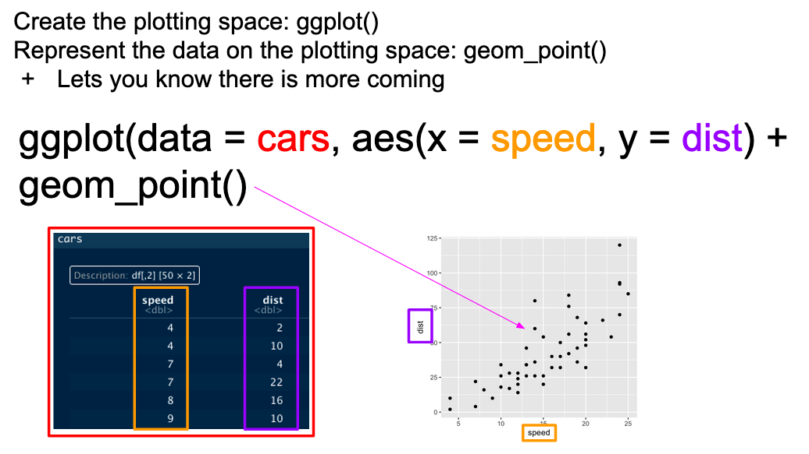

# Intro to data visualization {#Plotting}

## Learning Objectives
- The learning objectives for today are to begin getting comfortable navigating RStudio. A great way to do this is through data visualization. At the end of todays activities students will be able to:

  - Load data to RStudio
  - Visualize data by making plots/figures
  - Install and load packages
  - Begin coding using tidyverse
  - Have an understanding of projects and folder management
  - Knit .Rmd to .html

Follow this [link](https://github.com/tpcovino/unit_1_data_visualization){target="_blank"} to download everything you need for this unit. When you get to GitHub click on "Code" (green button) and select "download zip". You will then save this to a local folder where you should do all of your work for this class. You will work through the "_blank.Rmd". Always be sure to read the README.md files in the GitHub repo.  

Once you have this folder saved where you would like it, open RStudio and navigate to the folder. Next, open the project (".Rproj"). Doing so will set the folder as the working directory, make your life easier, and make everything generally work. The use of projects is highly recommended and is the practice we will follow in this class. You will learn more about projects later, for now just know they are useful and make things easier. In this unit we want to start familiarizing ourselves with R by visualizing some hydrological data.

The reading for this week will also begin to get you more familiar with R and RStudio. Please read [Chapters 1, 2, & 3](https://r4ds.had.co.nz/introduction.html){target="_blank"} 1-Welcome, 2-Introduction, & 3-Data visualization in R for Data Science (RDS).

## Download and install tidyverse library

We will use the tidyverse a lot this semester. It is a suite of packages that handles plotting and data wrangling efficiently.

You only have to install the library once. You have to load it using the library() function each time you start an R session.

```{r}
#install.packages("tidyverse")
library(tidyverse)

```

## Reading data

The following lines will read in the data we will use for this exercise. Don't worry about this right now beyond running it, we will talk more about it later.

```{r}
Pine <- read_csv("pine_jan-mar_2010.csv") 
SNP <- read_csv("pine_nfdr_jan-mar_2010.csv")
RBI <- read_csv("flashy_dat_subset.csv")
```



## Our first ggplot

Let's look at the Pine data, plotting streamflow (the cfs column) by the date (datetime column). We will show the time series as a line.

```{r}
ggplot(data = Pine, aes(x = datetime, y = cfs)) +
  geom_line()

```

## Change point type

Now let's make the same plot but show the data as points, using the shape parameter in geom_point() we can change the point type to any of the following:

See [here](https://ggplot2.tidyverse.org/articles/ggplot2-specs.html){target="_blank"}

```{r}
ggplot(data = Pine, aes(x = datetime, y = cfs))+
  geom_point(shape = 5)

```

## Set colors

We can also "easily" change the color. Easily is in quotes because this often trips people up. If you put color = "blue" in the aesthetic function, think about what that is telling ggplot. It says "control the color using "blue"". That doesn't make a whole lot of sense, so neither does the output... Try it.

What happens is that if color = "blue" is in the aesthetic, you are telling R that the color used in the geom represents "blue". This is very useful if you have multiple geoms in your plot, are coloring them differently, and are building a legend. But if you are just trying to color the points, it kind of feels like R is trolling you... doesn't it?

Take the color = "blue" out of the aesthetic and you're golden.

```{r}

ggplot(data = Pine, aes(x = datetime, y = cfs, color = "blue"))+
  geom_point()

ggplot(data = Pine, aes(x = datetime, y = cfs))+
  geom_point(color = "blue")

```

## Controlling color with a third variable and other functions

Let's plot the data as a line again, but play with it a bit.

First: make the line blue

```{r}
ggplot(data = Pine, aes(x = datetime, y = cfs)) +
         geom_line(color = "blue")
```

Second: change the theme

[See ggplot themes here](https://ggplot2.tidyverse.org/reference/ggtheme.html){target="_blank"}


```{r}
ggplot(data = Pine, aes(x = datetime, y = cfs)) +
  geom_line(color = "blue") +
  theme_linedraw()
  
```


Third: change the axis labels


```{r}
ggplot(data = Pine, aes(x = datetime, y = cfs)) +
  geom_line(color = "blue") +
  theme_linedraw() +
  labs(x = "Date", y = "Q (cfs)")
  
```


Fourth: color by discharge

[See here for changing axis labels and coloring by a variable (in this case discharge)](https://ggplot2.tidyverse.org/reference/labs.html){target="_blank"}

```{r}
ggplot(data = Pine, aes(x = datetime, y = cfs, color = cfs)) +
  geom_line() +
  theme_linedraw() +
  labs(x = "Date", y = "Q (cfs)")
  
```


## Plotting multiple groups (adding a third variable)

The SNP dataset has two different streams: Pine and NFDR

We can look at the two of those a couple of different ways.

First, make two lines, colored by the stream by adding color = to your aesthetic. Remember that we can have a look at column headers with head(df), if you need to remind yourself of variable names. 

```{r}

ggplot(data = SNP, aes(x = datetime, y = cfs, color = StationID)) +
  geom_line()

```


Now use what we just did to make that figure look better. 
```{r}
ggplot(data = SNP, aes(x = datetime, y = cfs, color = StationID)) +
  geom_line() +
  labs(x = "Date", y = "Q (cfs)", color = "Stream") +
  theme_linedraw(base_size = 18)

```

## Facets

We can also use facets.

You must tell the facet_wrap what variable to use to make the separate panels (facets =). It'll decide how to orient them or you can tell it how. We want them to be on top of each other so we are going to tell it we want 2 rows by setting nrow = 2. Note that we have to put the column used to make the facets in quotes after facets =

```{r}

ggplot(data = SNP, aes(x = datetime, y = cfs)) +
  geom_line() +
  facet_wrap(facets = "StationID", nrow = 2)

```

## Two variable faceting

You can also use facet_grid() to break your plots up into panels based on two variables. Below we will create a panel for each month in each watershed. Adding scales = "free" allows facet_grid to change the axes. By default, all axes will be the same. This is often what we want, so we can more easily compare magnitudes, but sometimes we are looking for patterns more, so we may want to let the axes have whatever range works for the individual plots.

```{r echo=TRUE}

ggplot(data = SNP, aes(x = datetime, y = cfs)) +
  geom_line() +
  facet_grid(StationID ~ month, scales = "free")

```

## Boxplots

We can look at these data in other ways as well. A very useful way to look at the variation of two groups is to use a boxplot.

Because the data span several orders of magnitude, we will have to log the y axis to see the differences between the two streams. We do that by adding scale_y\_log10()

```{r echo=TRUE}

ggplot(data = SNP, aes(x = StationID, y = cfs)) + 
  stat_boxplot() +
  scale_y_log10()

```


To investigate the boxplot more closely we can use "plotly". 
```{r echo=TRUE}
#install.packages("plotly")
library(plotly)

ggplotly(ggplot(data = SNP, aes(x = StationID, y = cfs)) + 
  stat_boxplot()+
  scale_y_log10()
)
```

## More about color, size, etc

Let's play around a bit with controlling color, point size, etc with other data.

We can control the size of points by putting size = in the aes() and color by putting color =


```{r echo=TRUE}

ggplot(RBI, aes(x = DRAIN_SQKM, y = RBI, size = T_AVG_SITE, color = STATE))+
  geom_point()

```


If you use a point type that has a background, like \#21, you can also set the background color using bg =

If points are too close together to see them all you can use a hollow point type or set the alpha lower so the points are transparent (alpha = )


```{r echo=TRUE}

  ggplot(data = RBI, aes(x = DRAIN_SQKM, y = RBI, size = T_AVG_SITE, bg = STATE))+
  geom_point(pch = 21, alpha = 0.3)

```

You can also easily make that an interactive plot with ggplotly. Try doing that. 

## Multiple geoms

Finally: You can add multiple geoms to the same plot. Examples of when you might want to do this are when you are showing point data and you want to have a line connecting them. Or if you are fitting a linear model to two data sets and you want to show each. These are just two examples. There are many other reasons you would do this. Point being you simply add additional geom\_... lines to add additional geoms.


See [here](https://ggplot2.tidyverse.org/articles/ggplot2-specs.html){target="_blank"} for information on linetype aesthetics. Using a "dashed" linetype to connect point measurements is a common approach. 

```{r}
ggplot(data = RBI, aes(x = RBI, y = DRAIN_SQKM, color = STATE))+
  geom_line(linetype = "dashed") +
  geom_point()
```


```{r echo=TRUE}

ggplot(data = RBI, aes(x = RBI, y = DRAIN_SQKM, color = AGGECOREGION))+
  stat_smooth(method = "lm", linetype = 2)+
  geom_point()

```


That's it for today! 

## Exit ticket

Write a code that generates a ggplot from a data frame called df and plots Date on the x-axis, discharge on the y-axis as a line, and colors by gauging_station. 
