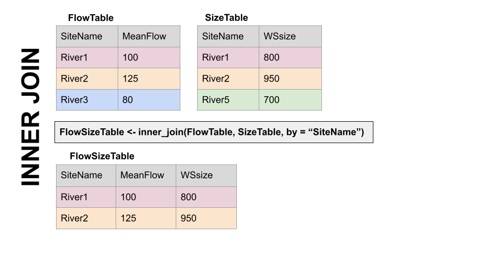
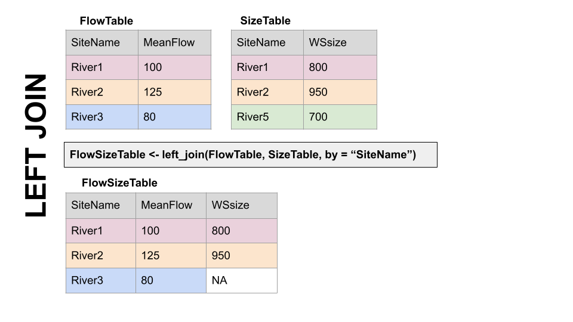
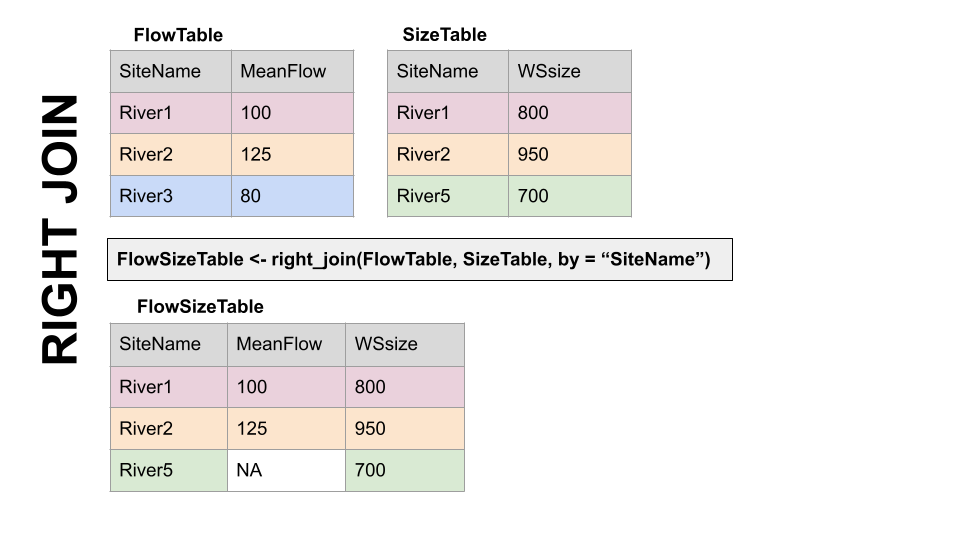
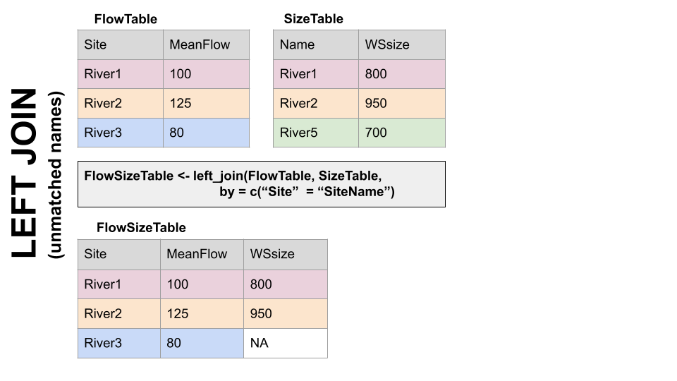

# USGS dataRetrieval: Part 1

Readings: Introduction to the dataRetrieval package <https://cran.r-project.org/web/packages/dataRetrieval/vignettes/dataRetrieval.html>{target="_blank"}

Chapter 12 & 13 of R for Data Science <https://r4ds.had.co.nz/tidy-data.html>{target="_blank"}

Repo for this module can be found [here](https://github.com/tpcovino/05_data_retrieval.git){target="_blank"}

## Goals

-   Get familiar with the dataRetrieval package
-   Intro to joins
-   Learn about long vs. wide data and how to change between them

Prep question: How would you get data from the USGS (non-R)? Test it out by downloading data for gauge 06050000.

See [here](https://dashboard.waterdata.usgs.gov/app/nwd/en/?region=lower48&aoi=default){target="_blank"} for the national water dashboard. Then search for gage 06050000 and download data from 2010 - 2020. 

It is good to know how to do that but dataRetrieval is going to make that much easier. 

Install and load the necessary packages.

```{r, message = FALSE}
#install.packages("dataRetrieval")
#install.packages("leaflet")
library(dataRetrieval)
library(tidyverse)
library(leaflet)
```

## Exploring what dataRetrieval can do

Think about the dataRetrieval as a way to interact with same public data you can access through waterdata.usgs.gov but without having to click on buttons and search around. It makes getting data or doing analyses with USGS data much more reproducible and fast!

The documentation for the package is extremely helpful: <https://cran.r-project.org/web/packages/dataRetrieval/vignettes/dataRetrieval.html>{target="_blank"}

<https://waterdata.usgs.gov/blog/dataretrieval/>{target="_blank"}

I always have to look up how to do things because the package is very specialized! This is the case with most website APIs, in my experience. It's a good argument for getting good at navigating package documentation! Basically you just look through and try to piece together the recipe for what you want to do using the examples they give in the document.

First, let's get some information about the gauging stations using the whatNWISsites(), readNWISsite(), and whatNWISdata() functions. Try each out and see what they tell you.

Remember, all the parameter codes and site names get passed to dataRetrieval functions as characters, so they must be in quotes.

[Link to parameter codes](https://help.waterdata.usgs.gov/parameter_cd?group_cd=PHY){target="_blank"}

Let's use dataRetrieval to see what's available in Montana.

```{r}
# Load the stream gauge data
# Configs that could be changed ...
param_cd <- "00060" # Parameter code for streamflow . See `dataRetrieval::parameterCdFile` for more.
service_cd <- "dv" # means "daily value". See `https://waterservices.usgs.gov/rest/` for more info.
# State code
state_cd <- "MT"
# set start and end dates for streamflow time series
start <- as_date("1990-10-01")
end <- as_date("2022-10-01")

# Use whatNWISsites to identify what gauges exist that meet the above conditions. 
stream_gauges <- whatNWISsites(parameterCd = param_cd, service = service_cd, stateCd = state_cd, startDate = start, endDate = end) %>% 
  select(site_no, station_nm, dec_lat_va, dec_long_va)

```

Map the gauges using leaflet. 
```{r}
mt_gauge_map <- leaflet() %>% 
  addProviderTiles("OpenStreetMap") %>% 
  addAwesomeMarkers(data = stream_gauges, lat = ~dec_lat_va, lng = ~dec_long_va, label = ~station_nm, 
                    popup = ~paste("Start date:", start, "<br>End date:", end)) 
  
mt_gauge_map
```

Let's change the popup to be the site_no.

```{r}
mt_gauge_map <- leaflet() %>% 
  addProviderTiles("OpenStreetMap") %>% 
  addAwesomeMarkers(data = stream_gauges, lat = ~dec_lat_va, lng = ~dec_long_va, label = ~station_nm, 
                    popup = ~paste("Site", site_no)) 
```


**Challenge**: change the code that generates the "stream_gauges" object to generate an object called "gallatin" that only includes the gauges within Gallatin County and map them. Investigate the map and pay particular attention to 06048650 and 06048700. What is going on there? 
```{r}

```


Let's explore some of dataRetrieval capabilities using two local gauging sites. Let's work with 1. A USGS gauge on the Gallatin River near Gallatin Gateway. The gague number is 06043500. And another gauge near the reservoir at Hyalite, gauge number 06050000.

## First, let's map these sites.

```{r}

#important: note the site number gets input as a character
site <- c("06043500", "06050000")


#Information about the sites
site_info <- readNWISsite(site)


# plot the gauge sites with a street map background basemap
street_map <- leaflet() %>% 
  addProviderTiles("OpenStreetMap") %>% 
  addAwesomeMarkers(data = site_info, lat = ~dec_lat_va, lng = ~dec_long_va, label = ~station_nm, 
                    popup = ~paste("Site:", site_no)) 

street_map


# or with imagery
esri_map <- leaflet() %>% 
  addProviderTiles("Esri.WorldImagery") %>% 
  addAwesomeMarkers(data = site_info, lat = ~dec_lat_va, lng = ~dec_long_va, label = ~station_nm, 
                    popup = ~paste("Site:", site_no)) 
  
esri_map
```

Now we have looked at where the sites are located. Now let' see what data are available with whatNWISdata().

```{r}

#What data are available for the sites?
# service = dv means give us the daily averages. 
data_available <- whatNWISdata(siteNumber = site, service = "dv", statCd = "00003")


```

## Joins

When we look at what whatNWISdata returns, we see it gives us parameter codes (param_cd), but doesn't tell us what they mean. This is a common attribute of databases: you use a common identifier but then have the full information in a lookup file. In this case, the look-up information telling us what the parameter codes mean is in "parameterCdFile" which loads with the dataRetrieval package.

So, you could look at that and see what the parameters mean. In the console type "view(parameterCdFile)". That doesn't seem very practical. There are over 24,000 rows!

Instead let's have R do it and add a column that tells us what the parameters mean. Enter JOINS!

Joins allow us to combine the data from two different data frames (dfs) that have a column in common. At its most basic, a join looks for a matching row with the same key in both dfs (for example, a USGS gauge number) and then combines the rows. So now you have all the data from both dfs, matched on the key.

But you have to make some decisions: what if a key value exists in one df but not the other? Do you just drop that observation? Do you add an NA? Let's look at the different options.

Take for example the two dfs, FlowTable and SizeTable. The SiteName values are the key values and the MeanFlow and WSsize values are the data.

{width="400"}

Note River1 and River2 match up, but River3 and River5 only exist in one df or the other.

The first way to deal with this is an **INNER JOIN: inner_join()** In an inner join, you only keep records that match. So the rows for River3 and River5 will be dropped because there is no corresponding data in the other df. See below:



But what if you don't want to lose the values in one or the other or both?!

For instance, let's say you have a bunch of discharge data for a stream, and then chemistry grab samples at a weekly or monthly timestep. You want to join the chemistry to the discharge based on the dates and times they were taken. But when you do this, you don't want to delete all the discharge data where there is no chemistry! We need another option. Enter OUTER JOINS

**LEFT JOIN, left_join():** Preserves all values from the LEFT df, and pastes on the matching ones from the right. This creates NAs where there is a value on the left but not the right. (this is what you'd want to do in the discharge - chemistry example above)



**RIGHT JOIN, right_join():** Preserves all values from the RIGHT df, and pastes on the matching ones from the left. This creates NAs where there is a value on the right but not the left.



**FULL JOIN, full_join():** KEEP EVERYTHING! The hoarder of the joins. No matching record on the left? create an NA on the right! No matching value on the right? Create an NA on the left! NAs for everyone!


When you do this in R, you use the functions identified in the descriptions with the following syntax (see example below):

**if the column is named the same in both data sets** \> xxx_join(left_tibble, right_tibble, by = "key_column")\*\*

**if the column is named differently in both data sets** \> xxx_join(left_tibble, right_tibble, by = c("left_key" = "right_key")



Note in both of the above, when you specify which column to use as "by" you have to put it in quotes.

## Join practice example

In the chunk below write code to add information about the parameters in data_available by joining it with the parameterCdFile. The column with the parameter codes is called parm_cd in data_available and parameter_cd in parameterCdFile

```{r}
data_available_cd <- left_join(data_available, parameterCdFile, by = c("parm_cd" = "parameter_cd"))


# that made a lot of columns, write code to clean that up and keep only relevant columns.
data_avail_clean <- data_available_cd %>% select(site_no, 
                                           station_nm,
                                           parm_cd, 
                                           srsname, #substance registry services
                                           parameter_units,
                                           begin_date, 
                                           end_date)


```

**Question**: in data_avail_clean why are there two rows for 06043500?


## Now we know what is available so let's download some data from the Gallatin site using "readNWISdata".

```{r}
# first let set some parameters. What do each of these do? 
gal_q_site <- data_avail_clean$site_no[2]
gal_q_param <- data_avail_clean$parm_cd[2]
gal_q_start <- data_avail_clean$begin_date[2]
gal_q_end <- data_avail_clean$end_date[2]


gal_q <- readNWISdata(sites = gal_q_site, parameterCd = gal_q_param, service ="dv", startDate = gal_q_start, endDate = gal_q_end) 


# Those column names are awful. Let's try that again and pipe into "renameNWISColumns()"
gal_q <- readNWISdata(sites = gal_q_site, parameterCd = gal_q_param, service ="dv", startDate = gal_q_start, endDate = gal_q_end) %>% 
  renameNWISColumns()

```

But is the Q data continuous for the entire period? The easiest way to find out is to make a plot. Make a ggplot with Q on the y and date on the x.

```{r}
gal_q %>% 
 ggplot(aes(x = dateTime, y = Flow)) +
 geom_point()

# Another way to explore this data is to use plotly, which creates an interactive graph. 
#install.packages
#library(plotly)
# I'm commenting this section out becuase it bogs down the knitting. 
#ggplotly(gal_q %>% 
  #ggplot(aes(x = dateTime, y = Flow)) +
  #geom_point()) # as an fyi, plotly is slow with large data sets. So you might want to comment this section out after you do your exploration. 

# We've identified some gaps. Now let's filter to everything after 1990

gal_q <- gal_q %>% 
  filter(dateTime > "1990-09-30")

```

Let's now plot that more recent (1990 - now) data.

```{r}
gal_q %>% 
  ggplot(aes(x = dateTime, y = Flow)) +
  geom_point() 
```

That looks better!


**Challenge** follow the steps from above to download and plot temperature data for the Gallatin River site (06043500) from begin_date to end_date. call the data frame gal_t.

```{r}


```

**Challenge** use join to create a dataframe called gal_t_q that joins gal_t and gal_q and keeps only Q data when there is T data. Then plot both Q and T and stack the plots.

```{r}


#let's clean that up!


```

**Challenge** Using gal_t_q, plot Q in cubic meters per second on x and T in Celsius on Y, color by date, add labels to axes, and select a theme.

```{r}


```

Ok. So above was one way that we could download some data. Let's explore another approach. 

```{r}
# Let's download some dta for the Hyalite Creek and Gallatin Gateway gauges. Let's also use the parameters that we have already defined. Things like servie_cd, param_cd, site, etc.

hy_gal <- readNWISdata(site = site, service = service_cd, parameterCd = param_cd, startDate = start, endDate = end) %>% 
  renameNWISColumns() %>% 
  select(site_no, date = dateTime, flow = Flow)


# now let's do a join so that we have both the site number (site_no) and the station name in the df.
hy_gal_names <- left_join(hy_gal, data_avail_clean, by = "site_no") %>% 
  select(station = station_nm, site_no, date, flow)


```

Now let's make a plot of Q at the Gallatin and Hyalite gauges to do an assessment (EDA) of the data. What is your observation? 
```{r}
hy_gal_names %>% 
  ggplot(aes(x = date, y = flow, color = station)) +
  geom_point(alpha = 0.5) + 
  labs(x = "Date", y = "Q (cfs)", color = "Gauge") +
  theme_linedraw() 

# We can log the y axis to zoom in on the low values a bit. 
hy_gal_names %>% 
  ggplot(aes(x = date, y = flow, color = station)) +
  geom_point(alpha = 0.5) + 
  labs(x = "Date", y = "Q (cfs)", color = "Gauge") +
  theme_linedraw() +
  scale_y_log10()

```


**Challenge** Download Q data for all of the sites in the gallatin df. Rename columns using renameNWIScolumns and call this df gallatin_q. Join gallatin and gallatin_q so that you have a df that includes the station names. Plot Q and color by station name. 

```{r}

```


```{r}


```


