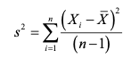
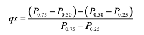

# Introduction

This book provides the materials that we will use in Watershed Analysis (ENSC 445/545). In this class we will be learning the fundamentals of watershed analysis in R.

Instructor: Dr. Tim Covino\
Class times: T 10:50 – 12:05; Th 10:50 – 12:05\
Office hours: By appointment\
Email: timothy.covino@montana.edu\
Website: <https://tpcovino.github.io/ensc_445_545_bookdown>


## Course overview and objectives

(1) provide theoretical understanding and practical experience with common analysis and modeling techniques relevant to watershed hydrology.

(2) provide training in analyzing, simulating, and presenting scientific data in written and oral formats.

## Structure

This class will be largely hands-on, and students will be conducting watershed analyses and modeling exercises. We will be doing our analysis and modeling in R and will do some R coding in each class session. Programming is best learned by doing it often. We will generally have "lecture" on Tuesday, where we will talk about and work through various types of hydrological analyses. On Thursday's you will then put the content from Tuesday to work in a lab where you will complete a variety of hydrological analyses in R.

Philosophical approach and books & resources we will utilize This course will use all online and open-source resources and will follow FAIR (findability, accessibility, interoperability, and reusability) data principles and promote sharing of hydrological education and research materials. Our computing will utilize open source [R](https://cran.rstudio.com/){target="_blank"} and [RStudio](https://posit.co/download/rstudio-desktop/){target="_blank"} software. Books and readings will include [R for Data Science](https://r4ds.hadley.nz/){target="_blank"} and [Statistical Methods in Water Resources](https://www.epa.gov/sites/default/files/2015-06/documents/twri4a3-new.pdf){target="_blank"}, but other readings will be made available on this bookdown page as needed. *We will promote an open, equitable, and collaborative environment such that we can all succeed and improve our skills in watershed analysis*. 
<br> Here are instructions for installing R and RStudio on your own computer if you would like [Hands on Programming with R](https://rstudio-education.github.io/hopr/starting.html){target="_blank"}

## Tentative schedule, subject to change

**Week 1**: <br> - *Lecture (1/14)*: Introduction, review.\
*Work session (1/16)*: Getting started in R. 
- *Reading*: [Intro & Chapter 1](https://r4ds.hadley.nz/intro){target="_blank"} Introduction & 1-Data visualization in R for Data Science (RDS).

**Week 2**: <br> - *Lecture (1/21)*: Overview and data viz. <br> - *Work session (1/23)*: Data visualization, data wrangling, and programming. <br> - *Reading*: [Chapter 2.1](https://www.epa.gov/sites/default/files/2015-06/documents/twri4a3-new.pdf){target="_blank"}: Graphical Analysis of Single Datasets in Statistical Methods in Water Resources (SMWR). *AND* [Chapters 2 & 3](https://r4ds.hadley.nz/workflow-basics){target="_blank"} 2-Workflow: Basics & 3-Data transformation in RDS. <br>

**Week 3**: <br> - *Lab1 (1/28)*: Data viz, wrangling, and programming. <br> - *Lab 1 (1/30)*: Data viz, wrangling, and programming. <br>

**Week 4**: <br> - *Lecture (2/4)*: Downloading and shaping data frames.<br> - *Lab 2 (2/6)*: Downloading and shaping data frames. <br> - **Submit term project ideas** <br> - *Reading*: [Introduction to the dataRetrieval package](https://cran.r-project.org/web/packages/dataRetrieval/vignettes/dataRetrieval.html){target="_blank"} *AND* [Chapter 4 of R for Data Science](https://r4ds.hadley.nz/workflow-style){target="_blank"}

**Week 5**: <br> - *Lecture (2/11)*: Statistics in hydrology. <br> - *Lab 3 (2/13)*: Statistics in hydrology. <br> - *Reading*: [Chapter 1](https://www.epa.gov/sites/default/files/2015-06/documents/twri4a3-new.pdf){target="_blank"}: Summarizing Data in SMWR *AND* [Chapter 5 in RDS](https://r4ds.hadley.nz/data-tidy){target="_blank"}

**Week 6**: <br> - *Lecture (2/18)*: Surface water: Rating curves and hydrographs.\
- *Lab 4 (2/20)*: Rating curves and hydrographs. <br> - *Reading*: [Chapter 4](https://www.epa.gov/sites/default/files/2015-06/documents/twri4a3-new.pdf){target="_blank"}: Hypothesis Tests in SMWR.

**Week 7**: <br> - *Work session (2/25)*: Term project work session. <br> - *Presentations (2/27)*: Term project updates <br> - *Reading*: [Chapter 6 in RDS](https://r4ds.hadley.nz/workflow-scripts){target="_blank"}

**Week 8**: <br> - *Lab 5 (3/4)*: Flow frequency analysis (low flows) <br> - *Work session (3/6)*: Term project work session/guest lecture <br> - *Reading*: [Definitions and characteristics of low flows](https://www.epa.gov/ceam/definition-and-characteristics-low-flows#1Q10){target="_blank"} in EPA Environmental Modeling Community of Practice

**Week 9**: <br> - *Lecture (3/11)*: Cimate trend analysis <br> - *Lab 6 (3/13)*: Trend analysis <br> - *Reading*: [Chapters 12.1 & 12.2](https://www.epa.gov/sites/default/files/2015-06/documents/twri4a3-new.pdf){target="_blank"} 12.1-General Structure of Trend Tests & 12.2-Trend Tests with No Exogenous Variables in SMWR.

**Week 10: Spring break (3/18 & 3/20)** - no class!

**Week 11**: <br> - *Lecture or Work session (3/25)*: Precipitation or Term project work session <br> - *Lab 7 or work session (3/27)*: Precipitation analysis or work session <br> - *Reading*: [Chapters 10 and 11 in RDS](https://r4ds.hadley.nz/eda){target="_blank"}

**Week 12**: <br> - *Lecture/lab (4/1)*: Geospatial hydrology in R <br> - *Lab 8 (4/3)*: Watershed delineation in R <br> - *Reading*: [Geocomputation with R](https://geocompr.robinlovelace.net/intro.html){target="_blank"} <br> - *Reading*: [Geospatial analysis in R](https://pjbartlein.github.io/REarthSysSci/geospatial.html){target="_blank"}

**Week 13**: <br> - *Lecture/lab (4/8)*: Term project work session <br> - *Lab (4/10)*: Term project update presentations <br> - *Reading* [An Overview of Rainfall-Runoff Model Types](https://cfpub.epa.gov/si/si_public_record_report.cfm?dirEntryId=339328&Lab=NERL){target="_blank"}

**Week 14**: <br> - *Lab (4/15)*: Term project work session <br> - *Lab (4/17)*: Hydrologic modeling <br>

**Week 15**: <br> - *Lab (4/22)*: Term project work session <br> - *Lab (4/24)*: Term project work session

**Week 16**: Term project presentations (4/29 and 5/1)

**Week 17 (finals week)**: Submit term project R Markdown

<!--chapter:end:index.Rmd-->


# Intro to data visualization

## Learning Objectives
- The learning objectives for today are to begin getting comfortable navigating RStudio. A great way to do this is through data visualization. At the end of todays activities students will be able to:

  - Load data to RStudio
  - Visualize data by making plots/figures
  - Install and load packages
  - Begin coding using tidyverse
  - Have an understanding of projects and folder management
  - Knit .Rmd to .html

Follow this [link](https://github.com/tpcovino/unit_1_data_visualization){target="_blank"} to download everything you need for this unit. When you get to GitHub click on "Code" (green button) and select "download zip". You will then save this to a local folder where you should do all of your work for this class. You will work through the "_blank.Rmd". Always be sure to read the README.md files in the GitHub repo.  

Once you have this folder saved where you would like it, open RStudio and navigate to the folder. Next, open the project (".Rproj"). Doing so will set the folder as the working directory, make your life easier, and make everything generally work. The use of projects is highly recommended and is the practice we will follow in this class. You will learn more about projects later, for now just know they are useful and make things easier. In this unit we want to start familiarizing ourselves with R by visualizing some hydrological data.

The reading for this week will also begin to get you more familiar with R and RStudio. Please read [Chapters 1, 2, & 3](https://r4ds.had.co.nz/introduction.html){target="_blank"} 1-Welcome, 2-Introduction, & 3-Data visualization in R for Data Science (RDS).

## Download and install tidyverse library

We will use the tidyverse a lot this semester. It is a suite of packages that handles plotting and data wrangling efficiently.

You only have to install the library once. You have to load it using the library() function each time you start an R session.

```{r}
options(knitr.duplicate.label = "allow")
#install.packages("tidyverse")
library(tidyverse)

```


## Reading data

The following lines will read in the data we will use for this exercise. Don't worry about this right now beyond running it, we will talk more about it later.

```{r}
Pine <- read_csv("pine_jan-mar_2010.csv") 
SNP <- read_csv("pine_nfdr_jan-mar_2010.csv")
RBI <- read_csv("flashy_dat_subset.csv")
```


## Our first ggplot

Let's look at the Pine data, plotting streamflow (the cfs column) by the date (datetime column). We will show the time series as a line.

```{r}
ggplot(data = Pine, aes(x = datetime, y = cfs)) +
  geom_line()

```

## Change point type

Now let's make the same plot but show the data as points, using the shape parameter in geom_point() we can change the point type to any of the following:

See [here](https://ggplot2.tidyverse.org/articles/ggplot2-specs.html){target="_blank"}

```{r}
ggplot(data = Pine, aes(x = datetime, y = cfs))+
  geom_point(shape = 5)

```

## Set colors

We can also "easily" change the color. Easily is in quotes because this often trips people up. If you put color = "blue" in the aesthetic function, think about what that is telling ggplot. It says "control the color using "blue"". That doesn't make a whole lot of sense, so neither does the output... Try it.

What happens is that if color = "blue" is in the aesthetic, you are telling R that the color used in the geom represents "blue". This is very useful if you have multiple geoms in your plot, are coloring them differently, and are building a legend. But if you are just trying to color the points, it kind of feels like R is trolling you... doesn't it?

Take the color = "blue" out of the aesthetic and you're golden.

```{r}

ggplot(data = Pine, aes(x = datetime, y = cfs, color = "blue"))+
  geom_point()

ggplot(data = Pine, aes(x = datetime, y = cfs))+
  geom_point(color = "blue")

```

## Controlling color with a third variable and other functions

Let's plot the data as a line again, but play with it a bit.

First: make the line blue

```{r}
ggplot(data = Pine, aes(x = datetime, y = cfs)) +
         geom_line(color = "blue")
```

Second: change the theme

[See ggplot themes here](https://ggplot2.tidyverse.org/reference/ggtheme.html){target="_blank"}


```{r}
ggplot(data = Pine, aes(x = datetime, y = cfs)) +
  geom_line(color = "blue") +
  theme_linedraw()
  
```


Third: change the axis labels


```{r}
ggplot(data = Pine, aes(x = datetime, y = cfs)) +
  geom_line(color = "blue") +
  theme_linedraw() +
  labs(x = "Date", y = "Q (cfs)")
  
```


Fourth: color by discharge

[See here for changing axis labels and coloring by a variable (in this case discharge)](https://ggplot2.tidyverse.org/reference/labs.html){target="_blank"}

```{r}
ggplot(data = Pine, aes(x = datetime, y = cfs, color = cfs)) +
  geom_line() +
  theme_linedraw() +
  labs(x = "Date", y = "Q (cfs)")
  
```


## Plotting multiple groups (adding a third variable)

The SNP dataset has two different streams: Pine and NFDR

We can look at the two of those a couple of different ways.

First, make two lines, colored by the stream by adding color = to your aesthetic. Remember that we can have a look at column headers with head(df), if you need to remind yourself of variable names. 

```{r}

ggplot(data = SNP, aes(x = datetime, y = cfs, color = StationID)) +
  geom_line()

```


Now use what we just did to make that figure look better. 
```{r}
ggplot(data = SNP, aes(x = datetime, y = cfs, color = StationID)) +
  geom_line() +
  labs(x = "Date", y = "Q (cfs)", color = "Stream") +
  theme_linedraw(base_size = 18)

```

## Facets

We can also use facets.

You must tell the facet_wrap what variable to use to make the separate panels (facets =). It'll decide how to orient them or you can tell it how. We want them to be on top of each other so we are going to tell it we want 2 rows by setting nrow = 2. Note that we have to put the column used to make the facets in quotes after facets =

```{r}

ggplot(data = SNP, aes(x = datetime, y = cfs)) +
  geom_line() +
  facet_wrap(facets = "StationID", nrow = 2)

```

## Two variable faceting

You can also use facet_grid() to break your plots up into panels based on two variables. Below we will create a panel for each month in each watershed. Adding scales = "free" allows facet_grid to change the axes. By default, all axes will be the same. This is often what we want, so we can more easily compare magnitudes, but sometimes we are looking for patterns more, so we may want to let the axes have whatever range works for the individual plots.

```{r}

ggplot(data = SNP, aes(x = datetime, y = cfs)) +
  geom_line() +
  facet_grid(StationID ~ month, scales = "free")

```

## Boxplots

We can look at these data in other ways as well. A very useful way to look at the variation of two groups is to use a boxplot.

Because the data span several orders of magnitude, we will have to log the y axis to see the differences between the two streams. We do that by adding scale_y\_log10()

```{r}

ggplot(data = SNP, aes(x = StationID, y = cfs)) + 
  stat_boxplot() +
  scale_y_log10()

```


To investigate the boxplot more closely we can use "plotly", which generates interactive plots.

```{r}
#install.packages("plotly")
library(plotly)

ggplotly(ggplot(data = SNP, aes(x = StationID, y = cfs)) + 
  stat_boxplot()+
  scale_y_log10()
)
```

## More about color, size, etc

Let's play around a bit with controlling color, point size, etc with other data.

We can control the size of points by putting size = in the aes() and color by putting color =


```{r}

ggplot(RBI, aes(x = DRAIN_SQKM, y = RBI, size = T_AVG_SITE, color = STATE))+
  geom_point()

```


If you use a point type that has a background, like \#21, you can also set the background color using bg =

If points are too close together to see them all you can use a hollow point type or set the alpha lower so the points are transparent (alpha = )


```{r}

  ggplot(data = RBI, aes(x = DRAIN_SQKM, y = RBI, size = T_AVG_SITE, bg = STATE))+
  geom_point(pch = 21, alpha = 0.3)

```

You can also easily make that an interactive plot with ggplotly. Try doing that. 

## Multiple geoms

Finally: You can add multiple geoms to the same plot. Examples of when you might want to do this are when you are showing point data and you want to have a line connecting them. Or if you are fitting a linear model to two data sets and you want to show each. These are just two examples. There are many other reasons you would do this. Point being you simply add additional geom\_... lines to add additional geoms.


See [here](https://ggplot2.tidyverse.org/articles/ggplot2-specs.html){target="_blank"} for information on linetype aesthetics. Using a "dashed" linetype to connect point measurements is a common approach. 

```{r}
ggplot(data = RBI, aes(x = RBI, y = DRAIN_SQKM, color = STATE))+
  geom_line(linetype = "dashed") +
  geom_point()
```


```{r}

ggplot(data = RBI, aes(x = RBI, y = DRAIN_SQKM, color = AGGECOREGION))+
  stat_smooth(method = "lm", linetype = 2)+
  geom_point()

```


That's it for today! 

## Exit ticket

Write a code that generates a ggplot from a data frame called df and plots Date on the x-axis, discharge on the y-axis as a line, and colors by gauging_station. 

<!--chapter:end:02_data_visualization.Rmd-->


# Data wrangling using tidyverse

Follow this [link](https://github.com/tpcovino/unit_2_data_wrangling){target="_blank"} to download everything you need for this unit. When you get to GitHub click on "Code" (green button) and select "download zip". You will then save this to a local folder where you should do all of your work for this class. You will work through the "\_blank.Rmd". Always be sure to read the README.md files in the GitHub repo.

Once you have this folder saved where you would like it, open RStudio and navigate to the folder. Next, open the project (".Rproj"). Doing so will set the folder as the working directory, make your life easier, and make everything generally work.

## Introduction

We have messed around with plotting a bit and you've seen a little of what R can do. So now let's review or introduce you to some basics. Even if you have worked in R before, it is good to be remind of/practice with this stuff, so stay tuned in!

Reading for this week:

[Chapter 2.1: Graphical analysis of single datasets](https://pubs.usgs.gov/tm/04/a03/tm4a3.pdf){target="_blank"} in SMWR

[Workflow: basics](https://r4ds.hadley.nz/workflow-basics.html){target="_blank"}

[Data transformation](https://r4ds.hadley.nz/data-transform.html){target="_blank"}

## Learning objectives:

Working through this exercise will help students: <br>
- become more familiar with the RStudio IDE <br>
- get in the habit of running single lines of code <br>
- know what a tibble is <br>
- know what the assignment operator is <br>
- begin using base and dplyr functions <br>


## You can use R as a calculator

If you just type numbers and operators in, R will spit out the results.

It is generally good to run one line of code at a time. In mac you do that by putting your cursor on the line and hitting command + enter. On windows/PC that is ctrl + enter.

[Here is a link to info on Editing and Executing code in RStudio](https://support.posit.co/hc/en-us/articles/200484448-Editing-and-Executing-Code-in-the-RStudio-IDE){target="_blank"}

[Very handy link to all keyboard shortcuts Windows, Linux and Mac](https://support.posit.co/hc/en-us/articles/200711853-Keyboard-Shortcuts){target="_blank"}

```{r}
1 + 2

2 + 2
```

## You can create new objects using \<-

Yes, = does the same thing. But use \<-. We will call \<- assignment or assignment operator. When we are coding in R we use \<- to assign values to objects and = to set values for parameters in functions/equations/etc. Using \<- helps us differentiate between the two. Norms for formatting are important because they help us understand what code is doing, especially when stuff gets complex.

Oh, one more thing: Surround operators with spaces.

x \<- 1 is easier to read than x\<-1

You can assign single numbers or entire chunks of data using \<-

So if you had an object called my_data and wanted to copy it into my_new_data you could do:

my_new_data \<- my_data

You can then recall/print the values in an object by just typing the name by itself.

In the code chunk below, assign a 3 to the object "y" and then print it out.

```{r}
# This is a code chunk. 
# Putting a pound sign in here allows me to type text that is not code.
# The stuff below is code. Not text. 

y <- 3
y

```

If you want to assign multiple values, you have to put them in the function c() c means combine. R doesn't know what to do if you just give it a bunch of values with space or commas, but if you put them as arguments in the combine function, it'll make them into a vector.

Any time you need to use several values, even passing as an argument to a function, you have to put them in c() or it won't work.

```{r}
a <- c(1,2,3,4)
a
```

When you are creating objects, try to give them meaningful names so you can remember what they are. You can't have spaces or operators that mean something else as part of a name. And remember, everything is case sensitive.

Assign the value 5.4 to water_pH and then try to recall it by typing "water_ph"

```{r}
water_pH <- 5.4

water_pH

```

If we want to remove something from the environment we can use rm(). Try to remove water_pH.

You can also set objects equal to strings, or values that have letters in them. To do this you just have to put the value in quotes, otherwise R will think it is an object name and tell you it doesn't exist.

Try: name \<- "your name" and then name \<- your name

What happens if you forget the ending parenthesis?

R can be cryptic with it's error messages or other responses, but once you get used to them, you know exactly what is wrong when they pop up.

As a note - when you go to the internet for example code it will often say things like df \<- your_data, this is similar to what I've written above: name \<- "your name". It means enter you name (or your data). As you progress you will get better at understanding example code and understanding error messages.

```{r}
name <- "Tim"
#name <- Tim
```

## Using functions

As an example, let's try the seq() function, which creates a sequence of numbers.

```{r}
seq(from = 1, to = 10, by = 1) # these are base R functions

# or

seq(1, 10, 1)

# or

seq(1, 10)

# Predict what this does
seq(10,1)
```

## Read in some data

First we will load the tidyverse library, everything we have done so far today is in base R. Next, let's load a few dataframes and have a look at them. We will load the "PINE_NFDR_Jan-Mar_2010.csv" and "flashy_dat_all.csv" files.

Important: read_csv() is the tidyverse csv reading function, the base R function is read.csv(). read.csv() will not read your data in as a tibble, which is the format used by tidyverse functions. You should get in the habit of using the tidyverse versions such as read_csv().

```{r}
library(tidyverse)

flow <- read_csv("pine_nfdr_jan-mar_2010.csv")
rbi <- read_csv("flashy_dat_all.csv")


```

## What is a tibble?

Good question. It's a fancy way to store data that works well with tidyverse functions. Let's look at the flow tibble with "head" and "str"

```{r}
head(flow)
str(flow)
```

Now read in the same data with read.csv() which will NOT read the data as a tibble. How is it different? Output each one in the Console.

Knowing the data type for each column is super helpful for a few reasons.... let's talk about them.

```{r}

flow_NT <- read.csv("pine_nfdr_jan-mar_2010.csv") # this is base R

head(flow_NT)
head(flow)

# We can remove the flow_NT dataframe from the enviroment with rm(flow_NT)
rm(flow_NT)

```

## Data wrangling in dplyr

If you forget syntax or what the following functions do, here is a cheat sheet: <https://rstudio.com/wp-content/uploads/2015/02/data-wrangling-cheatsheet.pdf>{target="_blank"}

We will demo five functions below (these are tidyverse/dplyr functions):

-   **filter()** - returns rows that meet specified conditions
-   **arrange()** - reorders rows
-   **select()** - pull out variables (columns)
-   **mutate()** - create new variables (columns) or reformat existing ones
-   **summarize()** - collapse groups of values into summary stats

## Filter

Write an expression that returns data in rbi for the state of Montana (MT)

```{r}

filter(rbi, STATE == "MT")

```

And one that keeps flows less than 100 cfs in the "flow" dataframe.

```{r}
filter(flow, cfs < 100)
```

Above we just executed the operation, but didn't save it. Let's save that work using the assignment operator.

```{r}
rbi_mt <- filter(rbi, STATE == "MT")

low_flows <- filter(flow, cfs < 100)
```

### Multiple conditions

How many gages are there in Montana with an rbi greater than 0.05

```{r}

filter(rbi, STATE == "MT" & RBI > 0.05)

```

Challenge: Filter for flow less than 100 cfs just for the NFDR gauge in "flow".

```{r}

```


## Arrange

Arrange sorts by a column in your dataset.

Sort the rbi data by the RBI column in ascending and then descending order

```{r}
arrange(rbi, RBI)


arrange(rbi, desc(RBI))

```

## Select

Look at the RBI dataframe. There are too many columns! You will often want to get rid of some columns and clean up the dataframe (df) for analysis.

Select Site name, state, and RBI from the rbi data

Note they come back in the order you put them in in the function, not the order they were in in the original data.

You can do a lot more with select, especially when you need to select a bunch of columns but don't want to type them all out. For example, if you want to select a group of columns you can specify the first and last with a colon in between (first:last) and it'll return all of them. Select the rbi columns from site_no to DRAIN_SQKM. You can also remove one column with select(-column). Remove the "surrogate" column from flow.

```{r}

rbi_mt_thin <- select(rbi, STANAME, STATE, RBI)

rbi_thin <- select(rbi, site_no:DRAIN_SQKM)

flow_thin <- select(flow, -surrogate)

```

## Mutate

Use mutate to add new columns based on additional ones. Common uses are to create a column of data in different units, or to calculate something based on two columns. You can also use it to just update a column, by naming the new column the same as the original one (but be careful because you'll lose the original one!).

Create a new column in rbi called T_RANGE by subtracting T_MIN_SITE from T_MAX_SITE

```{r}
mutate(rbi, T_RANGE = T_MAX_SITE - T_MIN_SITE)

```

When downloading data from the USGS through R, you have to enter the gage ID as a character, even though they are all made up of numbers. So to practice doing this, update the site_no column to be a character datatype

```{r}
mutate(rbi, site_no = as.character(site_no))

```

## Summarize

Summarize will perform an operation on all of your data, or groups if you assign groups.

Use summarize to compute the mean, min, and max rbi

```{r}
rbi_sum <- summarize(rbi, meanrbi = mean(RBI), maxrbi = max(RBI), minrbi = min(RBI))
```

Now use the group function to group rbi by state and then summarize in the same way as above, but for the full r

```{r}
rbi_state <- group_by(rbi, STATE)

rbi_state <- summarize(rbi_state, meanrbi = mean(RBI), maxrbi = max(RBI), minrbi = min(RBI))
```

## Multiple operations with pipes

You will note that your environment is filling up with objects. We can eliminate many of those by using pipes.

The pipe operator %\>% allows you to perform multiple operations in a sequence without saving intermediate steps. Not only is this more efficient, but structuring operations with pipes is also more intuitive than nesting functions within functions (the other way you can do multiple operations).

When you use the pipe, it basically takes whatever came out of the first function and puts it into the data argument for the next one, so:

rbi %\>% group_by(STATE)

**is the same as**

group_by(rbi, STATE)

Take the groupby and summarize code from above and perform the operation using the pipe

```{r}

rbi_sum <- rbi %>%
  group_by(STATE) %>%
  summarize(meanrbi = mean(RBI), maxrbi = max(RBI), minrbi = min(RBI))

```

## A final comment on NAs

We will talk more about this when we discuss stats, but some operations will fail if there are NA's in the data. If appropriate, you can tell functions like mean() to ignore NAs by using na.rm = TRUE. You can also use drop_na() if you're working with a tibble. But be aware if you use that and save the result, drop_na() gets rid of the whole row, not just the NA. Because what would you replace it with.... an NA?

First, lets create a small data frame called x that includes: 1, 2, 3, 4, NA. How do we do that?

```{r}

x <- c(1,2,3,4,NA)

```

Next, lets take the mean of x.

```{r}

mean(x)

```

How do you think we can fix this problem?

```{r}
mean(x, na.rm = TRUE)
```

## That's it for today

Can you run all of the code in this unit? Do you get errors? If you are working on a lab computer have you gotten your folder management set up?

## Exit ticket

If you have an error or problem we need to manage - let me know. If not write NA!

<!--chapter:end:03_data_wrang.Rmd-->


# Lab 1: Data vis, wrangling, and programming (12 pts)

[**You can find the repo for this lab here**](https://github.com/tpcovino/lab_1){target="_blank"}

As we have done previously, go to Code, download zip and put folder on your computer. Open the project in that folder and then open the .Rmd. Remember that opening the project from that folder will set that folder as the "working directory". Doing so means that when you read in your data, R will "look" in the right place to find it. Remember to rename the .Rmd file with your name in the file name.  

This lab covers workflow and functions that you have seen and a few things that haven't been explicitly demonstrated. Using functions that haven't been explicitly demonstrated will help you in developing your ability to use new functions and workflows. Understanding how to utilize resources like Stack Overflow and package vignettes will help you solve coding problems. You can also get function and package help from the console by typing "?". For example, you could type "?ggplot" or "?tidyverse" into the console and a help window will appear in the lower right. Also, when you are searching for coding help it is useful to be explicit about whether you are in base R or tidyverse. 

## Problem 1 (1 pts)

Load the tidyverse library.
```{r}

```


Read in the pine_nfdr csv using read_csv(). Name this "pine_nfdr".
```{r}


```


Make a plot with the date on the x axis, discharge on the y axis. Show the discharge of the two watersheds as a line, coloring by watershed (StationID). Use a theme to remove the grey background. Label the axes appropriately with labels and units. Bonus: change the title of the legend to "Gauging Station"
```{r}


```


## Problem 2 (1 pts)

Make a boxplot to compare the discharge of Pine to NFDR for February 2010.

Hint: use the pipe operator and the filter() function.

```{r}


```


## Problem 3 (2 pts)

Read in the flashy csv. Name this "flashy".

```{r}

```


Create a new df called flashy_west that includes data for: MT, ID, WY, UT, CO, NV, AZ, and NM

```{r}

```


For only sites in flashy_west: Plot PET (Potential Evapotranspiration) on the X axis and RBI (flashiness index) on the Y axis. Color the points based on what state they are in. Use the linedraw ggplot theme.

```{r}

```


## Problem 4 (2 pts)

We want to look at the amount of snow for each site in the flashy_west df. Problem is, we are only given the average amount of total precip (PPTAVG_BASIN) and the percentage of snow (SNOW_PCT_PRECIP).

Create a new column in the df called "snow_avg_basin" and make it equal to the average total precip times the percentage of snow (careful with the percentage number).

```{r}

```


Make a barplot showing the amount of snow for each site in MT. Put station name on the x axis and snow amount on the y. You have to add something to geom_bar() to use it for a 2 variable plot. *Use "?geom_bar" in the console and the internet to investigate.*

```{r}

```


The x axis of the resulting plot looks terrible! Rotate the X axis labels so we can read them.

```{r}

```


## Problem 5 (2 pts)

Create a new tibble called "flashy_west_thin" that contains the min, max, and mean PET for each state in flashy_west. Sort/arrange the tibble by mean PET from high to low. Give your columns meaningful names within the summarize function or using rename(). *You haven't seen rename yet*. Use ?rename in the console or search for examples. When searching you need to indicate that you are looking for "tidyverse rename". Rename is part of dplyr, which is part of tidyverse.  

Be sure your code outputs the tibble.

```{r}

```


## Problem 6 (2 pts)

Take the tibble from problem 5 and create a new df by first creating a new column that is the Range of the PET (max PET - min PET). Then get rid of the max PET and min PET columns so the tibble just has columns for State, mean_PET, and PET_range.

Be sure your code outputs the tibble.

```{r}

```


Save new_tib_thin as .csv files to your folder for this lab using the write_csv function. To get help on this function type "?write_csv" into the console. 

```{r}

```


## Summary (2 pts)

- Using the figues from problems 5 & 6 comment on the pattern in max PET across the western states. What climatological variable is likely driving this pattern? Do you think the values of actual evapotranspiration (AET) would be the same or different from the values of potential evapotranspiration (PET)? In which state would AET and PET potentially be most different and why? 

PET Reading:

[From NOAA](https://www.ncei.noaa.gov/access/monitoring/dyk/potential-evapotranspiration){target="_blank"}

[Vargas Zepetello et al. 2019b](images/VargasZeppetello_etal_2019b.pdf){target="_blank"} read Abstract and Introduction sections


## Feedback
- How long did this lab take you?
- Is there anything in particular you would like more practice with?

## Deliverables
- Knit this .Rmd as an .html and submit your lab_1_YOUR_NAME.Rmd and lab_1_YOUR_NAME.html on D2L. 


<!--chapter:end:04_data_viz_lab.Rmd-->

# dataRetrieval

Readings: Introduction to the dataRetrieval package <https://cran.r-project.org/web/packages/dataRetrieval/vignettes/dataRetrieval.html>{target="_blank"}

Chapter 12 & 13 of R for Data Science <https://r4ds.had.co.nz/tidy-data.html>{target="_blank"}

Repo for this module can be found [here](https://github.com/tpcovino/05_data_retrieval.git){target="_blank"}

## Goals

-   Get familiar with the dataRetrieval package
-   Intro to joins
-   Learn about long vs. wide data and how to change between them

Prep question: How would you get data from the USGS (non-R)? Test it out by downloading data for gauge 06050000.

See [here](https://dashboard.waterdata.usgs.gov/app/nwd/en/?region=lower48&aoi=default){target="_blank"} for the national water dashboard. Then search for gage 06050000 and download data from 2010 - 2020. 

It is good to know how to do that but dataRetrieval is going to make that much easier. 

Install and load the necessary packages.

```{r, message = FALSE}
#install.packages("dataRetrieval")
#install.packages("leaflet")
library(dataRetrieval)
library(tidyverse)
library(leaflet)
```

## Exploring what dataRetrieval can do

Think about the dataRetrieval as a way to interact with same public data you can access through waterdata.usgs.gov but without having to click on buttons and search around. It makes getting data or doing analyses with USGS data much more reproducible and fast!

The documentation for the package is extremely helpful: <https://cran.r-project.org/web/packages/dataRetrieval/vignettes/dataRetrieval.html>{target="_blank"}

<https://waterdata.usgs.gov/blog/dataretrieval/>{target="_blank"}

I always have to look up how to do things because the package is very specialized! This is the case with most website APIs, in my experience. It's a good argument for getting good at navigating package documentation! Basically you just look through and try to piece together the recipe for what you want to do using the examples they give in the document.

First, let's get some information about the gauging stations using the whatNWISsites(), readNWISsite(), and whatNWISdata() functions. Try each out and see what they tell you.

Remember, all the parameter codes and site names get passed to dataRetrieval functions as characters, so they must be in quotes.

[Link to parameter codes](https://help.waterdata.usgs.gov/parameter_cd?group_cd=PHY){target="_blank"}

Let's use dataRetrieval to see what's available in Montana.

```{r}
# Load the stream gauge data
# Configs that could be changed ...
param_cd <- "00060" # Parameter code for streamflow . See `dataRetrieval::parameterCdFile` for more.
service_cd <- "dv" # means "daily value". See `https://waterservices.usgs.gov/rest/` for more info.
# State code
state_cd <- "MT"
# set start and end dates for streamflow time series
start <- as_date("1990-10-01")
end <- as_date("2022-10-01")

# Use whatNWISsites to identify what gauges exist that meet the above conditions. 
stream_gauges <- whatNWISsites(parameterCd = param_cd, service = service_cd, stateCd = state_cd, startDate = start, endDate = end) %>% 
  select(site_no, station_nm, dec_lat_va, dec_long_va)

```

Map the gauges using leaflet. 
```{r}
mt_gauge_map <- leaflet() %>% 
  addProviderTiles("OpenStreetMap") %>% 
  addAwesomeMarkers(data = stream_gauges, lat = ~dec_lat_va, lng = ~dec_long_va, label = ~station_nm, 
                    popup = ~paste("Start date:", start, "<br>End date:", end)) 
  
mt_gauge_map
```

Let's change the popup to be the site_no.

```{r}
mt_gauge_map <- leaflet() %>% 
  addProviderTiles("OpenStreetMap") %>% 
  addAwesomeMarkers(data = stream_gauges, lat = ~dec_lat_va, lng = ~dec_long_va, label = ~station_nm, 
                    popup = ~paste("Site", site_no)) 
```


**Challenge**: change the code that generates the "stream_gauges" object to generate an object called "gallatin" that only includes the gauges within Gallatin County and map them. Investigate the map and pay particular attention to 06048650 and 06048700. What is going on there? 
```{r}

```


Let's explore some of dataRetrieval capabilities using two local gauging sites. Let's work with 1. A USGS gauge on the Gallatin River near Gallatin Gateway. The gague number is 06043500. And another gauge near the reservoir at Hyalite, gauge number 06050000.

## First, let's map these sites.

```{r}

#important: note the site number gets input as a character
site <- c("06043500", "06050000")


#Information about the sites
site_info <- readNWISsite(site)


# plot the gauge sites with a street map background basemap
street_map <- leaflet() %>% 
  addProviderTiles("OpenStreetMap") %>% 
  addAwesomeMarkers(data = site_info, lat = ~dec_lat_va, lng = ~dec_long_va, label = ~station_nm, 
                    popup = ~paste("Site:", site_no)) 

street_map


# or with imagery
esri_map <- leaflet() %>% 
  addProviderTiles("Esri.WorldImagery") %>% 
  addAwesomeMarkers(data = site_info, lat = ~dec_lat_va, lng = ~dec_long_va, label = ~station_nm, 
                    popup = ~paste("Site:", site_no)) 
  
esri_map
```

Now we have looked at where the sites are located. Now let' see what data are available with whatNWISdata().

```{r}

#What data are available for the sites?
# service = dv means give us the daily averages. 
data_available <- whatNWISdata(siteNumber = site, service = "dv", statCd = "00003")


```

## Joins

When we look at what whatNWISdata returns, we see it gives us parameter codes (param_cd), but doesn't tell us what they mean. This is a common attribute of databases: you use a common identifier but then have the full information in a lookup file. In this case, the look-up information telling us what the parameter codes mean is in "parameterCdFile" which loads with the dataRetrieval package.

So, you could look at that and see what the parameters mean. In the console type "view(parameterCdFile)". That doesn't seem very practical. There are over 24,000 rows!

Instead let's have R do it and add a column that tells us what the parameters mean. Enter JOINS!

Joins allow us to combine the data from two different data frames (dfs) that have a column in common. At its most basic, a join looks for a matching row with the same key in both dfs (for example, a USGS gauge number) and then combines the rows. So now you have all the data from both dfs, matched on the key.

But you have to make some decisions: what if a key value exists in one df but not the other? Do you just drop that observation? Do you add an NA? Let's look at the different options.

Take for example the two dfs, FlowTable and SizeTable. The SiteName values are the key values and the MeanFlow and WSsize values are the data.

{width="400"}

Note River1 and River2 match up, but River3 and River5 only exist in one df or the other.

The first way to deal with this is an **INNER JOIN: inner_join()** In an inner join, you only keep records that match. So the rows for River3 and River5 will be dropped because there is no corresponding data in the other df. See below:


But what if you don't want to lose the values in one or the other or both?!

For instance, let's say you have a bunch of discharge data for a stream, and then chemistry grab samples at a weekly or monthly timestep. You want to join the chemistry to the discharge based on the dates and times they were taken. But when you do this, you don't want to delete all the discharge data where there is no chemistry! We need another option. Enter OUTER JOINS

**LEFT JOIN, left_join():** Preserves all values from the LEFT df, and pastes on the matching ones from the right. This creates NAs where there is a value on the left but not the right. (this is what you'd want to do in the discharge - chemistry example above)


**RIGHT JOIN, right_join():** Preserves all values from the RIGHT df, and pastes on the matching ones from the left. This creates NAs where there is a value on the right but not the left.


**FULL JOIN, full_join():** KEEP EVERYTHING! The hoarder of the joins. No matching record on the left? create an NA on the right! No matching value on the right? Create an NA on the left! NAs for everyone!


When you do this in R, you use the functions identified in the descriptions with the following syntax (see example below):

**if the column is named the same in both data sets** \> xxx_join(left_tibble, right_tibble, by = "key_column")\*\*

**if the column is named differently in both data sets** \> xxx_join(left_tibble, right_tibble, by = c("left_key" = "right_key")


Note in both of the above, when you specify which column to use as "by" you have to put it in quotes.

## Join practice example

In the chunk below write code to add information about the parameters in data_available by joining it with the parameterCdFile. The column with the parameter codes is called parm_cd in data_available and parameter_cd in parameterCdFile

```{r}
data_available_cd <- left_join(data_available, parameterCdFile, by = c("parm_cd" = "parameter_cd"))


# that made a lot of columns, write code to clean that up and keep only relevant columns.
data_avail_clean <- data_available_cd %>% select(site_no, 
                                           station_nm,
                                           parm_cd, 
                                           srsname, #substance registry services
                                           parameter_units,
                                           begin_date, 
                                           end_date)


```

**Question**: in data_avail_clean why are there two rows for 06043500?


## Now we know what is available so let's download some data from the Gallatin site using "readNWISdata".

```{r}
# first let set some parameters. What do each of these do? 
gal_q_site <- data_avail_clean$site_no[2]
gal_q_param <- data_avail_clean$parm_cd[2]
gal_q_start <- data_avail_clean$begin_date[2]
gal_q_end <- data_avail_clean$end_date[2]


gal_q <- readNWISdata(sites = gal_q_site, parameterCd = gal_q_param, service ="dv", startDate = gal_q_start, endDate = gal_q_end) 


# Those column names are awful. Let's try that again and pipe into "renameNWISColumns()"
gal_q <- readNWISdata(sites = gal_q_site, parameterCd = gal_q_param, service ="dv", startDate = gal_q_start, endDate = gal_q_end) %>% 
  renameNWISColumns()

```

But is the Q data continuous for the entire period? The easiest way to find out is to make a plot. Make a ggplot with Q on the y and date on the x.

```{r}
gal_q %>% 
 ggplot(aes(x = dateTime, y = Flow)) +
 geom_point()

# Another way to explore this data is to use plotly, which creates an interactive graph. 
#install.packages
#library(plotly)
# I'm commenting this section out becuase it bogs down the knitting. 
#ggplotly(gal_q %>% 
  #ggplot(aes(x = dateTime, y = Flow)) +
  #geom_point()) # as an fyi, plotly is slow with large data sets. So you might want to comment this section out after you do your exploration. 

# We've identified some gaps. Now let's filter to everything after 1990

gal_q <- gal_q %>% 
  filter(dateTime > "1990-09-30")

```

Let's now plot that more recent (1990 - now) data.

```{r}
gal_q %>% 
  ggplot(aes(x = dateTime, y = Flow)) +
  geom_point() 
```

That looks better!


**Challenge** follow the steps from above to download and plot temperature data for the Gallatin River site (06043500) from begin_date to end_date. call the data frame gal_t.

```{r}


```

**Challenge** use join to create a dataframe called gal_t_q that joins gal_t and gal_q and keeps only Q data when there is T data. Then plot both Q and T and stack the plots.

```{r}


#let's clean that up!


```

**Challenge** Using gal_t_q, plot Q in cubic meters per second on x and T in Celsius on Y, color by date, add labels to axes, and select a theme.

```{r}


```

Ok. So above was one way that we could download some data. Let's explore another approach. 

```{r}
# Let's download some dta for the Hyalite Creek and Gallatin Gateway gauges. Let's also use the parameters that we have already defined. Things like servie_cd, param_cd, site, etc.

hy_gal <- readNWISdata(site = site, service = service_cd, parameterCd = param_cd, startDate = start, endDate = end) %>% 
  renameNWISColumns() %>% 
  select(site_no, date = dateTime, flow = Flow)


# now let's do a join so that we have both the site number (site_no) and the station name in the df.
hy_gal_names <- left_join(hy_gal, data_avail_clean, by = "site_no") %>% 
  select(station = station_nm, site_no, date, flow)


```

Now let's make a plot of Q at the Gallatin and Hyalite gauges to do an assessment (EDA) of the data. What is your observation? 
```{r}
hy_gal_names %>% 
  ggplot(aes(x = date, y = flow, color = station)) +
  geom_point(alpha = 0.5) + 
  labs(x = "Date", y = "Q (cfs)", color = "Gauge") +
  theme_linedraw() 

# We can log the y axis to zoom in on the low values a bit. 
hy_gal_names %>% 
  ggplot(aes(x = date, y = flow, color = station)) +
  geom_point(alpha = 0.5) + 
  labs(x = "Date", y = "Q (cfs)", color = "Gauge") +
  theme_linedraw() +
  scale_y_log10()

```


**Challenge** Download Q data for all of the sites in the gallatin df. Rename columns using renameNWIScolumns and call this df gallatin_q. Join gallatin and gallatin_q so that you have a df that includes the station names. Plot Q and color by station name. 

```{r}

```


```{r}


```


<!--chapter:end:05_data_retrieval_partial.Rmd-->


# Lab 2: dataRetrieval and area normalized flows (20 pts)

[**Repo here**](https://github.com/tpcovino/lab_3){target="_blank"}

## Intro

In this lab we are going to use dataRetrieval and other packages (e.g., tidyverse, patchwork, leaflet) to download and analyze flow data. You are going to download streamflow data for gauges in Park County Montana. You will start by exploring how many gauges there are in the county and mapping them to see where they are. Next you will download the data from the gauges and do some EDA. You will then do some data analysis on a subset of gauges that meet certain criteria. 

### This is knitr settings. Knitr is a package that will turn this Rmd to an html. 
```{r}

knitr::opts_chunk$set(echo = TRUE, warning = FALSE, message = FALSE, results = FALSE)

```


### Load the necessary packages. 
```{r}
library(tidyverse)
library(dataRetrieval)
library(leaflet)
library(patchwork)

```

### Workflow

Use dataRetrieval to see how many USGS streamflow gauges there are in Park County that have data from 10/1/1990 to 10/1/2022.
```{r}
# Load the stream gauge data
# Configs that could be changed ...
param_cd <- "00060" # Parameter code for streamflow . See `dataRetrieval::parameterCdFile` for more.
service_cd <- "dv" # means "daily value". See `https://waterservices.usgs.gov/rest/` for more info.
# State code
state_cd <- "MT"
# County code
county_cd <- "Park County"
# set start and end dates for streamflow time series
start <- as_date("1990-10-01")
end <- as_date("2022-10-01")
huc_cd <- "10070003"

# Use whatNWISsites to identify what gauges exist that meet the above conditions. However, the whatNWISsites doesn't always screen out sites that don't have the exact dates we want. 

stream_gauges <- whatNWISsites(parameterCd = param_cd, service = service_cd, stateCd = state_cd, countyCd = county_cd, startDate = start, endDate = end) %>% select(site_no, station_nm, dec_lat_va, dec_long_va)

# Since whatNWISsites doesn't always work for the dates we can also run whatNWISdata to filter for the dates and gain some info on the gauges. Both of them are useful to run.  

stream_gauges_info <- whatNWISdata(parameterCd = param_cd, service = service_cd, stateCd = state_cd, countyCd = county_cd, startDate = start, endDate = end) %>% 
  filter(begin_date < start, end_date > end) 

# Uncomment the code below to write the csv to save the data locally. This means you don't have to re-download everytime you work with this. 
#write_csv(stream_gauges, "stream_gauges.csv")
#write_csv(stream_gauges_info, "steam_gauges_info.csv")

# In the future uncomment the code below to load the csv. 
#stream_gauges <- read_csv("stream_gauges.csv")
#stream_gauges_info <- read_csv("stream_gauges_info.csv")

```

Map the gauges. If leaflet isn't working for you, don't worry. This isn't critical, just useful to visualize where the gauges are. 
```{r}
park_map <- leaflet() %>% 
  addProviderTiles("OpenStreetMap") %>% 
  addAwesomeMarkers(data = stream_gauges, lat = ~dec_lat_va, lng = ~dec_long_va, label = ~station_nm, 
                    popup = ~paste("Site", site_no)) 
  
park_map
```


Download the Q data for the gauges and create a df called "flows".
```{r}
sites <- stream_gauges$site_no

flows <- readNWISdata(sites = sites, parameterCd = param_cd, service = service_cd, startDate = start, endDate = end) %>% renameNWISColumns()

#write_csv(flows, "flows.csv")
#flows <- read_csv("flows.csv")
```

Make a facet wrap to look at the flows for each gauge. Facet by "site_no". 
```{r}

```


Filter the "flows" df to only include gauges that have data that extends back to 1990. Hint: you should have 4 gauges. Call this new df "flows_filt".
```{r}

```

Make another facet wrap of flow at those 4 gauges. Again, filter by "site_no".
```{r}

```

For the 4 gauges you have kept, convert flow to mm/day. 

This is a unit of depth per time, which we generally refer to as an area normalized flow. To get area normalized flow you divide the volumetric flow (e.g., cubic meters per second, m3/s) by the area of the watershed (e.g., cubic meters, m2). In this example, that division would yield meters per second (m/s). From there you would do some conversion to get to mm/day.  

To do this, you obviously need to know the area of each watershed, which you can get from readNWISsite. 

Also, remember that your Q data are currently in cfs so there are multiple conversions you will need to do. 

You can find this online but the areas given from NWIS are in square miles. I'd recommend converting the area from square miles to square meters. And converting cubic feet per second to cubic meters per second. From there, the instructions above should get you where you want to go. 


You can use whatNWISdata, readNWISsite, and a join (e.g., left_join) to get the names of the sites and the drainage areas in the same df. 
```{r}
site_info_a <- whatNWISdata(parameterCd = param_cd, service = service_cd, stateCd = state_cd, countyCd = county_cd, startDate = start, endDate = end) 

#write_csv(site_info_a, "site_info_a.csv")
#site_info_a <- read_csv("site_info_a.csv")

site_info_a <- site_info_a %>% 
  select(site_no, station_nm, dec_lat_va, dec_long_va, alt_va, begin_date, end_date, count_nu)

site_info_b <- readNWISsite(stream_gauges$site_no)

#write_csv(site_info_b, "site_info_b.csv")
#site_info_b <- read_csv("site_info_b.csv")

site_info_b <- site_info_b %>% 
  select(site_no, drain_area_va)

site_info <- left_join(site_info_a, site_info_b, by = "site_no") %>% 
  filter(site_no != "06192980", site_no != "06187915", site_no != "06187910") 
```

Next, you will need to do another join to get the flow data and the drainage area in the same df. Once you have them in the same df all you need to do is the conversions outlined above. 
```{r}

```

Now that you have flow at each site in mm/day, make a facet wrap of flow for each gauge in mm/day. This area normalize flow gives us a sense of how much flow a watershed produces per unit area. It also allows us to compare across watersheds of different sizes. Obviously a larger watershed will produce more volumetric flow but will it produce more flow per unit area? Think about it like an hourly wage. You might make more at work because you work more hours, but your friend might make a higher hourly wage. So volumetric is like how much you made this pay period, and area normalized is like how much you made divided by the number of hours you worked. So wet watersheds that produce a lot of flow per unit area, have a high hourly wage, so to speak. 

```{r}

```

Compute and plot total annual flow for each gauge. You will need group_by(site_no, station_nm, year), and reframe. We did this is the first few weeks. Remember to add in na.rm = TRUE in case there are any NA values.  

```{r}


```

Plot total annual flow from each gauge in mm/year all on the same graph, and color by gauge name. 
```{r}

```

Make a map of the gauges included in this plot of total annual flow to aid in interpretation. 
```{r}
# 

```

## Summary (14 pts)

Using mm/year allows us to compare across gauges with very different volumetric (e.g., cfs or cms) flow rates. Remember that gauges that produce more water per unit area have a higher hourly wage. So from a watershed hydrology perspective, what types of watersheds would produce more water per unit area? Think about the watershed and climate characteristics that might lead to more or less production of water per unit area (aka, area normalized flow). 

Use your plots of mm/year to comment on:\
1. Does one gauge produce consistently less flow year to year? (2 pts)\

2. Does one gauge produce consistently more flow year to year? (2 pts)\

3. Which gauges show similar patterns in annual water yield? Provide a plausible explanation for why that might be. (5 pts)\

4. For any gauges that seem different than the others, provide a plausible explanation for why that might be. (5 pts) 


## Deliverable (6 pts)

Knit this .Rmd to .html and upload both on D2L. If you can't get to knit, just upload .Rmd. 

Points for clarity and commenting of .Rmd and clarity of figures. 


<!--chapter:end:06_data_retrieval_lab.Rmd-->


# Statistics in hydrology (15 pts)

You can find the repo for this activity [here](https://github.com/tpcovino/unit_3_stats){target="_blank"}

## Learning objectives

- Describe the characteristics of normal and non-normal distributions
- Understand the difference between a sample and a population
- Quantitatively describe data distributions 
- Test data sets for normality

Reading for this section 

[Statistical Methods in Water Resources: Chapter 1](https://pubs.usgs.gov/tm/04/a03/tm4a3.pdf){target="_blank"}

Today will use a new package called patchwork that is an extension to ggplot. See [here](https://exts.ggplot2.tidyverse.org/gallery/){target="_blank"} for ggplot extensions including patchwork. 

```{r}

library(tidyverse)
library(patchwork)

```


First let's generate some synthetic data and talk about how to visualize it.

```{r}
# generate a normal distribution
ExNorm <- rnorm(1000, mean = 5) %>% 
  as_tibble()

# look at distributions
# first using a histogram
ExNorm %>%
  ggplot(aes(value)) +
  geom_histogram()

# next using the pdf
ExNorm %>%
  ggplot(aes(value)) +
  stat_density()

#Let's generate a plot that makes comparing these two easier
```

Stack plots to compare histogram and pdf

We will save each plot as "ggplot object" and then output them using the patchwork package (loaded in the setup chunk).

We have made other objects, like data frames or values, how do you think you would make a ggplot object? 

```{r}
# histogram
exhist <- ExNorm %>% 
  ggplot(aes(value)) +
  geom_histogram()

# pdf
expdf <- ExNorm %>%
  ggplot(aes(value)) +
  stat_density()

# put the plots side by side with + or on top of each other with /
# I've also shown how to put a caption into a patchwork figure that has multiple panels. 

p <- exhist/expdf
p + labs(caption = "Figure 1. Comparison of histogram (top) and probability density function (bottom) of a synthetic data set generated with\n the rnorm function, 1000 samples, and a mean of 5.") + theme(plot.caption = element_text(hjust = 0))
```

## Homework Q1 (2 pts) 

- What is the difference between a histogram and a pdf?\
- What features of the histogram are preserved? Which are lost?


## What is the difference between a sample and a population?

Simply put: a population is the thing you are trying to measure. A sample is the data you measure in an effort to measure the population. A sample is a subset of a population.

Let's write some code for an example:

We will create a POPULATION that is a large set of numbers. Think of this is as the concentration of Calcium in every bit of water in a lake. Then we will create a SAMPLE by randomly grabbing values from the POPULATION. This simulates us going around in a boat and taking grab samples in an effort to figure out the concentration of calcium in the lake.

We can then run this code a bunch of times, you'll get a different sample each time. You can also take a smaller or larger number of samples by changing "size" in the sample() function.


```{r}

all_the_water <- rnorm(10000, mean = 6) %>% 
  as_tibble()

sample_of_water <- sample(all_the_water$value, size = 100, replace = FALSE) %>% 
  as_tibble()

population_hist <- all_the_water %>%
  ggplot(aes(value))+
  geom_histogram()+
  ggtitle("Population: \n All water in lake")

sample_hist <- sample_of_water %>%
  ggplot(aes(value))+
  geom_histogram()+
  ggtitle("Your sample \n of the lake")

population_hist + sample_hist

# OR

sample_hist/population_hist

```

## Homework Q2 (2 pts)

- How does your sample distribution look similar or different from the population?\
- Why does the sample change every time you run it?\
- What happens as you increase or decrease the number of samples?\
- What happens if you set the number of samples to the size of the population?


## Measuring our sample distribution: central tendency

When we take a sample of a population, there are a few things we will want to measure about the distribution of values: where is the middle, how variable is it, and is it skewed to one side or another?

The first of these, "where is the middle?" is addressed with measures of central tendency. We will discuss three possible ways to measure this. The mean, median, and weighted mean.

To explain the importance of choosing between the mean and median, we will first import some discharge data. Read in the PINE discharge data.

```{r}
pineQ <- read_csv("PINE_Jan-Mar_2010.csv")

```

To find the mean (average), you just sum up all the values in your sample and divide by the number of values.

To find the median, you put the values IN ORDER, and choose the middle value. The middle value is the one where there are the same number of values higher than that value as there are values lower than it.

Because it uses the order of the values rather than just the values themselves, the median is resistant to skewed distributions. This means it is less effected by very large or very small values compared to most values in the sample data.

Let's look at our normal distribution from earlier (ExNorm) compared to the Pine watershed discharge (pineQ)

Note that distributions like pineQ, that are positively skewed, are very common in environmental data.

```{r}
# Calculate mean and median for "cfs" in pineQ and "values" in ExNorm
pineMean <- mean(pineQ$cfs)
pineMedian <- median(pineQ$cfs)

xmean <- mean(ExNorm$value)
xmedian <- median(ExNorm$value)

# plot mean and median on the ExNorm distribution
Ex <- ExNorm %>% 
  ggplot(aes(value)) +
  geom_histogram()+
  geom_vline(xintercept = xmean, color = "red") +
  geom_vline(xintercept = xmedian, color = "blue")

#plot mean and median on the pineQ discharge histogram
PineP <- pineQ %>% 
  ggplot(aes(cfs)) +
  geom_histogram()+
  geom_vline(xintercept = pineMean, color = "red")+
  geom_vline(xintercept = pineMedian, color = "blue")

Ex / PineP  

```

## So what's a weighted average?

When you compute a standard mean or median, you are giving equal weight to each measurement. Adding up all the values in a sample and dividing by the number of samples is the same as multiplying each value by 1/\# of samples. For instance if you had ten samples, to calculate the mean you would add them up and divide by 10. This is the same as multiplying each value by 1/10 and then adding them up. Each value is equally weighted at 1/10.

There are certain situations in which this is not the ideal way to calculate an average. A common one in hydrology is that you have samples that are supposed to represent different portions of an area. One sample may be taken to measure a forest type that takes up 100 ha of a watershed while another sample represents a forest type that only takes up 4 ha. You may not want to simply average those values!

Another example is precipitation gages. In the image below, you see there are 5 rain gages. To get a precipitation number for the watershed, we could just average them, or we could assume they represent an area of the watershed and then weight their values by the area they represent. One method of designating the areas is by using Theissen polygons (the middle watershed). Another method of weighting is isohyetal contours, but we won't worry about that for now!

In the weighted situation, we find the average by multiplying each precipitation values by the proportion of the watershed it represents, shown by the Thiessen polygons, and then add them all together. Let's do an example.

source: [https://edx.hydrolearn.org/assets/courseware/v1/e5dc65098f1e8c5faacae0e171e28ccf/asset-v1:HydroLearn+HydroLearn401+2019_S2+type\@asset+block/l2_image004.png](https://edx.hydrolearn.org/assets/courseware/v1/e5dc65098f1e8c5faacae0e171e28ccf/asset-v1:HydroLearn+HydroLearn401+2019_S2+type@asset+block/l2_image004.png){.uri}

The precip values for the watershed above are 4.5, 5.5, 5.8, 4.7, and 3.0

We will assume the proportions of the watershed that each gauge represents are 0.20, 0.15, 0.40, 0.15, 0.10, respectively (or 20%, 15%, 40%, 15%, 10%)

**Challenge**: Write some code to compute the regular mean precip from the values, and then the weighted mean.

```{r}


```

## Measures of variability

Measures of variability allow us to measure the width of our sample data histogram or pdf. If all the values in our sample are close together, we would have small measures of variability, and a pointy pdf/histogram. If they vary more, we would have larger measures of variability and a broad pdf/histogram.

We will explore four measures of variability:

#### Variance:

Sum of the squared difference of each value from the mean divided by the number of samples minus 1. In R code "var()"

(<https://pubs.usgs.gov/tm/04/a03/tm4a3.pdf>) source: <https://pubs.usgs.gov/tm/04/a03/tm4a3.pdf>

#### Standard deviation:

The square root of the variance. In R code "sd()"

\*\*Both variance and standard deviation are sensitive to outliers.

#### CV: Coefficient of Variation

CV is simply the standard deviation divided by the mean of the data. Because you divide by the mean, CV is dimensionless. This allows you to use it to compare the variation across distributions with very different magnitudes (e.g., discharge at different gauges).

#### IQR: Interquartile Range

IQR is resistant to outliers because it works like a median. It measures the range of the middle 50% of the data in your distribution. So the IQR is the difference between the 75th and 25th percentiles of your data, where the 75th percentile means 75% of the data is BELOW that value and the 25th percentile means 25% is below that value. Using the same vocabulary, the median is the same as the 50th percentile of the data.

If you ask R for the QUANTILES of your sample data, it will give you the values at which 0%, 25%, 50%, 75%, and 100% of the data are below. These are the 1,2,3,4, and 5th quantiles. Therefore, the IQR is the difference between the 4th and 2nd quantile.

Okay, code time.

First, let's explore how changing the variability of a distribution changes the shape of it's distribution. Create a plot a random normal distribution using rnorm() and set sd to different numbers. Make the mean of the distribution 0, the sample size 300, and the standard deviation 1 to start. Then increase the standard deviation incrementally to 10 and see what happens. Make the limits of the x axis on the plot -30 to 30.

```{r}
rnorm(300, mean = 0, sd = 1) %>% 
  as_tibble %>%
  ggplot(aes(value))+
  stat_density()+
  xlim(c(-30,30))
```

## Homework Q3 (3 pts)
- What happens to the shape of the distribution as the SD increases?
- If you were to plot the pdf of two hydrographs, one that is flashy, one that isn't - predict what those distributions would look like. 

Now let's calculate the standard deviation, variance, coefficient of variation, and IQR of the Pine discharge data.

```{r}
# standard deviation
sd(pineQ$cfs)

# variance
var(pineQ$cfs)

# coefficient of variation
sd(pineQ$cfs)/mean(pineQ$cfs)

# IQR using the IQR funciton
IQR(pineQ$cfs)

# IQR using the quantile function
quants <- quantile(pineQ$cfs)
quants[4] - quants[2]
```

#### What about how lopsided the distribution is?

There are several ways to measure this as well, but we are just going to look at one: The Quartile skew. The quartile skew is the difference between the upper quartiles (50th-75th) and the lower quartiles (25th-50th) divided by the IQR (75th-25th).

 source: <https://pubs.usgs.gov/tm/04/a03/tm4a3.pdf>

Let's look at the quartile skew of the two distributions we've been measuring. Calculate it for the pineQ discharge data and the random normal distribution we generated.

Which one is more skewed?

```{r}
quantsP <- quantile(pineQ$cfs)

((quantsP[3]-quantsP[2]) - (quantsP[2] - quantsP[1])) / quantsP[3] - quantsP[1]

quantsX <- quantile(ExNorm$value)

((quantsX[3]-quantsX[2]) - (quantsX[2] - quantsX[1])) / quantsX[3] - quantsX[1]
```

## What is a normal distribution and how can we determine if we have one?

The distribution we generated with rnorm() is a normal distribution. The distribution of pineQ discharge is not normal. Now that we've looked at different ways to characterize distributions, we have the vocabulary to describe why.

**Normal distributions:**

-   mean = median, half values to the right, half to the left
-   symmetric (not skewed)
-   single peak

Many statistical tests require that the distribution of the data you put into them is normally distributed. BE CAREFUL! There are also tests that use ranked data. Similar to how the median is resistant to outliers, these rank-based tests are resistant to non-normal data. Two popular ones are Kruskal-Wallis and Wilcoxon rank-sum.

But how far off can you be before you don't consider a distribution normal? Seems like a judgement call!

R to the rescue! There is a built in test for normality called shapiro.test(), which performs the Shapiro-Wilk test of normality. The hypothesis this test tests is "The distribution is normal." So if this function returns a p-value less than 0.05, you reject that hypothesis and your distribution is NOT normal.

You can also make a quantile-quantile plot. A straight line on this plot indicates a normal distribution, a non-straight line indicates it is not normal.

Let's test Pine discharge data for normality with the Shapiro test and the Q-Q test. 

```{r}
shapiro.test(pineQ$cfs)

qqnorm(pineQ$cfs)

```

Let's also look at the Q-Q plot with some synthetic data.\ 
Create a normal data set and play with the number of values (n, samples). Investigate how changing the number of samples influences the linearity of the Q-Q plot. Also run this code multiple times with the same n and see if/how the results change. 

```{r}
norm <- rnorm(n = 10, mean = 0, sd = 1) %>% 
  as_tibble()

qqnorm(norm$value)
```

## Homework Q4 (4 pts)
- Do the results change more from run to run when the n is high or low and why?

## Homework Q5 (4 pts)

Test your all_the_water, ExNorm, and sample_of_water data frames for normality using shapiro test and qqnorm.

**Note**: *The shapiro.test will only accept 5000 values so the all_the_water data frame is too large. The reason for this is that in many fields (e.g., social science) an n of 5000 would be VERY large and would result in a normal distribution. In hydrology and the earth and environmental sciences in genreal we routinely have data sets that are MUCH larger than n = 5000 and the are STILL non-normal. To manage this situation we can use a different test, the Kolmogorov-Smirnov normality test which is in the "nortest" package and the test is called lillie.test. Lillie is short for Lilliefors test which is based on the Koolmogorv-Smirnov test. See below*

[**See here for documentation of tests contained in the nortest package**](https://cran.r-project.org/web/packages/nortest/nortest.pdf){target="_blank"}

```{r}

# shapiro.test(all_the_water$value) # won't work. n is too big. 

# but we can use a test that CAN take large sample sizes. Here we use the Lilliefors test.
#install.packages("nortest")
library(nortest)
lillie.test(all_the_water$value)

# and here we can use another normality test from the "nortest" package called the Anderson-Darling test. 

ad.test(all_the_water$value)

# Point being, there are a number of tests for normality that we can apply. 

```


- According to the tests you've just performed, which datasets ARE and which datesets are NOT normal?

## Deliverable

- Write up your answers to HW questions 1 - 5 in a word doc and submit on D2L. 


<!--chapter:end:07_stats.Rmd-->


# Lab 3: Statistics in hydrology (27 pts)

Reading for this lab:

[Statistical Methods in Water Resources: Chapter 1](https://pubs.usgs.gov/tm/04/a03/tm4a3.pdf){target="_blank"}

Questions from the reading (3 pts):

1. Describe the difference between a histogram, pdf, and cdf. 

2. Why is the median more useful than the mean value in hydrology?

3. What is the Weibull plotting and what do we use it for? 

Repo for this lab:

[**The repo for this lab can be found here**](https://github.com/tpcovino/lab_2){target="_blank"}

Address each of the questions in the code chunk below and/or by typing outside the chunk (for written answers).

## Problem 1 (3 pts)
Load the tidyverse and patchwork libraries and read in the flashy and pine_nfdr datasets.

```{r}


```

Using the flashy dataset, generate two new dataframes. One for the "WestMnts" and one for the "NorthEast" AGGECOREGION. Name these flashy_west and flashy_ne. Next make pdfs of the average basin rainfall (PPTAVG_BASIN) for the WestMnts (flashy_west) and NorthEast (flashy_ne) agricultural ecoregions. On each pdf add vertical lines showing the mean and median. Label the x axis "Average precipitation (mm)" and the y "Density". Set the x scale limits to 0 - 500 using xlim(c(0, 500)). Save each ggplot as an object and stack them on top of each other. Provide a caption below the figure that states which is on top, which is on bottom, and which color is the mean and which is the median. 

```{r}
# Make the ggplot for the NE


```

```{r}
# Make the ggplot for the Mountain West


```

Use patchwork to stack the NE and West ggplots.
```{r}


```

## Problem 2 (3 pts)
Calculate the SD and IQR for precipitation for the MtnsWest and Northeast ag-ecoregions. Using the SD, IQR and density plots from above, comment on the distributions of precipitation for the MtnsWest and Northeast ag-ecoregions. Which has a larger spread?  

```{r}


```


## Problem 3 (4 pts)
Next, make Q-Q plots and perform a Shapiro-Wilk test for normality on the precipitation data sets for the MtnsWest and Northeast ag-ecoregions. Using the results from these tests discuss whether or not the distributions are normal. Also if you based your decision as to whether the data sets were normal on the pdfs you developed in problem 1, the Q-Q test, and Shapiro-Wilk test would each lead you to same conclusion? Please comment. 

```{r}


```

## Problem 4 (5 pts)
Make a plot that shows the distribution of the data from the PINE watershed and the NFDR watershed (two pdfs on the same plot). Log the x axis, label the x axis "Flow (cfs)" and the y axis "Density". 

```{r}


```

## Problem 5 (5 pts)
You want to compare how variable the discharge is in each of the watersheds in question 4. Which measure of spread would you use and why? If you wanted to measure the central tendency which measure would you use and why?


## Problem 6 (5 pts)
Compute 3 measures of spread and 2 measures of central tendency for the PINE and NFDR watershed. (hint: use group_by() and summarize()) Be sure your code outputs the result. Which watershed has higher flow? Which one has more variable flow? How do you know?
```{r}


```


## Deliverable

Please knit this .Rmd as .html and submit both on D2L. 

<!--chapter:end:08_stats_lab.Rmd-->


# Hydrographs and rating curves (10 pts)


A stream’s volumetric flow rate, hereafter referred to as discharge, is a parameter of interest for scientists and practitioners in various areas of hydrology. However, producing a continuous record of discharge (i.e., hydrograph) involves obtaining a continuous record of stage (i.e., water depth), making discharge measurements over a range of stages, establishing and maintaining a relation between the stage and discharge, and applying the stage-discharge relation to the stage record.  A hydrograph can provide insight into the primary drivers of flow (i.e., rain vs snow) and can be tracked to ensure users have access to their water rights as well as be used in flooding risk assessments. 

## Overall Learning Objectives

At the end of this module, students should be able to describe hydrographs of rain vs snow dominated systems, create a stage-discharge relationship, and understand the different methods used to measure streamflow.

## Reading

[Dingman Appendix F](https://www.dropbox.com/s/zdl5syq3c0cdrl8/Dingman_2002_Appendix_F.pdf?dl=0)


## Lecture

<iframe width="560" height="315" src="https://www.youtube.com/embed/3C-6qlXBNZE?si=e8DOuBUWEY5_vop0" title="YouTube video player" frameborder="0" allow="accelerometer; autoplay; clipboard-write; encrypted-media; gyroscope; picture-in-picture; web-share" allowfullscreen></iframe>

### Hydrographs and Rating Curves

A hydrograph is a time series of stream discharge at a specific point in a river. Hydrographs are constructed by continuously measuring stage (depth of water) and developing a rating curve (Figure 1), which is a relationship between stage (D) and discharge (Q) at a specific monitoring location. Discharge can be measured at stream gauging stations using the velocity-area or dilution gauging methods, or by installing a weir or flume. Weirs and flumes have specific geometry and a known relationship between stage and discharge. However, we often don't have a weir or flume, and we have to construct this relationship by taking measurements of stage and discharge across a range of flows to develop the rating curve. The stage-discharge relationship typically takes the form of a power law equation (Equation 1) and is controlled by channel morphology. By using this mathematical relationship between stage and discharge we can convert a continuous stage record to a continuous discharge record (Figure 2).


As noted above, the stage-discharge relationship depends on the characteristics of the stream channel. Therefore, if the channel geometry changes as a result of erosion or deposition, the rating curve needs to be updated. Because of this, it would be ideal to take stage measurements at a control structure (i.e., weirs and flumes) or stable cross section (i.e., at bridges or where bedrock is confining the channel). However, this is not always possible and we must rebuild rating curves if there is significant change in channel morphology. Additionally, it is important not to extrapolate the stage-discharge relationship for data larger or smaller than the stages and discharges measured in the field that were used to create your rating curve. Extrapolating beyond the bounds of the rating curve leads to large uncertainty in the estimates discharge. 

### Rain versus Snow dominated systems

The shape of the hydrograph contains information about the system that you are working in. The most common conclusion that can be drawn from a hydrograph is whether a system is snow or rain dominated and in what hemisphere the stream is located. Snowmelt dominated streams in the northern hemisphere have peak flows in April or May, whereas snowmelt dominated systems in the southern hemisphere will typically have peak flows around October. In the northern hemisphere and indeed in the US, hydrologists prefer to conduct analyses based on the water year (October 1 - September 30) as opposed to the calendar year. This allows the comparison of incoming precipitation and outgoing streamflow, and specifically ensures that snow delivered in October-December is accounted for in the same time period that it is likely to melt, which may be in spring or summer of the following calendar year.

A snow dominated hydrograph (Figure 3) typically has a prominent peak in discharge during the spring and summer months driven by snowmelt as temperatures warm. Alternatively, a rain dominated hydrograph is characterized by high magnitude, short duration increases in flow due to specific rain events (Figure 4). These temporal patterns of high and low flows are referred to collectively as a river’s flow regime. The flow regime plays a key role in regulating geomorphic processes that shape river channels and floodplains, ecological processes that govern the life history of aquatic organisms, and is a major determinant of the biodiversity found in river ecosystems.


### Field Measurements of Area-Velocity

<iframe width="560" height="315" src="https://www.youtube.com/embed/A3aM42UnRo4?si=pR3pRxkCJn3nRDCI" title="YouTube video player" frameborder="0" allow="accelerometer; autoplay; clipboard-write; encrypted-media; gyroscope; picture-in-picture; web-share" allowfullscreen></iframe>


### Making Stage Measurements

Stage, or water depth, measurements can be continuously collected with either analog methods (a chart recorder with float gauge) or digital methods (pressure transducers or capacitance rods). These instruments are commonly placed in a stilling well to reduce noise induced by waves. This continuous measurement is usually accompanied with a staff gage which is used to take point measurements on site by a technician. Often control structures are utilized when routinely taking stage measurements at a specific cross section. Control structures such as flumes and weirs are advantageous as they slow stream water, create a smooth surface to measure stage and have a well-known, unchanging geometry. Flumes are self-cleaning whereas weirs are not. Weirs tend to create a pond upstream of the structure.

**USGS Gaging Station Videos:**

<iframe width="560" height="315" src="https://www.youtube.com/embed/BaSgOHYhj_o" frameborder="0" allow="accelerometer; autoplay; clipboard-write; encrypted-media; gyroscope; picture-in-picture" allowfullscreen data-external="1"></iframe>

<iframe width="560" height="315" src="https://www.youtube.com/embed/UQlBR5vbqyw?si=BFdIefxsF1luNHRR" title="YouTube video player" frameborder="0" allow="accelerometer; autoplay; clipboard-write; encrypted-media; gyroscope; picture-in-picture; web-share" allowfullscreen></iframe>

**Montana DNRC Videos:**

<iframe width="560" height="315" src="https://www.youtube.com/embed/bxHagMo6nm0" frameborder="0" allow="accelerometer; autoplay; clipboard-write; encrypted-media; gyroscope; picture-in-picture" allowfullscreen data-external="1"></iframe>

<iframe width="560" height="315" src="https://www.youtube.com/embed/ytaC23ZCD30?si=OtxSMJP1Eof7yO2S" title="YouTube video player" frameborder="0" allow="accelerometer; autoplay; clipboard-write; encrypted-media; gyroscope; picture-in-picture; web-share" allowfullscreen></iframe>

### Applications of streamflow and stream gage 

Stage and streamflow are important for a variety of applications. Check out this USGS video describing applications of how the data collected at USGS stream gaging sites is used:

<iframe width="560" height="315" src="https://www.youtube.com/embed/9H-0A3nJabM" frameborder="0" allow="accelerometer; autoplay; clipboard-write; encrypted-media; gyroscope; picture-in-picture" allowfullscreen data-external="1"></iframe>

## Optional activity to gain deeper understanding of rating curve

Similar to a stage-discharge relationship you would make in a stream, you can make a volume-depth relationship with any cup or bowl at your house. 

**Materials:**

1. 2 different water vessels (i.e. cups, water bottles and bowls). Make sure they vary in size and shape.
2. Measuring cup
3. Ruler
4. Notebook

a.	Using the measuring cup, add a known amount of water into one of the water vessels.
b.	Measure the height of the water with your ruler.
c.	Record the total amount of water in the cup and depth of the water.
d.	Repeat steps 1 – 3, 5 times. Be sure you have a large range of water depths ranging from almost empty to full.
e.	Repeat the above steps with your second water vessel.
f.	Plot your results for each water vessel separately. Put the depth of water on the x-axis and the volume on the y-axis. Add a best fit line to your plot. Include these two plots in your Assessment submission.
g.	Reflect: What are the differences between your two plots? What is the primary factor controlling the difference between the two volume-stage relationships you developed in the hands on activity?


## Summary questions and deliverable (10 pts)

Submit your answers to these questions as a word doc on D2L. 

1. You have a rating curve that has good coverage between 1 and 7 ft depth.

  - Is it appropriate to estimate discharge for a stage of 8.5 ft with this rating curve? If so, why? If not, why not?
<br>  

2. Describe the process to create a rating curve at a stream site be sure to include information on:

  -The requirements of a good cross section to establish the site.
  
  -When and how frequently you would make discharge measurements.
  
 - What instrumentation would you use to collect continuous stage measurements.
 
3. What causes the stage-discharge relationship (i.e., the rating curve) to change over time? 
    


<!--chapter:end:09_rating_curve_module.Rmd-->


# Lab 4: Rating cuve lab (25 pts) 

Download the repo for this lab [here](https://github.com/tpcovino/rating_curve_lab.git){target="_blank"}

In this lab we will analyze rating curve data. A rating curve is a relationship between stage (depth of water) and discharge (flow). In natural rivers these relationships tend to change over time as the geomorphology of the river channel changes. When this happens the rating curve needs to be updated.


Here are some packages you will need. You may use/need others as well. 
```{r}
library(dataRetrieval)
library(tidyverse)
library(plotly)
library(lubridate)
library(patchwork)
library(broom)
```

We can begin by defining some dataRetrieval parameters. 
```{r}

site <- "06192500"

```

## Problem 1 

Download rating curve data using readNWISmeas. Use ?readNWISmeas for details. 

I will write this code and raname the columns so we are all working with the same variable names. qual is an assessment of how good the measurement was. 
```{r}
rate_df <- readNWISmeas(siteNumbers = site) %>% 
  select(site_no, date = measurement_dt, stage_ft = gage_height_va, q_cfs = discharge_va, qual = measured_rating_diff)

```

A good first step is to plot a time series of Q vs date, and stage vs. date. This is good to just have an initial look and see if anything looks weird. Using patchwork put the time series of stage on top and the time series of Q on bottom, color by qual. 
```{r}

```

### Q1.1. (5 pts)

- comment on temporal patterns in stage and Q. What are some key aspects of these time series that jump out at you? Given that rating curves are non-stationary (i.e., they can change through time) can you make some initial judgements on temporal groupings that you might apply for developing rating curves?  

## Problem 2

From the analysis above it seems likely that we will need to have some temporal groupings. It is quite common to group between large flow (i.e., flood) events. So you might have one rating curve for about 10 years, then there is a flood and the curve changes. That one may be accurate for about 10 years until the next large flood. In general, anytime there is major reworking of the channel, channel geometry/morphology changes as a function of aggradation or degradation - then we need to update the rating curve. Rating curves can also change more slowly over time as a function of slower deposition or scouring processes. 

First - make a plot using ALL of rating curve data. Put stage on x and Q on y. Color by date. 
You can make the color ramp more distinct using:
scale_color_gradient(low = 'cyan', high = 'deeppink', trans = "date")
Feel free to play with colors to see what gives you good separation between low and high. 

```{r}

  
```

### Q2.1. (5 pt)
- what do you notice when you plot ALL of the rating curve data? Do you notice any steps? What might be causing those steps?  


## Problem 3

Using your plots from above, in particularly the plot of stage over time, start exploring some temporal groupings of stage-discharge. You can make sub-sets of the rate_df by making a year column using lubridate and then filtering for years.

For this task try to find some periods that have fairly tight relationships between stage and Q, without obvious deviations. 

When making these plots add a smooth line to aid in visually assessing the scatter around the trendline. You do that with:

 geom_smooth(color = "red")

```{r}


```


```{r}


```

```{r}


```

Once you have 3 groupings plot the rating curves, add geom_smooth to each, set the limits to 

xlim(0, 11) +
ylim(0, 40000) +

And stack them on top of each other using patchwork. 

### Q3.1. (5 pts)

- Do your rating curves span the same range of stage and Q? What happens if you try to extrapolate beyond the bounds of a rating curve? 


## Problem 4

Now we need to fit a function (i.e., equation) to each of your stage-discharge relationships. 

We do this by fitting a non-linear model to the data. Remembmer that stage-discharge relations (the rating curve) are typically non-linear. We will use nls, which you can read up on with “?nls”. In this model a1, C, and n are parameters and we have to give them initial values. After that, R will find the best fit for each parameter. The equation will be Q = C(Stage - a1)^n where C is a fitting parameter, a1 is the depth at which flow is 0 (so if flow was zero at 1 ft depth a1 = 1), and n is an exponent that gives the function its concave up shape.

I would recommend starting with a1 = 0. Here is some example code for how you would fit a non-linear model to your data:

Here we give a1 an initial value. Note that the a1 offset is something we are adding to the nls. It is not one of the parameters of the model, so it won't be fit. This is something we would evaluate by looking at the data. 

a1 <- 0 

Next we run the model. This code below says run a nls model where Discharge = C*(gage height - a1)^n. In R statistical models the ~ is similar to equals. It basically means predict discharge using this function. 

model <- nls(discharge~C*(gage_height-a1)^n, start = list(C = 1, n = 1.2), data = meas, trace=T)

Keep in mind that in the line of code above you will need to change the code to use YOUR specific variable names and df. What I have provided is generic. Also keep in mind you may have to change the initial value for a1, C, and/or n. If they aren't close enough initial values the model will fail to converge on an optimal set of parameters. 

After you have gotten your model to converge you can get a summary of the output. 
summary(model)

And we can also pull out the parameters that we are interested in (C and n).
C1 <- coef(model)[1]
n1 <- coef(model)[2]

We can also put the parameters into an equation in the eqn_a <- 
That can then be used to add the equation to the ggplot. 
```{r}


# test the parsing of the equation
#parse(text = eqn_a)# you will need to uncomment this code. 

```


#Now we can plot the data and add a geom_smooth. Next we annotate the figure with the equations (i.e., the rating curve).
```{r}

#formula <- y ~ C * x^(n) # you will need to uncomment this code. 


  
```


Q4.1. (10 pts)

- Please provide your paramater values (a, C, and n) for each of your rating curves (hint: you should have 3 rating curves for 3 time periods). 

- What is your calculated Q for a stage of 3 ft with each of your rating curves? 

- Is it appropriate to use any of your rating curves to calculate flow at a stage of 12 ft? Why or why not? 

<!--chapter:end:10_rating_curve_lab.Rmd-->


# Flow Duration Curves (13 pts)


Alright team. So far we have learned to wrangle data, make plots, and look at data distributions. Now it is time to put all that knowledge to use.

## Lecture

<iframe width="560" height="315" src="https://www.youtube.com/embed/j3wniP1qHRo?si=xwNm5pRK5KhyuLzz" title="YouTube video player" frameborder="0" allow="accelerometer; autoplay; clipboard-write; encrypted-media; gyroscope; picture-in-picture; web-share" allowfullscreen></iframe>

## Reading

[Flow Duration Curves: A new model to envision healthy watersheds and resilient communities ](https://www.epa.gov/snep/flow-duration-curves-new-model-envision-healthy-watersheds-and-resilient-communities){target="_blank"}

## Packages and coding

As always let's load the packages we will use: tidyverse, dataRetrieval, lubridate, and patchwork. Patchwork will help us make a multi-panel graph in the last part of the exercise.

We will also use theme_set() in this chunk so we don't have to change the ggplot theme every time we make a plot.

```{r}
library(tidyverse)
library(dataRetrieval)
library(lubridate)
library(patchwork)

#set plot theme for the document so we 
#don't have to do it in every plot
theme_set(theme_classic())
```

## Get data

To start, let's grab the USGS discharge data for the gage in Linville NC from 1960 to 2020.

We will download the data using USGS dataRetrieval and look at a line plot.

```{r}
siteno <- "02138500" #Linville NC
startDate <- "1960-01-01"
endDate <- "2020-01-01"
parameter <- "00060"

Qdat <- readNWISdv(siteno, parameter, startDate, endDate) %>% 
  renameNWISColumns()

#Look at the data
Qdat %>% ggplot(aes(x = Date, y = Flow))+
  geom_line()
```

## Review: describe the distribution

Make a plot to view the distribution of the discharge data.

* What is the median flow value? 
* What does this tell us about flow at that river? 
* How often is the river at or below that value? 
* Could you pick that number off the plot? 
* What about the flow the river is at or above only 5% of the time?

```{r}
Qdat %>% ggplot(aes(Flow))+
  stat_density()+
  scale_x_log10()+
  geom_vline(xintercept = median(Qdat$Flow), color = "red")

```

## ECDFs

Let's look at an Empirical Cumulative Density Function (ECDF) of the data.

Look at this carefully, what does it show? How is it different from the pdf of the data?

Plot the median again. Without the line on the plot, how would you tell where the median is?

Given your answer to the question above, can you determine the flow the river is at or above only 25% of the time? Think carefully about what the y axis of the ECDF means.

```{r}
Qdat %>% ggplot(aes(Flow))+
  stat_ecdf()+
  scale_x_log10()+
  geom_vline(xintercept = median(Qdat$Flow), color = "red")+
  geom_vline(xintercept = quantile(Qdat$Flow)[4], color = "blue")
```

## Calculate flow exceedence probabilities

In hydrology, it is common to look at a similar representation of flow distributions, but with flow on the Y axis and "% time flow is equaled or exceeded" on the X axis. There are a number of ways we could make this plot: for example we could transform the axes of the plot above or we could use the function that results from the ECDF function in R to calculate exceedence probabilities at flow throughout our range of flows. But for our purposes, we are just going to calculate it manually.

We are going to calculate our own exceedence probabilities because knowing how to do this will help us understand what a flow duration curve is AND we will need to do similar things in our high and low flow analyses.

The formula for exceedence probability (P) is below. What do we need to calculate this?

Exceedence probability (P), Probability a flow is equaled or exceeded 

$P = 100 * [M / (n + 1)]$ 

M = Ranked position of the flow 
n = total number of observations in data record

Here's a description of what we will do: 
> Pass our Qdat data to mutate and create a new column that is equal to the ranks of the discharge column. 
> Then pass that result to mutate again and create another column equal exceedence probability (P) * 100, which will give us %.

```{r}
#Flow is negative in rank() to make 
#high flows ranked low (#1)
Qdat <- Qdat %>%
  mutate(rank = rank(-Flow)) %>%
  mutate(P = 100 * (rank / (length(Flow + 1)))) 
```

## Plot a Flow Duration Curve using the probabilities

Now construct the following plot: A line with P on the x axis and flow on the y axis. Name the x axis "% Time flow equaled or exceeded" and log the y axis.

That's a flow duration curve!

Questions about the flow duration curve: 
* How often is a flow of 100 cfs exceeded at this gage? 
* Is flow more variable for flows exceeded 0-25% or of the time or 75-100% * of the time? 
* How can you tell? 


```{r}
Qdat %>% ggplot(aes(x = P, y = Flow))+
  geom_line()+
  scale_y_log10()+
  xlab("% Time flow equalled or exceeded")+
  ylab("Q (cfs)")

```


## Example use of an FDC

Let's explore one potential use of flow duration curves: examining the differences between two sets of flow data.

From the line plot of the discharge, it looked like the flow regime may have shifted a bit in the data between the early years and newer data. Let's use flow duration curves to examine potential differences. We can come up with groups and then use group_by to run the analysis by groups instead of the whole dataset.

We are introducing a new function here called case_when(). This allows you to assign values to a new column based on values in another column. In our case, we are going to name different time periods in our data.

We will then group the data by these periods and calculate exceedence probabilities for each. The procedure works the same, except we add a group_by statement to group by our time period column before we create the rank and P columns. Then, when we plot, we can just tell ggplot to create different colored lines based on the time period names and it will plot a separate flow duration curve for each. Tidyverse FOR THE WIN!

## Module Question 1 (2 pts): Describe the differences in flow regime you see between the three periods of 1960-1980, 1980-2000, and 2000-2020.

```{r}
Qdat <- Qdat %>%
  mutate(year = year(Date)) %>%
  mutate(period = case_when( year <= 1980 ~ "1960-1980",
                             year > 1980 & year <= 2000 ~ "1980-2000",
                             year > 2000 ~ "2000-2020"))

Qdat <- Qdat %>%
  group_by(period) %>%
  mutate(rank = rank(-Flow)) %>% 
  mutate(P = 100 * (rank / (length(Flow) + 1)))

Qdat %>% ggplot(aes(x = P, y = Flow, color = period))+
  geom_line()+
  scale_y_log10()+
  xlab("% Time flow equalled or exceeded")+
  ylab("Q (cfs)")
```

## Compare to a boxplot of the same data

We are really just looking at the data distribution here. Remember another good way to compare distributions is a boxplot. Let's create a boxplot showing flows from these time periods. (we will also mess with the dimensions of the plot so the boxes aren't so wide using fig.width and fig.height in the \`\`\` header above the code chunk)

## Module Question 2 (2 pts): What are the advantages/disadvantages of the flow duration curves vs. boxplots?

```{r, fig.width = 5, fig.height = 5}
Qdat %>% ggplot(aes(x = period, y = Flow)) +
  geom_boxplot()+
  scale_y_log10()
```

## Module Summary Assignment: Examining flow regime change at the Grand Canyon (12 pts)

The USGS Gage "Colorado River at Yuma, AZ" is below the Hoover dam. The Hoover Dam closed in 1936, changing the flow of the Colorado River below. Using the dataRetrieval package, load average daily discharge data from 10-01-1905 to 10-01-1965 from the Yuma gage. 


```{r}
siteid <- "09521000"
startDate <- "1905-10-01"
endDate <- "1965-10-01"
parameter <- "00060"

```


Deliverables:

1. Provide your answers to module questions 1 & 2 (5 pts)

2. Create a line plot of discharge and flow duration curves to examine the differences in discharge for the periods: 1905 - 1936, 1937 - 1965. Use patchwork to place the figures side-by-side. (3 pts)

2. Describe what the FDCs for the two periods tell you about the flows in the river. Be specific and quantitative in your description. (5 pts)


<!--chapter:end:11_flow_duration_curves.Rmd-->

# Lab 5: Low Flow Analysis (15 pts)

In this lab I am giving you most of the code. Your task will be to use that code to analyze low flows at the Gallatin Gateway gage and answer the summary questions at the end of this markdown. For you deliverable submit your answers to the summary questions in a word doc. 

[Link to repo here](https://github.com/tpcovino/lab_5){target="_blank"}

**Reading:** 
[Definitions and characteristics of low flows](https://www.epa.gov/ceam/definition-and-characteristics-low-flows){target="_blank"} in EPA Environmental Modeling Community of Practice


*Load packages for analysis. zoo will allow us to easily perform rolling means, and moments will allow easy calculation of skewness.*
```{r}

library(zoo)
library(tidyverse)
library(dataRetrieval)
library(moments)
library(patchwork)

theme_set(theme_linedraw())
```

## What are low flow statistics?

Low flow design flows can be specified based on hydrological or biological data. Biological methods look more at water quality standards relevant to biota. The hydrologic method just looks at the statistical distribution of low flows over a period of time.

* Just from this simple definition, can you think of a management situation where it would make sense to use the biological method? The hydrologic method? What are the advantages to each?

We will focus on hydrologic methods. You will most frequently see low flow stats in the format of xQy. So for example 7Q10 or 1Q10 are common design flows. Let's look at the EPA definition of these and then break them down.

"The 1Q10 and 7Q10 are both hydrologically based design flows. The 1Q10 is the lowest 1-day average flow that occurs (on average) once every 10 years. The 7Q10 is the lowest 7-day average flow that occurs (on average) once every 10 years." -EPA <https://www.epa.gov/ceam/definition-and-characteristics-low-flows#1Q10>

So the first number, **the 7 in 7Q10** is how many days we will average flow over to calculate the statistic. Why does does this matter? Why not always use a 1 day flow record?

Then the second number is the return-interval of the flow, or the probability that a flow of that magnitude or lower will occur any given year. **The 10 in 7Q10** means there is a 10 percent chance that the associated 7-day average flow or below will occur in any given year. Another way of saying this is that a flow of that magnitude or below occurs on average once every 10 years. **However** expressing it this way can be dangerous, especially with the opposite type of extreme flows: Floods. Why do you think it could be dangerous to say a flow of this magnitude or below will happen on average once every 10 years?

**So, to calculate a 7Q10** we need:
* 7-day mean-daily flows
* The minumum value per year of those 7-day mean-daily flows
* The return intervals of those flows minimum yearly flows

**Because a 7Q10 flow means**
* There is a 10% chance (return interval = 10) that a river will have a average weekly flow of that level or below in a given year.


## Get data

We will calculate the 7Q10 low flow statistic for the Gallatin Gateway USGS gage (06043500) using daily discharge data from 1990-2022. (parameter = 00060)

In the code below you will see that I have added a line of code to add a water year (addWaterYear). This allows us to start doing our analyes on the water year (Oct - Oct) as opposed to calendar year like we have in the past. 

```{r}
site_no <- "06043500"
startDate <- as_date("1990-10-01")
endDate <- as_date("2022-10-01")
parameter <- "00060"

Qdat <- readNWISdv(site = site_no, parameterCd = parameter, startDate = startDate, endDate = endDate) %>%
  addWaterYear() %>% 
  renameNWISColumns() %>% 
  select(-agency_cd)
  
```


## Create the X days average flow record

Remember the 7 in 7Q10 means we are looking at the 7-day average flow. We just have daily values from the USGS gage, so we need to create this data record.  

To do this we will calculate a rolling average, also called a moving-window average. This just means you grab the first 7 days, average them, then move the window of the days you are averaging forward a day, and average again... all the way through the record. 

For your rolling mean you can have the window look forward, backward, or forward and backward. For example, a forward window takes the average of X number of records and places the value at the beginning. Backward places that value at the end, and both would put it in the middle. In the function we will use to do this, forward is a left align, backward is right align, and both is centered. 

**For example**

> data window = 1, 2, 3, 4, 5 (lots of values before and after this)

> mean = 3

> forward window/left align: 3, NA, NA, NA, NA

> backward window/right align: NA, NA, NA, NA, 3

> both/center align: NA, NA, 3, NA, NA

We could certainly set up some code to calculate this, but there is a nice and fast function in the zoo package for calculating rolling means. It is called rollmean().

As we write the code to do this analysis, we are going to keep in mind that we may want to calculate a different type of low flow, like a 1Q10, so we are going to store the x and y of the xQy low flow statistic as objects rather than including them several places in the code. That way we can just change them in one place and run the analysis to compute a different statistic.

Use rollmean() to create a column called xdaymean that is the 7-day rolling average. 

```{r}
#set x and y for xQy design flow
Xday <- 7
YrecInt <- 10

#X day rolling mean, don't fill the ends of the timeseries,
#don't ignore NAs, use a backward-looking window (right align)


```

## Look at what a rolling mean does.

We just added a new column with the rolling mean, so let's plot it and see what it did to the discharge record.

```{r}


```


Let's look at June-August 1991. You can't see too well what is going on in the full record.

Create a line plot (geom_line) of daily flow and rolling mean flow for 6/1/1991 to 9/1/1991. 

What's the rolling mean doing? 

```{r}


```


## Calculate yearly minimums

Okay, we have our X-day rolling mean. Now we need to calculate the probability that a given magnitude flow or below will happen in a given year. Because we are concerned with *a given year* we need the lowest flow per year. 

We will calculate minimum flow per year by gouping by the *waterYear* column, and using the summarize function to calculate the minimum flow per water year. 

### Challenge
- create a new df called Q_yearly_mins that has year and minimum annual Q calculated from your 7-day rolling mean. 


```{r}


```

## Calculate return interval

Now that we have a df that contains our yearly minimum flows, we can calculate the return interval as

$Return Interval = (n + 1) / rank$

Where n is the number of records in the data (number of years) and rank is the rank of each year's low flow (lowest flow = rank 1 and so on). We can calculate the rank with the rank() function in base R. In the rank function we will specify that in the case of a tie, the first value gets the lower rank using ties.method = "first". That code will look like:

mutate(rank = rank(minQ, ties.method = "first"))

You will also need to create a column of return interval with:

mutate(ReturnInterval = (length(rank) + 1)/rank)

- the length() function returns the length (n) of the column. 

We can then transform that to an exceedence probability as

$Exceedence Probability = 1 / Return Interval$


```{r}
# add rank column and return interval column (uncomment the code below)

# Q_yearly_mins <- Q_yearly_mins %>%
#                 mutate(rank = rank(minQ, ties.method = "first")) %>%
#                 mutate(ReturnInterval = (length(rank) + 1)/rank) %>%
#                 mutate(ExceedProb = 1 / ReturnInterval)

```


- use patchwork to create a figure with minQ on the y and return on the x and another with minQ on the y and exceedence probability on the x. 


```{r}

```


## Fit to Pearson Type III distribution
Source for these calculations:
<https://water.usgs.gov/osw/bulletin17b/dl_flow.pdf>

We now have everything we need to calculate what the 10-year return interval flow is (the 0.1 probability flow). To do this, we have to fit a distribution to our data and then use that fitted distribution to predict the value of the 10-year return interval flow. 

This may sound a little complex, but let's think about it this way:

* You have some data, let's say: heights of students 
* You did some tests on it and know it is a normal distribution
* If you measure the mean and standard deviation of that distribution, you could create a "fitted" representation of your distrubtion by generating a normal distribution with the same mean and standard deviation with the rnorm() function.
* Now you could plot that fitted, synthetic distribution as an ECDF and read the plot to determine, say, 10% of students (0.1 probability) are at or above what height?

Assume the average height from your data was 65 inches and the standard deviation was 6 inches (this is 100% made up), let's look at it.

```{r}
# fitteddistribution <- rnorm(1000, mean = 65, sd = 6) %>%
#   as_tibble()
# 
# ggplot(fitteddistribution, aes(x = value))+
#   stat_ecdf()+
#   xlab("height (in)")+
#   ylab("probability")

```

To get our 10 year return period (0.1 exceedence probability) we are going to do the same thing, except we know the distribution of the data isn't normal, so we have to use a different distribution. 

There are a bunch of "extreme value" distributions used in these types of analyses. When we talk about floods we will use the Gumbel distribution, for example. For this type of analysis, it is common to use the Pearson Type III distribution.

When we used the normal distribution example, we let R produce the distribution that fit our data. In this case we will use the equation that describes the Person Type III distribution. To predict flow at a given recurrence interval we will need the mean of the logged discharges (Xbar), the frequency factor (K), the standard deviation of the log discharges (S), skewness (g), and the standard normal variate (z). We will first compute this for all of the values in our dataset to see how the fitted values fit our calculated values.

**Pearson Type III**

$Flow = exp(Xbar + KS)$

where:

Xbar = mean of the log discharge you are investigating

K = frequency factor

S = standard deviation of log discharges

**Frequency Factor**

$K = (2 / g) * ((1 +( g * z)) / 6 - ((g ^ 2) / 36)) ^ 3 - 1)$

**Skewness**

g = skewness() from moments package

**Standard normal variate**

$z = 4.91 * ((1 / y) ^ {0.14} - (1 - (1 / y)) ^ {0.14})$

y = recurrence interval

```{r}
#Measures of the distribution
# Xbar <- mean(log(Q_yearly_mins$minQ))
# S    <- sd(log(Q_yearly_mins$minQ))
# g    <- skewness(log(Q_yearly_mins$minQ))
 
#calculate z, K, to plot the fitted Pearson Type III (uncomment the code below)

# Q_yearly_mins <- Q_yearly_mins %>%
#   mutate(z = 4.91 * ((1 / ReturnInterval) ^ 0.14 - (1 - 1 / ReturnInterval) ^ 0.14)) %>%
#   mutate(K = (2 / g) * (((1 + (g * z) / 6 - (g ^ 2) / 36) ^ 3) - 1) ) %>%
#   mutate(Qfit = exp(Xbar + K * S))
```

Let's look our results and see how they fit. Plot the return interval on the x axis and flow on the y. Plot minQ, the minimum Q data, and Qfit, the "data" from the the model fit. 

```{r}


```

Above we calculated z, K and the flow for each return interval in our data record to see how the distribution fit our data. We can see it fits quite well. 

We can use the same calculations as we used on the entire record to calculate a specific return period of interest. In our case, the 10 year return period for the 7Q10.

We will set y equal to YrecInt, which we set above. This way we can just change it at the top of the code to run whatever xQy metric we want.

Here I am giving you the code, for fitting these models but look at the code above where we fit the distribution to all the data and the code below where we are specfically calculating the 7Q10 and be sure you understand what the code is doing. If you don't, reach out to me so we can step through it. 

```{r}
#xQy ei: 7Q10
# y = YrecInt
# 
# #Find these values based on established relationships
# z    <- 4.91 * ((1 / y) ^ 0.14 - (1 - 1 / y) ^ 0.14)
# K    <- (2 / g) * (((1 + (g * z) / 6 - (g ^ 2) / 36) ^ 3) - 1) 
# 
# PearsonxQy <- exp(Xbar + K * S)
```

So, our 7Q10 flow in cfs for this gage is....
```{r}
#Low flow stat (7Q10 in this case)
#PearsonxQy
```

## Deliverable - Summary questions (15 pts)

- submit your answers to these questions as a word doc on D2L. 

### Question 1 (6 pts)
- Interpret your plots of minQ vs return interval and minQ vs exceedence probability. What does each tell you? Using these figures estimate the probability of having a year with minimum annual flow ~ 250 cfs. What return interval would you estimate for a year with miminum annual flow ~ 250 cfs? 

### Question 2 (3 pts)
- what is your 7Q10?
- In the context of low flows, describe what the 7Q10 is and how it might be used in water resource management.

### Question 3 (6 pts)
- You are a water resource planner for the city of Bozeman. Part of your job is to monitor low flows. You have noticed that the 7-day moving average has dropped below the 7Q10. What does this tell you? And what recommendations would you make to the city regarding water use? 


<!--chapter:end:12_low_flow_analysis_lab.Rmd-->

# Functions

## Reading on functions from RDS by Hadley Wickham

[Functions from RDS](https://r4ds.hadley.nz/functions){target="_blank"}

## Tutorial 

This is a good opportunity to illustrate the usefulness of writing your own functions. When you install packages in R, you get a bunch of functions you can use. But you can also create these on your own to simplify your analyses!

You do this with the following syntax: MyNewFunction <- function(param1, param2){ >code >}

Whatever the last line of the “code” portion of the function spits out, get’s returned from the function. So if you said X <- mynewfunction(param1, parm2) X would now have it in whatever your function returned. See a simple example below: a function that adds 1 to any number we pass to it.


```{r}

add1 <- function(number){
          number + 1
          }

add1(14)
```

You can make a generic ggplot function. Here I make a geom_point function. You can adjust the ggplot details to whatever you want. 


```{r}

library(tidyverse)

```


```{r}

point_fun <- function(...) {
  ggplot(df, aes(x = x, y = y, color = color)) +
    geom_point() +
    labs(x = x_lab, y = y_lab, title = title, color = color_lab)
}


```

Then you just tell it what the inputs are. If you don't want to color by something you need to remove that from the function. If you don't want a title you just say title <- ""

Of course you could make a variety of these. A line function. So on. 

The mtcars is just an example df that comes with R for demonstration. 
```{r}
df <- mtcars
x <- mtcars$hp
y <- mtcars$mpg
x_lab <- "Horsepower"
y_lab <- "MPG"
color <- mtcars$cyl
color_lab <- "Cyl"
title <- "Plot title"
  
point_fun()

```

You could also save the plot as an object and adjust. 
```{r}

p <- point_fun()

p + theme_bw() + geom_line() + scale_x_reverse()

```

In general you should write a function for anything that you do repetitively. So if you have a particular analysis that you will do many times, rather that cutting and pasting or writing the code over and over again, just write a function, save that function, and call it when you need it. 

Next week will we look at for loops which are also useful for iterating something over and over again. 


<!--chapter:end:13_functions.Rmd-->


# Lab 6: Climate trend analysis (25 pts)

In this lab you are going to work with weather / climate data from the MSU weather station that has data from 1892 - now. You will use the Mann-Kendall test to determine if there are significant trends in various climate data and will also calculate the slope of any trend using the Sens's slope. Need to add something. 

## Summary questions and deliverable


For this lab you will answer the following questions and submit your lab on D2L as a word doc. Insert tables and figures into your word doc as appropriate. Always provide a caption for any tables and figures. 

1. Describe what the Mann-Kendall (MK) test does and what the Sen's slope is and why they are appropriate for climate data. (3 pts)


2. Provide a table (Table 1) of MK p-values and Sen's slopes over the entire period (1900 – current). (5 pts)

3. For the average temperature provide a figure that has time on the x and average T on the y. Fit a stat_smooth to this data "stat_smooth(method = "lm")" (2 pt). 

4. Provide a table (Table 2) of MK p-values and Sen's slopes over the climate normal period 1990 – 2020. Compare and contrast this to what you found (p-value and Sen’s slope) over the entire period from table 1. (5 pts)

5. In this lab we have evaluated significance (i.e., MK p-values) in trends in climate data. For the data in Table 1, communicate: A) What this tells you about climate at the MSU weather station over the past 122 years. B) Describe any similarities and/or differences in the statistics (MK p-value and Sen's slope) for the entire record (1900 - current) vs. the normal period (1990 - 2020). (10 pts)


## New packages

We will use the packages below. You will need to install the rnoaa package for downloading NOAA data, and the trend package for doing Mann-Kendall trend tests and computing the Sen's slope.

```{r}
library(tidyverse)
library(plotly)
library(rnoaa) # for downloading data from GHCN
library(trend) # for Mann-Kendall trend analysis and Sen's slope

```

```{r}
site <- "USC00241044"
vars <- c("prcp", "tmax", "tmin")
end <- as_date("2023-09-30")
```

## Data download, exploration and cleaning 
```{r}
met_data <- meteo_pull_monitors(
  monitors = site,
  keep_flags = FALSE,
  date_min = NULL,
  date_max = end,
  var = vars
)

```

```{r}
met_data_adj <- met_data %>% 
   mutate(prcp = prcp/10, 
          tmin = tmin/10, 
          tmax = tmax/10, 
          tavg = ((tmin + tmax)/2))

# The units of these data are prcp = tenths of mm, snow = mm (we aren't using snow data today but just fyi), tmin = tenths of C, tmax = tenths of C. So we need to convert the prcp, tmin, and tmax data.   
```

Add a water year and filter the data to start on 10/1/1900.
```{r}
met_data_adj <- met_data_adj %>% 
  filter(date > "1900-09-30") %>% 
  mutate(wtr_yr = if_else(month(date) > 9,   
                          year(date) + 1, 
                          year(date))) %>% 
  select(id, date, wtr_yr, everything())

```

## Computing annual values

Now that you have a cleaned data frame you will now begin the climate data analysis.

The first step is to create a data frame that has annual values called met_data_an that includes:

* there are many others we could do, like the mean of the mins and the maxes, but we will just do the ones listed here for this project. 

- total annual prcp
- the min of the minimum temperatures
- the max of the minimum teperatures
- the min of the maximum temperatures
- the max of the maximum temperatures
- the mean of the average temperatures


```{r}

met_data_an <- met_data_adj %>% 
  group_by(wtr_yr) %>% 
  summarize(tot_p = sum(prcp, na.rm = TRUE), # Can also use reframe here instead of summarize. Reframe is a more generalizable form of summarize. 
            min_min_t = min(tmin, na.rm = TRUE),
            max_min_t = max(tmin, na.rm = TRUE),
            min_max_t = min(tmax, na.rm = TRUE),
            max_max_t = max(tmax, na.rm = TRUE),
            av_t = mean(tavg, na.rm = TRUE))
```

## Exploratory data analysis (EDA) of annual values 

For your own insight, make plots of the variables in met_data_an over time to see if there appear to be trends in any of the data. 

If you want practice making a function you can do so here. Remember functions look like:

my_fun <- function(x){
do_stuff()
}

Can also be written as 

my_fun <- function(...){
do_stuff()
}

```{r}
met_data_an %>% 
  ggplot(aes(x = wtr_yr)) +
  geom_line(aes(y = min_min_t), color = "blue") +
  geom_line(aes(y = max_min_t), color = "cyan") +
  geom_line(aes(y = min_max_t), color = "pink") +
  geom_line(aes(y = max_max_t), color = "red") +
  geom_line(aes(y = av_t), color = "green") 

met_data_an %>% 
  ggplot(aes(x = wtr_yr, y = tot_p)) +
  geom_line(linetype = "dashed", color = "grey") +
  geom_point() +
  geom_smooth(method = "lm") +
  labs(y = "Total annual P (mm)", x = "Water year") +
  theme_bw()

```

## Trend analysis and creating Table 1

Next, you will fill in a table. The table will have columns for: 

* See the word doc handout for an example of the table that you will fill in. 

- total annual prcp
- the min of the minimum temperatures
- the max of the minimum temperatures
- the min of the maximum temperatures
- the max of the maximum temperatures
- the mean of the average temperatures

And values for:

- the p-value for the Mann-Kendall test. We will use p < 0.05 as an indicator of a significant trend.

- the slope of the trend as given by the Sen's slope. 
```{r}

t_sens_tot_p <- sens.slope(met_data_an$tot_p) # this is how you would get the MK p-value and Sen's slope for one of the variables (av_t) in the data frame. Can you use apply or map to do this for all the variables in the data frame?  

t_sens_tot_p[3]


```

Both apply and map return a list. "A list in R can contain many different data types inside it. A list is a collection of data which is ordered and changeable."

Here is a link with information about lists and how to access elements within the list <https://data-flair.training/blogs/r-list-tutorial/>

Chapters 19 & 21 in RDS are both very useful resources for functions and iteration (e.g., apply, map). 

In the next class I will show a tutorial on apply, map and pulling information from lists. But you should work with a partner to test them out and see what they do.  
```{r}
met_test_data <- met_data_an %>% 
  filter(wtr_yr > 1989 & wtr_yr < 2021) %>% 
  select(-wtr_yr)

test <- apply(X = met_test_data,    # The data frame you want to apply to
      FUN = sens.slope,           # The function you want to run
      MARGIN = 2)                 # Margin (axis) to apply over 1 = rows, 2 = columns

test[[c(1,1)]]

test_map <- met_test_data %>% 
  map(sens.slope)

#Extract values from the list manually. 

test_map[[c(1,3)]]

#Extract values from the list using map. This part does the p-values. 
p_vals <- test_map[1:6] %>% 
  map(3) %>%
  flatten_dfc() %>% 
  pivot_longer(names_to = "parameter", 
               values_to = "p_value",
               cols = everything())

#Same as above but for Sens's slopes. 
sens <- test_map[1:6] %>% 
  map(1) %>%
  flatten_dfc() %>% 
  pivot_longer(values_to = "sens_slope",
               cols = everything()) %>% 
  select(-name)
  
  
#Last, we bind the two data frames together so we have the p-values and the Sen's slopes both in one df. 
sens_p <- cbind(p_vals, sens)

```


## See summary section at top for questions to answer and deliverable. 


<!--chapter:end:14_climate_trends_lab.Rmd-->

# For loops


Here we are going to learn how to write a for loop to download some data and name files. We will do two sites for simplicity, but this can be fed as many sites as you wish!

## Libraries
```{r}
library(tidyverse)
library(dataRetrieval)

```

## Defining parameters 

You could type out the sites and names or you could pull it from some whatNWISsites call. 
```{r}
sites <- c("06037500", "12363000")
names <- c("salmon", "flathead")
params <- c("00060", "00010") # This is temperature and Q. You can obviously change and then also change the readNWISdata to something else and the parameters, etc. 
start <- as_date("1900-10-01") # Just a nice round number for start time. 
end <- as_date("2023-09-30") #End of last water year. 
service <- "dv" # Daily values

# Removed those sites for testing
# "12363000", "13296000", "12344000", "12447200", "13331500", "06191500"

```

## Writing the for loop 

Instead of writing a function, we use for(i in sites). So this will run through the list of sites and download the data and do whatever else you tell it. Then we create a filename that is data_, i. So it will write out data_06037500.csv for the first, data_12363000.csv for the second, so on. Then I just read the .csv in to check and make sure it worked.

```{r}
for (i in sites) {
  tmp <- readNWISdata(sites = i, parameterCd = params, service = service, startDate = start, endDate = end) %>% 
    renameNWISColumns()
  filename <- paste("data_", i, sep="")
  write_csv(tmp, file = paste(filename, ".csv", sep=""))
}

test_df <- read_csv("data_06037500.csv")
```


## Adding second for

Here, I've added a second for. For i in sites and for j in names. So when we get to the naming we look to the j for the name to put that in the title of the .csv
```{r}
for (i in sites) {
  for (j in names) {
  tmp <- readNWISdata(sites = i, parameterCd = params, service = service, startDate = start, endDate = end) %>% 
    renameNWISColumns()
  filename <- paste("data_", j, sep="")
  write_csv(tmp, file = paste(filename, ".csv", sep=""))
  }
}

test_df <- read_csv("data_salmon.csv")
```

## Removing the tmp file

This does the same thing, just removes the tmp file at the end to clean up the global environment.

```{r}
for (i in sites) {
  for (j in names) {
  tmp <- readNWISdata(sites = i, parameterCd = params, service = service, startDate = start, endDate = end) %>% 
    renameNWISColumns()
  assign(paste("data_", j, sep=""), tmp)
  rm(tmp) 
  }
}
```

<!--chapter:end:15_for_loop.Rmd-->


# Lab 7: Downloading DEMs and delineating watersheds (5 pts)

In this tutorial shows you how to download a DEM and delineate a watershed. Your deliverable for this lab is to repeat this workflow for a USGS gauge of your choosing (i.e., not the one in this tutorial) and submit a map with a figure caption noting the gauge number, location, and watershed area in the caption. On the map show a hillshade, the streams, and the gauge. 


## [Repo here](https://github.com/tpcovino/21_dem_download_delineation.git){target="_blank"}


## StreamStats

There are lots of ways we can delineate watersheds. A particularly easy one is to use the Stream Stats package. Stream Stats is a USGS webpage where you can delineate to a point on a stream. It doesn't work (hasn't been developed) in every state (e.g., Wyoming). So it is good to know how to delineate with other packages (e.g., Whitebox).

Let's first do a watershed delineation using StreamStats. [Here](https://streamstats.usgs.gov/ss/) is the link to the StreamStats GUI.

```{r, message = FALSE}
knitr::opts_chunk$set(echo = TRUE, include = TRUE, message = FALSE, warning = FALSE)

devtools::install_github("https://github.com/giswqs/whiteboxR")

library(terra)
library(tidyverse)
library(dataRetrieval)
library(whitebox)
whitebox::wbt_init()
library(leaflet)
library(sf)
library(viridis)
library(terrainr)
library(tmap)
library(elevatr)
library(ggnewscale)
library(tidyterra)
library(stars)


```


The gauge we will delineate to today is USGS 06047500 Bozeman Creek near Bozeman MT

```{r}

gage_info <- readNWISsite(site = "06047500")

xlocation <- gage_info$dec_long_va
ylocation <- gage_info$dec_lat_va


```

Now we can use the shapefile we just got from StreamStats to download a DEM. We will start by writing the shapefile. Next, we will load the shapefile. And then use that shapefile to download DEMs using terrainr. 

```{r}

# Read in the shape file using library(sf)

boundary <- st_read("stream_stat/layers/globalwatershed.shp") 

# Look at the boundary using library(tmap)

tm_shape(boundary) +
  tm_polygons()


```


Download USGS DEM with terrainr.

```{r}

# We could put the coordinates of the gage in and download. We already have the shapefile so we will use that instead. But the commented out code below would do it. 
# location_of_interest <- data.frame(
#   x = xlocation,
#   y = ylocation
# )
# 
# location_of_interest <- st_as_sf(
#   location_of_interest, 
#   coords = c("x", "y"), 
#   crs = 4326
# )
# 
# box_of_interest <- set_bbox_side_length(location_of_interest, 20000)

output_tiles <- get_tiles(boundary,
                          services = c("elevation"),
                          resolution = 10 # pixel side length in meters
                          )

output_tiles <- rast(output_tiles[["elevation"]])

writeRaster(output_tiles, "dem/output_tiles.tif", overwrite = TRUE)

tm_shape(output_tiles) +
  tm_raster(style = "cont", palette = "-viridis", legend.show = TRUE)


```


Now we can run some Whitebox algorithms like fill sinks, flow accumulation, flow direction, and stream extraction.  

We always start hydro-analysis with filling/breaching sinks. 

```{r}

wbt_breach_depressions_least_cost(
  dem = "dem/output_tiles.tif",
  output = "dem/bzn_crk_breached.tif",
  dist = 10,
  fill = TRUE)

wbt_fill_depressions_wang_and_liu(
  dem = "dem/bzn_crk_breached.tif",
  output = "dem/bzn_filled_breached.tif"
)
```

Next, we create flow accumulation and pointer rasters. 

```{r}
wbt_d8_flow_accumulation(input = "dem/bzn_filled_breached.tif",
                         output = "dem/D8FA.tif")

wbt_d8_pointer(dem = "dem/bzn_filled_breached.tif",
               output = "dem/D8pointer.tif")
```

Now, we set a pour point and make it a shape file.

```{r}
ppoints <- tribble(
          ~Lon, ~Lat,
          xlocation, ylocation
          )

ppointsSP <- st_as_sf(ppoints, coords = c("Lon", "Lat"), crs = 4326)

write_sf(ppointsSP, "dem/pourpoints.shp", overwrite = TRUE)
```

Now we can extract the streams like we did last week. 

You can play with the threshold to see how it affects the drainage density. This threshold requires some knowledge of the watershed, climate, etc. We will also plot the point and the streams to make sure the point of the gauge falls on the stream as modeled by whitebox. 

```{r}
wbt_extract_streams(flow_accum = "dem/D8FA.tif",
                    output = "dem/raster_streams.tif",
                    threshold = 8000)

wbt_jenson_snap_pour_points(pour_pts = "dem/pourpoints.shp",
                            streams = "dem/raster_streams.tif",
                            output = "dem/snappedpp.shp",
                            snap_dist = 0.0010) #careful with this! Know the units of your data
tmap_mode("view")

pp <- read_sf("dem/snappedpp.shp")
streams <- rast("dem/raster_streams.tif")

tm_shape(streams)+
  tm_raster(legend.show = TRUE, palette = "darkblue")+
tm_shape(pp)+
  tm_dots(col = "red")
```


Now, we can delineate the watershed. This is the whitebox watershed delineation tool. We already did this with the stream stats GUI, but this is good to know how to do as well. 
```{r}
# Delineate the watershed. 
wbt_watershed(d8_pntr = "dem/D8pointer.tif",
              pour_pts = "dem/snappedpp.shp",
              output = "dem/bzn_crk_watershed.tif")


# Write the watershed raster. 
ws <- rast("dem/bzn_crk_watershed.tif")

# View the watershed raster. 
tm_shape(ws) +
  tm_raster(style = "cont", palette = "-viridis", legend.show = TRUE)

```

We have now delineated the watershed. We can now make a hillshade for visualization.

```{r}

wbt_hillshade(dem = "dem/output_tiles.tif",
              output = "dem/bzn_creek_hillshade.tif",
              azimuth = 315)

hillshade <- rast("dem/bzn_creek_hillshade.tif")

tm_shape(hillshade) +
  tm_raster(style = "cont", palette = "-Greys", legend.show = FALSE)

```

But let's clip that hillshade to the delineated watershed. 

```{r}

clip_dem <- ws * output_tiles
clip_dem_df <- as.data.frame(clip_dem, xy = TRUE)
colnames(clip_dem_df)[3] <- "elevation"

# remove rows of data frame with one or more NA's,using complete.cases
clip_dem_df <- clip_dem_df[complete.cases(clip_dem_df), ]

# do same for hillshade
clip_hillshade <- ws * hillshade
clip_hillshade_df <- as.data.frame(clip_hillshade, xy = TRUE)
colnames(clip_hillshade_df)[3] <- "hillshade"
clip_hillshade_df <- clip_hillshade_df[complete.cases(clip_hillshade_df), ]
```

Make map with ggplot. 

```{r}
ggplot() +
  geom_raster(data = clip_dem_df, aes(x = x, y = y, fill = elevation)) +
  geom_sf(data = boundary, fill = NA, color = "white") +
  coord_sf() +
  scale_fill_viridis_c() +
  labs(title = "Bozeman Creek Watershed", x = "Longitude", y = "Latitude", fill = "Elevation (meters)")
```

Let's add the pour point, hillshade, and streams to the figure.

```{r}
# Make streams a data frame then shape. 
clip_streams <- ws * streams
clip_streams_df <- as.data.frame(clip_streams, xy = TRUE)
colnames(clip_streams_df)[3] <- "elevation"
clip_streams_df <- clip_streams_df[complete.cases(clip_streams_df), ]
writeRaster(clip_streams, "dem/clip_streams.tif", overwrite = TRUE)

wbt_raster_streams_to_vector(streams = "dem/clip_streams.tif",
                             d8_pntr = "dem/D8pointer.tif",
                             output = "dem/streams.shp")

streams_shp <- st_read("dem/streams.shp")


```

Make a map with ggplot, add streams and pour point. 

```{r}
ggplot() +
  geom_raster(data = clip_dem_df, aes(x = x, y = y, fill = elevation)) +
  geom_sf(data = streams_shp, color = "blue") +
  geom_point(data = ppoints, aes(x = Lon, y = Lat), color = "red") + 
  coord_sf() +
  scale_fill_viridis_c() +
  labs(title = "Bozeman Creek Watershed", x = "Longitude", y = "Latitude", fill = "Elevation (meters)")

```

Add hillshade. 

```{r}
ggplot() +
  geom_raster(data = clip_hillshade_df,
              aes(x = x, y = y, fill = hillshade),
              show.legend = FALSE) +
  scale_fill_distiller(palette = "Greys") +
  new_scale_fill() +
  geom_raster(data = clip_dem_df,
              aes(x = x, y = y, fill = elevation),
              alpha = .7) +
  scale_fill_distiller(palette = "GnBu") +
  geom_sf(data = streams_shp, color = "blue") +
  geom_point(data = ppoints, aes(x = Lon, y = Lat), color = "red") +
  guides(fill = guide_colorsteps(barwidth = 20,
                                 barheight = .5,
                                 title.position = "right")) +
  labs(fill = "m") +
  coord_sf() +
  theme_void() +
  theme(legend.position = "bottom")
```

Play with colors in. Here change to cold_humid color. 
```{r}
library(ggnewscale)
library(tidyterra)

ggplot() +
  geom_raster(data = clip_hillshade_df,
              aes(x = x, y = y, fill = hillshade),
              show.legend = FALSE) +
  scale_fill_distiller(palette = "Greys") +
  new_scale_fill() +
  geom_raster(data = clip_dem_df,
              aes(x = x, y = y, fill = elevation),
              alpha = .7) +
  scale_fill_cross_blended_c(palette = "cold_humid") +
  geom_sf(data = streams_shp, color = "blue") +
  geom_point(data = ppoints, aes(x = Lon, y = Lat), color = "red") +
  guides(fill = guide_colorsteps(barwidth = 20,
                                 barheight = .5,
                                 title.position = "right")) +
  labs(fill = "m") +
  coord_sf() +
  theme_void() +
  theme(legend.position = "bottom")
```

Here change to viridis color. 
```{r}

ggplot() +
  geom_raster(data = clip_hillshade_df,
              aes(x = x, y = y, fill = hillshade),
              show.legend = FALSE) +
  scale_fill_distiller(palette = "Greys") +
  new_scale_fill() +
  geom_raster(data = clip_dem_df,
              aes(x = x, y = y, fill = elevation),
              alpha = .7) +
  scale_fill_continuous(type = "viridis") +
  geom_sf(data = streams_shp, color = "blue") +
  geom_point(data = ppoints, aes(x = Lon, y = Lat), color = "red") +
  labs(fill = "Elevation (m)") +
  coord_sf() +
  theme_void() +
  theme(legend.position = "bottom")
```


You can also make this map with tmap.

```{r}
tmap_mode("plot")

tm_shape(clip_hillshade) +
  tm_raster(style = "cont", palette = "-Greys", legend.show = FALSE) +
  tm_scale_bar() +
  tm_shape(clip_dem) +
  tm_raster(legend.show = FALSE, palette = "-viridis", alpha = 0.5) +
  tm_shape(streams_shp) + 
  tm_lines(col = "blue", lwd = 2) +
  tm_scale_bar() +
  tm_shape(pp) +
  tm_dots(col = "red", size = 0.25) +
  tm_layout(title = "Bozeman Creek \nWatershed") +
  tm_compass(type = "arrow", position = c("center", "bottom"))

```


<!--chapter:end:16_dem_download_delineation.Rmd-->


# Lab 8: Modeling in hydrology (20 pts)

[Find repo here](https://github.com/tpcovino/22_predict_peak.git){target="_blank"}

## Background

### Identifying the question

The [Predict the Peak Fundraiser](https://mfp.betterworld.org/giveaways/predict-peak-2024-yellowstone#rules){target="_blank"} is run by the Montana Freshwater Partners, a nonprofit that preserves and restores streams and wetlands throughout the sate of Montana. The task is simple: predict the peak flow of the Yellowstone, Sun, or Gallatin River and win big! We'll build a model to predict peak flows on each of those rivers, and students can opt in to submitting their modeled results if they so choose.

### Modeling approaches

**Empirical Models** are based on empirical analysis of observed inputs (e.g., rainfall) or outputs (ET, discharge). These simple models may not be transferable to other watersheds. Also, they may not reveal much about the physical processes influencing runoff. Therefore, these types of models may not be valid if the study area experiences land use or climate change.

**Conceptual Models** describe processes with simple mathematical equations. For example, we might use a simple linear equation to interpolate precipitation inputs over a watershed with a high elevation gradient using precipitation measurements from two points (high and low). This represents the basic relationship between precipitation and elevation, but does not capture all features that affect precipitation patterns (e.g. aspect, prevailing winds). The combined impact of these factors is probably negligible compared to the substantial amount of data required to accurately model them.

**Physically Based Models** These models offer deep insights into the processes governing runoff generation by relying on fundamental physical equations like mass conservation. However, they come with drawbacks. Their implementation often demands complex numerical solving methods and a significant volume of input data. Without empirical data to validate these techniques, there is a risk of introducing substantial uncertainty into our models, reducing their reliability and effectiveness.

When modeling watersheds, we often use a mix of empirical, conceptual, and physically based models. The choice of model type depends on factors like the data we have, the time or computing resources we can allocate, and how we plan to use the model.

## Question 1 (3 pts)

What kind of data would you use to build a model that predicts peak streamflow in this part of Montana? Make a list of all of the data you'd like to add. Is all of this data feasible? How would you downscale the number of inputs to your model, balancing the need for data with the feasibility of getting that data?

## Download and explore flow data

For the purposes of this lab, we'll see if we can model a relationship between peak SWE values and flow on the Yellowstone River. You're welcome to adapt this code for the Sun or Gallatin Rivers if you'd like a challenge (or up your chance at winning a prize).


```{r}
# library(tidyverse)
# library(dataRetrieval)
# library(snotelr)
# library(caret)
# library(randomForest)
# library(plotly)
# library(leaflet)

theme_set(theme_linedraw())
```

First we'll use the dataRetrieval package to download data from the Yellowstone Gauge near Livingston. This is the gauge they'll be using to determine the 2024 peak flow value. We'll use the past 30 years of data.

```{r}
# siteno <-"06192500"
# startDate <- "1988-10-01"
# endDate <- "2023-9-30"
# parameter <- "00060"
# 
# Qdat <- readNWISdv(siteno, parameter, startDate, endDate) %>% 
#   addWaterYear() %>% 
#   renameNWISColumns() %>% 
#   select(-agency_cd)
# 
# Qdat$waterYear <- as.character(Qdat$waterYear)

#Look at the data
# Qdat %>% 
#   ggplot(aes(x = Date, y = Flow)) +
#   geom_line()
```

This is helpful to see, but it can be hard to compare the variation from year to year on a yearly scale.

Let's stack each water year on top of each other so we can see the range of variation a bit better. Let's also plot the median value as a blue line.

```{r}
#Extract just month and day 
# Qdat <- Qdat %>%
#   mutate(month_day = paste(month(Date), day(Date), sep = "-") %>%
#            as.Date(format = "%m-%d"))

#Plot the data 
# ggplotly(
# Qdat %>% 
#   ggplot(aes(x = month_day, y = Flow, group = waterYear))+
#   geom_line(color='gray', alpha = 0.7)+
#   stat_summary(fun = median, geom = "line", aes(group = 1), color = 'blue') +
#   scale_x_date(date_labels = "%b %d", date_breaks = "2 months")+
#   labs(x = 'Date', y = "Flow (cfs)", title = 'Yearly Flow Patterns')
# ) 
```

## Extract peak flow values

To win the fundraiser, we need to predict the peak value. Let's extract just the peak value from each year and explore the range.

```{r}
#Create new df with peak flow value for each water year
# peak_flow <- Qdat %>%
#   group_by(waterYear) %>%
#   summarise(peak_flow = max(Flow, na.rm = T))

#Calculate mean and median
# peak_mean <- mean(peak_flow$peak_flow)
# peak_med <- median(peak_flow$peak_flow)

#Plot as pdf
# peak_flow %>%
#   ggplot(aes(peak_flow))+
#   stat_density()+
#   geom_vline(xintercept = median(peak_flow$peak_flow), linetype = 'dashed',  color = 'red')+
#   geom_vline(xintercept = mean(peak_flow$peak_flow), linetype = 'dashed',  color = 'blue')+
#   labs(x = "Peak flow (cfs)", y = "Density")

```

That's a pretty wide range of possible peak flow values! Looks like some basic stats aren't enough to allow us to make an informed guess. We'll need to correlate peak SWE to peak flow values.

## Choose Snotel Sites

First let's see what snotel sites exist in the region. I'll filter for Teton and Park county in WY, which are both in Yellowstone NP.

```{r}
# snotel_sites <- snotel_info()%>%
#   filter(state == "WY", county == c("Teton", "Park"))
# 
# snotel_map <- leaflet() %>% 
#   addProviderTiles("OpenStreetMap") %>% 
#   addAwesomeMarkers(data = snotel_sites, lat = ~latitude, lng = ~longitude, label = ~elev, 
#                     popup = ~paste("Start:", start, "<br>End date:", end, "<br>Site:", description, "<br>Site ID:", site_id)) 

# snotel_map
```

There are a lot in the area! How do we know which sites to choose? One approach could be to determine what the contributing area of our stream is (i.e. the watershed boundary) and use all of the snotel sites within the watershed.

## Working with spatial data

The USGS has a series of pre-defined watershed boundaries. Let's explore them to see if we can find a good representation of this portion of the Yellowstone River. The huc_shape item will include every watershed in Montana.

There are multiple packages for working with spatial data in R, but we'll stick to the sf package for now. The sf package plays nicely with leaflet, and is nice for working with polygons (i.e. watersheds) and point data (i.e. snotel sites).

We set up our leaflet map the same way that we've used it before to look at snotel sites. This time, we'll use "addPolygons" to view our watershed boundaries.

```{r warning=FALSE}
# library(sf)
# huc_shape<-st_read('WBD_Shapefiles/WBDHU8.shp') #all MT watersheds

# Reproject to WGS84 to work with leaflet
# huc_shape <- st_transform(huc_shape, crs = st_crs(4326))

#View map
# leaflet() %>%
  # addProviderTiles("OpenStreetMap.Mapnik") %>%
  # addPolygons(data = huc_shape, fillOpacity = 0.3, color = "blue", weight = 2, 
  #             popup = ~Name)

```

Does one watershed represent the portion of the Yellowstone River we're interested in? There's not a perfect match, but I found one that is pretty close. Hover over the map to find the name of the watershed and filter huc_shape to extract just that watershed. Call this variable "yell_shape"

```{r}
# yell_shape<-
```

Let's use leaflet again to map our isolated watershed boundary. We'll add the snotel markers too.

```{r}
#View map
# leaflet() %>%
#   addProviderTiles("OpenStreetMap.Mapnik") %>%
#   addPolygons(data = yell_shape, fillOpacity = 0.3, color = "blue", weight = 2, 
#               popup = ~Name)%>%
#   addAwesomeMarkers(data = snotel_sites, lat = ~latitude, lng = ~longitude, label = ~elev, 
#                     popup = ~paste("Start:", start, "<br>End date:", end, "<br>Site:", description, "<br>Site ID:", site_id)) 
```

It looks like there are a few snotel sites in the contributing area. We could manually filter for those sites, but this can be tedious. A few lines of code can do this for us! st_as_sf() takes a dataframe with lat/long columns and by specifying these coordinates, allows R to understand and analyze the data as spatial.

The command st_intersection() will extract all of the point data from within the watershed boundary.

```{r}
#Turn dataframe into spatial df by specifying lat and long. 
# snotel_sf <- st_as_sf(snotel_sites, coords = c("longitude", "latitude"), crs = 4326)

#Extract just snotel sites from within the watershed boundary 
# sno_yell <- st_intersection(snotel_sf, yell_shape)
```

Excellent. Now we have a df with just the snotel sites in the Yellowstone watershed. Now we can download the snotel data from these sites.

## Download and explore Snotel

You can directly plug your site_id column from the Yellowstone snotel df into the snotel_download function. This is savvier than hard-coding in the site numbers.

```{r}
# sno_dat <- as_tibble(snotel_download(site_id = sno_yell$site_id, internal = TRUE)) %>% 
#   mutate(date = ymd(date)) %>% 
#   filter(date > as_date("1988-10-01") & date < as_date("2023-09-30")) %>% 
#   mutate(wtr_yr = if_else(lubridate::month(date) > 9, lubridate::year(date) + 1, lubridate::year(date))) %>% 
#   select(description, site_id, date, wtr_yr, swe = snow_water_equivalent, p = precipitation, p_cum = precipitation_cumulative, temp_max = temperature_max, temp_min = temperature_min, temp_mean = temperature_mean)
```

Let's look at the data in the same manner as before, plotting all data over the 30 year time series. We're interested in SWE (snow water equivalent), so let's plot a facet plot for each of our snotel sites with peak SWE on the x axis and Date on the y axis.

```{r}
#Plot SWE timeseries as facet_plot with each snotel site

```

Now let's make a plot with each year's data on top of itself like we did with the flow data. You'll need to extract the month and day to make a new column just like we did before.

Create a ggplot showing all years as gray lines and add a blue line for the median. Use facet_wrap to plot each of the three snotel sites, and plotly to make the plot interactive such that the water year pops up when hovering over a line.

```{r, warning = F}
#Extract just month and day 

# Plot all years on top of each other, add median SWE line and use facet wrap to plot each snotel site. Make sure to make the plot interactive and set the tooltip to show the water year. 

```

## Question 2 (3 points)

What do you notice about yearly trends across the three sites? Pay attention to the y axis. Could you guess which of these sites is at the highest elevation? What about the lowest?

## Extract peak SWE values

Just like before, we want to examine the yearly peak value. Let's create a new df called peak_swe that outputs a peak SWE value corresponding with each water year.

```{r}
# peak_swe <-
```

How greatly do these values vary from year to year?

```{r}
# swe_summary<-peak_swe%>%
#   group_by(description)%>%
#   summarize(mean = mean(peak_swe), median = median(peak_swe))
# 
# peak_swe%>%
#   ggplot(aes(peak_swe))+
#   stat_density(aes(color = description, fill = description), alpha = 0.3)+
#   labs(x = "Peak swe (in)", y = "Density")+
#   geom_vline(xintercept = swe_summary$mean, color = c('red', 'green','blue'))+
#   geom_vline(xintercept = swe_summary$median, color = c('red', 'green','blue'), linetype = "dashed")
           
```

## Peak SWE and Q

Let's see if peak SWE and peak Q correlate. Start by joining the peak flow and peak snowmelt dataframes by water year, calling this "peak_vals". Next, plot the relationship between the two. Use ggplotly and set tooltip = waterYear to explore outlier data.

```{r, warning = F}
#join peak_flow and peak_swe into one dataframe by water year.
# peak_vals<-

#plot swe vs. flow among sites
# ggplotly(
#   peak_vals%>%
#   ggplot(aes(x=peak_swe, y = peak_flow, label = waterYear))+
#   geom_point()+
#   geom_smooth(method = 'lm')+
#   labs(x = 'Peak SWE (in)', y = 'Peak Flow (cfs)')+
#   facet_wrap(~description, ncol= 1)
# , tooltip= 'waterYear')
```

## Question (4 points)

You should note one outlier in your SWE vs. Flow plots. What year did this outlier occur? What could have caused such high peak flow despite relatively low peak SWE?

## Model inputs

Now let's reorganize the data to prepare it for our model.

```{r}
# model_df <- peak_vals %>%
#   spread(description, peak_swe) %>%
#   rename(chipmunk= `Chipmunk Creek (100700010404)`, 
#          pelican = `Lower Pelican Creek (100700010409)`, 
#          slough = `Upper Slough Creek (100700010705)`)
```

This is where the model magic happens. The train() command is part of the caret package. We'll tell the model that peak_flow is driven by our three snotel sites. The train command has a variety of different model types, but we want to run a random forest, "rf".

```{r}
# rf_model <- train(
#   peak_flow ~ chipmunk + pelican + slough,
#   data= model_df,
#   method = "rf",
#   trControl = trainControl(method = "cv", number = 10)
# )
# 
# print(rf_model)
```

## Run model

Now it's time to predict peak flow for 2024. Let's download the snotel data from this year and extract the peak SWE value from each site.

We can use the predict() command and input our model and our 2024 data to calculate a flow value.

```{r}
#Download current data from snotel sites
# sno_24 <- as_tibble(snotel_download(site_id = sno_yell$site_id, internal = TRUE)) %>% 
#   mutate(date = ymd(date)) %>% 
#   filter(date > as_date("2024-01-01") & date < as_date("2024-05-30")) %>% 
#   mutate(wtr_yr = if_else(lubridate::month(date) > 9, lubridate::year(date) + 1, lubridate::year(date))) %>% 
#   select(description, site_id, date, wtr_yr, swe = snow_water_equivalent, p = precipitation, p_cum = precipitation_cumulative, temp_max = temperature_max, temp_min = temperature_min, temp_mean = temperature_mean)

#Find max value from each site
# swe_24 <- sno_24 %>%
#   group_by(description) %>%
#   summarize(max_swe = max(swe)) %>%
#   spread(description, max_swe) %>%
#   rename(
#     chipmunk = `Chipmunk Creek (100700010404)`,
#     pelican = `Lower Pelican Creek (100700010409)`,
#     slough = `Upper Slough Creek (100700010705)`
#   )
# 
# predict_flow<-predict(rf_model, newdata= swe_24)
# 
# predict_flow
```

## Question 4 (4 points)

Compare the predicted flow to the mean and median peak values you calculated earlier. Is the predicted value smaller than or greater than the historic mean/median value? Plot this year's SWE history on top of historic SWE data. Does the value make sense given the kind of snow year we're having?

```{r}
#Filter for 2024
# sno_dat_filt<-sno_dat%>%
#   filter(month_day < ymd("2024-06-15") & month_day > ymd("2024-01-01"))

#Visualize this year's SWE
# ggplotly(  
# ggplot()+
#   geom_line(data=sno_dat_filt, aes(x = month_day, y = swe, group = wtr_yr), color ='gray', alpha= 0.7)+
#   geom_line(data= sno_24,aes(x =date , y = swe),color='red')+
#   scale_x_date(date_labels = "%b %d", date_breaks = "2 months")+
#   labs(x = 'Date', y = "Flow (cfs)")+ 
#   facet_wrap(~ description, scales = "free_y", ncol = 1)  
# )


```

We can also visualize our prediction on a scatter plot of peak flow vs peak SWE data. Does the value still make sense?

```{r}
# pred_val<-cbind(swe_24, predict_flow)%>%
#    pivot_longer(cols = c(chipmunk, pelican, slough), 
#                names_to = "description", 
#                values_to = "peak_swe")
#   
# 
# ggplot()+
#   geom_point(data=peak_vals,aes(x=peak_swe, y = peak_flow, color = description))+
#   geom_point(data= pred_val, aes(x= peak_swe, y = predict_flow), color= 'black')+
#   labs(x = 'Peak SWE (in)', y = 'Peak Flow (cfs)')

```

## Question 5 (3 points)

It looks like the 2022 outlier data is really affecting our results. Go back in your code and filter out water year 2022 in model_df. Now rerun the code below and examine your model. Does your new number make more sense?

## Question 6 (3 point)

Is the number you calculated today representative of the peak flow? If no, what do we need to wait for to accurately predict the flow? Think about our input to the model and if we have enough data to predict the peak right now.

<!--chapter:end:17_Lab_partial.Rmd-->

# daymetr

The daymetr package can be used to download daymet climate data. 

[See here](https://cran.r-project.org/web/packages/daymetr/vignettes/daymetr-vignette.html){target="_blank"}

[And here](https://tmieno2.github.io/R-as-GIS-for-Economists/daymet-with-daymetr-and-feddata.html){target="_blank"}

For some daymetr tutorials. 


## Install Packages

```{r}
# Install and load required packages
# install.packages("daymetr") #uncomment here to install the package. 
library(daymetr)
library(tidyverse)

```


## Download daymet for a specific location. 
```{r}
df <- download_daymet(
  site = "Oak Ridge National Laboratories",
  lat = 36.0133,
  lon = -84.2625,
  start = 2000,
  end = 2010,
  internal = TRUE,
  simplify = TRUE # return tidy data !!
  ) 
```

## Here are the daymet variables:

..$ year

..$ yday         

..$ dayl..s.     

..$ prcp..mm.day.

..$ srad..W.m.2.

..$ swe..kg.m.2.  

..$ tmax..deg.c. 

..$ tmin..deg.c. 

..$ vp..Pa.     
 
 
Those variables are: year, day of yeat, day length in seconds, precip in mm/day, solar radiation in w/m2, swe in kg/m2, tmax in C, tmin in C, and vapor pressure in Pascals. 
 
## Make a date column and plot max temperature.  
```{r}

df <- df %>% 
  mutate(date = as.Date(paste(year, yday, sep = "-"), "%Y-%j"))

df %>%
  filter(measurement == "tmax..deg.c.") %>%
  ggplot(aes(x = date, y = value)) +
  geom_line(color = "red") +
  theme_linedraw() +
  labs(y = "Max T (\u00b0C)", x = "")
```
 
## Do the same for radiation.  
```{r}
df %>%
  filter(measurement == "srad..W.m.2.") %>%
  ggplot(aes(x = date, y = value)) +
  geom_line(color = "red") +
  theme_linedraw() +
  labs(y = "Solar radiation"~(W/m^2), x = "")
```

## Stack 2 variables with patchwork. 

[Here is a refernce for special characters in ggplot axes labels](https://www.casualinferences.com/posts/adding-special-characters-ggplot-labels/){target="_blank"}

```{r}
library(patchwork)

temp_plot <- df %>%
  filter(measurement == "tmax..deg.c.") %>%
  ggplot(aes(x = date, y = value)) +
  geom_line(color = "red") +
  theme_linedraw() +
  labs(y = "Max T (\u00b0C)", x = "")

srad_plot <- df %>%
  filter(measurement == "srad..W.m.2.") %>%
  ggplot(aes(x = date, y = value)) +
  geom_line(color = "red") +
  theme_linedraw() +
  labs(y = "Solar radiation"~(W/m^2), x = "")

srad_plot / temp_plot

```


<!--chapter:end:18_daymetr.Rmd-->

---
title: "Watershed Analysis: ENSC 445/LRES 545"
author: "Tim Covino"
date: "`r Sys.Date()`"
site: bookdown::bookdown_site
---

# Introduction

This book provides the materials that we will use in Watershed Analysis (ENSC 445/545). In this class we will be learning the fundamentals of watershed analysis in R.

Instructor: Dr. Tim Covino\
Class times: T 10:50 – 12:05; Th 10:50 – 12:05\
Office hours: By appointment\
Email: timothy.covino@montana.edu\
Website: <https://tpcovino.github.io/ensc_445_545_bookdown>


## Course overview and objectives

(1) provide theoretical understanding and practical experience with common analysis and modeling techniques relevant to watershed hydrology.

(2) provide training in analyzing, simulating, and presenting scientific data in written and oral formats.

## Structure

This class will be largely hands-on, and students will be conducting watershed analyses and modeling exercises. We will be doing our analysis and modeling in R and will do some R coding in each class session. Programming is best learned by doing it often. We will generally have "lecture" on Tuesday, where we will talk about and work through various types of hydrological analyses. On Thursday's you will then put the content from Tuesday to work in a lab where you will complete a variety of hydrological analyses in R.

Philosophical approach and books & resources we will utilize This course will use all online and open-source resources and will follow FAIR (findability, accessibility, interoperability, and reusability) data principles and promote sharing of hydrological education and research materials. Our computing will utilize open source [R](https://cran.rstudio.com/){target="_blank"} and [RStudio](https://posit.co/download/rstudio-desktop/){target="_blank"} software. Books and readings will include [R for Data Science](https://r4ds.hadley.nz/){target="_blank"} and [Statistical Methods in Water Resources](https://www.epa.gov/sites/default/files/2015-06/documents/twri4a3-new.pdf){target="_blank"}, but other readings will be made available on this bookdown page as needed. *We will promote an open, equitable, and collaborative environment such that we can all succeed and improve our skills in watershed analysis*. 
<br> Here are instructions for installing R and RStudio on your own computer if you would like [Hands on Programming with R](https://rstudio-education.github.io/hopr/starting.html){target="_blank"}

## Tentative schedule, subject to change

**Week 1**: <br> - *Lecture (1/14)*: Introduction, review.\
*Work session (1/16)*: Getting started in R. 
- *Reading*: [Intro & Chapter 1](https://r4ds.hadley.nz/intro){target="_blank"} Introduction & 1-Data visualization in R for Data Science (RDS).

**Week 2**: <br> - *Lecture (1/21)*: Overview and data viz. <br> - *Work session (1/23)*: Data visualization, data wrangling, and programming. <br> - *Reading*: [Chapter 2.1](https://www.epa.gov/sites/default/files/2015-06/documents/twri4a3-new.pdf){target="_blank"}: Graphical Analysis of Single Datasets in Statistical Methods in Water Resources (SMWR). *AND* [Chapters 2 & 3](https://r4ds.hadley.nz/workflow-basics){target="_blank"} 2-Workflow: Basics & 3-Data transformation in RDS. <br>

**Week 3**: <br> - *Lab1 (1/28)*: Data viz, wrangling, and programming. <br> - *Lab 1 (1/30)*: Data viz, wrangling, and programming. <br>

**Week 4**: <br> - *Lecture (2/4)*: Downloading and shaping data frames.<br> - *Lab 2 (2/6)*: Downloading and shaping data frames. <br> - **Submit term project ideas** <br> - *Reading*: [Introduction to the dataRetrieval package](https://cran.r-project.org/web/packages/dataRetrieval/vignettes/dataRetrieval.html){target="_blank"} *AND* [Chapter 4 of R for Data Science](https://r4ds.hadley.nz/workflow-style){target="_blank"}

**Week 5**: <br> - *Lecture (2/11)*: Statistics in hydrology. <br> - *Lab 3 (2/13)*: Statistics in hydrology. <br> - *Reading*: [Chapter 1](https://www.epa.gov/sites/default/files/2015-06/documents/twri4a3-new.pdf){target="_blank"}: Summarizing Data in SMWR *AND* [Chapter 5 in RDS](https://r4ds.hadley.nz/data-tidy){target="_blank"}

**Week 6**: <br> - *Lecture (2/18)*: Surface water: Rating curves and hydrographs.\
- *Lab 4 (2/20)*: Rating curves and hydrographs. <br> - *Reading*: [Chapter 4](https://www.epa.gov/sites/default/files/2015-06/documents/twri4a3-new.pdf){target="_blank"}: Hypothesis Tests in SMWR.

**Week 7**: <br> - *Work session (2/25)*: Term project work session. <br> - *Presentations (2/27)*: Term project updates <br> - *Reading*: [Chapter 6 in RDS](https://r4ds.hadley.nz/workflow-scripts){target="_blank"}

**Week 8**: <br> - *Lab 5 (3/4)*: Flow frequency analysis (low flows) <br> - *Work session (3/6)*: Term project work session/guest lecture <br> - *Reading*: [Definitions and characteristics of low flows](https://www.epa.gov/ceam/definition-and-characteristics-low-flows#1Q10){target="_blank"} in EPA Environmental Modeling Community of Practice

**Week 9**: <br> - *Lecture (3/11)*: Cimate trend analysis <br> - *Lab 6 (3/13)*: Trend analysis <br> - *Reading*: [Chapters 12.1 & 12.2](https://www.epa.gov/sites/default/files/2015-06/documents/twri4a3-new.pdf){target="_blank"} 12.1-General Structure of Trend Tests & 12.2-Trend Tests with No Exogenous Variables in SMWR.

**Week 10: Spring break (3/18 & 3/20)** - no class!

**Week 11**: <br> - *Lecture or Work session (3/25)*: Precipitation or Term project work session <br> - *Lab 7 or work session (3/27)*: Precipitation analysis or work session <br> - *Reading*: [Chapters 10 and 11 in RDS](https://r4ds.hadley.nz/eda){target="_blank"}

**Week 12**: <br> - *Lecture/lab (4/1)*: Geospatial hydrology in R <br> - *Lab 8 (4/3)*: Watershed delineation in R <br> - *Reading*: [Geocomputation with R](https://geocompr.robinlovelace.net/intro.html){target="_blank"} <br> - *Reading*: [Geospatial analysis in R](https://pjbartlein.github.io/REarthSysSci/geospatial.html){target="_blank"}

**Week 13**: <br> - *Lecture/lab (4/8)*: Term project work session <br> - *Lab (4/10)*: Term project update presentations <br> - *Reading* [An Overview of Rainfall-Runoff Model Types](https://cfpub.epa.gov/si/si_public_record_report.cfm?dirEntryId=339328&Lab=NERL){target="_blank"}

**Week 14**: <br> - *Lab (4/15)*: Term project work session <br> - *Lab (4/17)*: Hydrologic modeling <br>

**Week 15**: <br> - *Lab (4/22)*: Term project work session <br> - *Lab (4/24)*: Term project work session

**Week 16**: Term project presentations (4/29 and 5/1)

**Week 17 (finals week)**: Submit term project R Markdown

<!--chapter:end:index.Rmd-->


# Intro to data visualization

## Learning Objectives
- The learning objectives for today are to begin getting comfortable navigating RStudio. A great way to do this is through data visualization. At the end of todays activities students will be able to:

  - Load data to RStudio
  - Visualize data by making plots/figures
  - Install and load packages
  - Begin coding using tidyverse
  - Have an understanding of projects and folder management
  - Knit .Rmd to .html

Follow this [link](https://github.com/tpcovino/unit_1_data_visualization){target="_blank"} to download everything you need for this unit. When you get to GitHub click on "Code" (green button) and select "download zip". You will then save this to a local folder where you should do all of your work for this class. You will work through the "_blank.Rmd". Always be sure to read the README.md files in the GitHub repo.  

Once you have this folder saved where you would like it, open RStudio and navigate to the folder. Next, open the project (".Rproj"). Doing so will set the folder as the working directory, make your life easier, and make everything generally work. The use of projects is highly recommended and is the practice we will follow in this class. You will learn more about projects later, for now just know they are useful and make things easier. In this unit we want to start familiarizing ourselves with R by visualizing some hydrological data.

The reading for this week will also begin to get you more familiar with R and RStudio. Please read [Chapters 1, 2, & 3](https://r4ds.had.co.nz/introduction.html){target="_blank"} 1-Welcome, 2-Introduction, & 3-Data visualization in R for Data Science (RDS).

## Download and install tidyverse library

We will use the tidyverse a lot this semester. It is a suite of packages that handles plotting and data wrangling efficiently.

You only have to install the library once. You have to load it using the library() function each time you start an R session.

```{r}
options(knitr.duplicate.label = "allow")
#install.packages("tidyverse")
library(tidyverse)

```


## Reading data

The following lines will read in the data we will use for this exercise. Don't worry about this right now beyond running it, we will talk more about it later.

```{r}
Pine <- read_csv("pine_jan-mar_2010.csv") 
SNP <- read_csv("pine_nfdr_jan-mar_2010.csv")
RBI <- read_csv("flashy_dat_subset.csv")
```


## Our first ggplot

Let's look at the Pine data, plotting streamflow (the cfs column) by the date (datetime column). We will show the time series as a line.

```{r}
ggplot(data = Pine, aes(x = datetime, y = cfs)) +
  geom_line()

```

## Change point type

Now let's make the same plot but show the data as points, using the shape parameter in geom_point() we can change the point type to any of the following:

See [here](https://ggplot2.tidyverse.org/articles/ggplot2-specs.html){target="_blank"}

```{r}
ggplot(data = Pine, aes(x = datetime, y = cfs))+
  geom_point(shape = 5)

```

## Set colors

We can also "easily" change the color. Easily is in quotes because this often trips people up. If you put color = "blue" in the aesthetic function, think about what that is telling ggplot. It says "control the color using "blue"". That doesn't make a whole lot of sense, so neither does the output... Try it.

What happens is that if color = "blue" is in the aesthetic, you are telling R that the color used in the geom represents "blue". This is very useful if you have multiple geoms in your plot, are coloring them differently, and are building a legend. But if you are just trying to color the points, it kind of feels like R is trolling you... doesn't it?

Take the color = "blue" out of the aesthetic and you're golden.

```{r}

ggplot(data = Pine, aes(x = datetime, y = cfs, color = "blue"))+
  geom_point()

ggplot(data = Pine, aes(x = datetime, y = cfs))+
  geom_point(color = "blue")

```

## Controlling color with a third variable and other functions

Let's plot the data as a line again, but play with it a bit.

First: make the line blue

```{r}
ggplot(data = Pine, aes(x = datetime, y = cfs)) +
         geom_line(color = "blue")
```

Second: change the theme

[See ggplot themes here](https://ggplot2.tidyverse.org/reference/ggtheme.html){target="_blank"}


```{r}
ggplot(data = Pine, aes(x = datetime, y = cfs)) +
  geom_line(color = "blue") +
  theme_linedraw()
  
```


Third: change the axis labels


```{r}
ggplot(data = Pine, aes(x = datetime, y = cfs)) +
  geom_line(color = "blue") +
  theme_linedraw() +
  labs(x = "Date", y = "Q (cfs)")
  
```


Fourth: color by discharge

[See here for changing axis labels and coloring by a variable (in this case discharge)](https://ggplot2.tidyverse.org/reference/labs.html){target="_blank"}

```{r}
ggplot(data = Pine, aes(x = datetime, y = cfs, color = cfs)) +
  geom_line() +
  theme_linedraw() +
  labs(x = "Date", y = "Q (cfs)")
  
```


## Plotting multiple groups (adding a third variable)

The SNP dataset has two different streams: Pine and NFDR

We can look at the two of those a couple of different ways.

First, make two lines, colored by the stream by adding color = to your aesthetic. Remember that we can have a look at column headers with head(df), if you need to remind yourself of variable names. 

```{r}

ggplot(data = SNP, aes(x = datetime, y = cfs, color = StationID)) +
  geom_line()

```


Now use what we just did to make that figure look better. 
```{r}
ggplot(data = SNP, aes(x = datetime, y = cfs, color = StationID)) +
  geom_line() +
  labs(x = "Date", y = "Q (cfs)", color = "Stream") +
  theme_linedraw(base_size = 18)

```

## Facets

We can also use facets.

You must tell the facet_wrap what variable to use to make the separate panels (facets =). It'll decide how to orient them or you can tell it how. We want them to be on top of each other so we are going to tell it we want 2 rows by setting nrow = 2. Note that we have to put the column used to make the facets in quotes after facets =

```{r}

ggplot(data = SNP, aes(x = datetime, y = cfs)) +
  geom_line() +
  facet_wrap(facets = "StationID", nrow = 2)

```

## Two variable faceting

You can also use facet_grid() to break your plots up into panels based on two variables. Below we will create a panel for each month in each watershed. Adding scales = "free" allows facet_grid to change the axes. By default, all axes will be the same. This is often what we want, so we can more easily compare magnitudes, but sometimes we are looking for patterns more, so we may want to let the axes have whatever range works for the individual plots.

```{r}

ggplot(data = SNP, aes(x = datetime, y = cfs)) +
  geom_line() +
  facet_grid(StationID ~ month, scales = "free")

```

## Boxplots

We can look at these data in other ways as well. A very useful way to look at the variation of two groups is to use a boxplot.

Because the data span several orders of magnitude, we will have to log the y axis to see the differences between the two streams. We do that by adding scale_y\_log10()

```{r}

ggplot(data = SNP, aes(x = StationID, y = cfs)) + 
  stat_boxplot() +
  scale_y_log10()

```


To investigate the boxplot more closely we can use "plotly", which generates interactive plots.

```{r}
#install.packages("plotly")
library(plotly)

ggplotly(ggplot(data = SNP, aes(x = StationID, y = cfs)) + 
  stat_boxplot()+
  scale_y_log10()
)
```

## More about color, size, etc

Let's play around a bit with controlling color, point size, etc with other data.

We can control the size of points by putting size = in the aes() and color by putting color =


```{r}

ggplot(RBI, aes(x = DRAIN_SQKM, y = RBI, size = T_AVG_SITE, color = STATE))+
  geom_point()

```


If you use a point type that has a background, like \#21, you can also set the background color using bg =

If points are too close together to see them all you can use a hollow point type or set the alpha lower so the points are transparent (alpha = )


```{r}

  ggplot(data = RBI, aes(x = DRAIN_SQKM, y = RBI, size = T_AVG_SITE, bg = STATE))+
  geom_point(pch = 21, alpha = 0.3)

```

You can also easily make that an interactive plot with ggplotly. Try doing that. 

## Multiple geoms

Finally: You can add multiple geoms to the same plot. Examples of when you might want to do this are when you are showing point data and you want to have a line connecting them. Or if you are fitting a linear model to two data sets and you want to show each. These are just two examples. There are many other reasons you would do this. Point being you simply add additional geom\_... lines to add additional geoms.


See [here](https://ggplot2.tidyverse.org/articles/ggplot2-specs.html){target="_blank"} for information on linetype aesthetics. Using a "dashed" linetype to connect point measurements is a common approach. 

```{r}
ggplot(data = RBI, aes(x = RBI, y = DRAIN_SQKM, color = STATE))+
  geom_line(linetype = "dashed") +
  geom_point()
```


```{r}

ggplot(data = RBI, aes(x = RBI, y = DRAIN_SQKM, color = AGGECOREGION))+
  stat_smooth(method = "lm", linetype = 2)+
  geom_point()

```


That's it for today! 

## Exit ticket

Write a code that generates a ggplot from a data frame called df and plots Date on the x-axis, discharge on the y-axis as a line, and colors by gauging_station. 

<!--chapter:end:02_data_visualization.Rmd-->


# Data wrangling using tidyverse

Follow this [link](https://github.com/tpcovino/unit_2_data_wrangling){target="_blank"} to download everything you need for this unit. When you get to GitHub click on "Code" (green button) and select "download zip". You will then save this to a local folder where you should do all of your work for this class. You will work through the "\_blank.Rmd". Always be sure to read the README.md files in the GitHub repo.

Once you have this folder saved where you would like it, open RStudio and navigate to the folder. Next, open the project (".Rproj"). Doing so will set the folder as the working directory, make your life easier, and make everything generally work.

## Introduction

We have messed around with plotting a bit and you've seen a little of what R can do. So now let's review or introduce you to some basics. Even if you have worked in R before, it is good to be remind of/practice with this stuff, so stay tuned in!

Reading for this week:

[Chapter 2.1: Graphical analysis of single datasets](https://pubs.usgs.gov/tm/04/a03/tm4a3.pdf){target="_blank"} in SMWR

[Workflow: basics](https://r4ds.hadley.nz/workflow-basics.html){target="_blank"}

[Data transformation](https://r4ds.hadley.nz/data-transform.html){target="_blank"}

## Learning objectives:

Working through this exercise will help students: <br>
- become more familiar with the RStudio IDE <br>
- get in the habit of running single lines of code <br>
- know what a tibble is <br>
- know what the assignment operator is <br>
- begin using base and dplyr functions <br>


## You can use R as a calculator

If you just type numbers and operators in, R will spit out the results.

It is generally good to run one line of code at a time. In mac you do that by putting your cursor on the line and hitting command + enter. On windows/PC that is ctrl + enter.

[Here is a link to info on Editing and Executing code in RStudio](https://support.posit.co/hc/en-us/articles/200484448-Editing-and-Executing-Code-in-the-RStudio-IDE){target="_blank"}

[Very handy link to all keyboard shortcuts Windows, Linux and Mac](https://support.posit.co/hc/en-us/articles/200711853-Keyboard-Shortcuts){target="_blank"}

```{r}
1 + 2

2 + 2
```

## You can create new objects using \<-

Yes, = does the same thing. But use \<-. We will call \<- assignment or assignment operator. When we are coding in R we use \<- to assign values to objects and = to set values for parameters in functions/equations/etc. Using \<- helps us differentiate between the two. Norms for formatting are important because they help us understand what code is doing, especially when stuff gets complex.

Oh, one more thing: Surround operators with spaces.

x \<- 1 is easier to read than x\<-1

You can assign single numbers or entire chunks of data using \<-

So if you had an object called my_data and wanted to copy it into my_new_data you could do:

my_new_data \<- my_data

You can then recall/print the values in an object by just typing the name by itself.

In the code chunk below, assign a 3 to the object "y" and then print it out.

```{r}
# This is a code chunk. 
# Putting a pound sign in here allows me to type text that is not code.
# The stuff below is code. Not text. 

y <- 3
y

```

If you want to assign multiple values, you have to put them in the function c() c means combine. R doesn't know what to do if you just give it a bunch of values with space or commas, but if you put them as arguments in the combine function, it'll make them into a vector.

Any time you need to use several values, even passing as an argument to a function, you have to put them in c() or it won't work.

```{r}
a <- c(1,2,3,4)
a
```

When you are creating objects, try to give them meaningful names so you can remember what they are. You can't have spaces or operators that mean something else as part of a name. And remember, everything is case sensitive.

Assign the value 5.4 to water_pH and then try to recall it by typing "water_ph"

```{r}
water_pH <- 5.4

water_pH

```

If we want to remove something from the environment we can use rm(). Try to remove water_pH.

You can also set objects equal to strings, or values that have letters in them. To do this you just have to put the value in quotes, otherwise R will think it is an object name and tell you it doesn't exist.

Try: name \<- "your name" and then name \<- your name

What happens if you forget the ending parenthesis?

R can be cryptic with it's error messages or other responses, but once you get used to them, you know exactly what is wrong when they pop up.

As a note - when you go to the internet for example code it will often say things like df \<- your_data, this is similar to what I've written above: name \<- "your name". It means enter you name (or your data). As you progress you will get better at understanding example code and understanding error messages.

```{r}
name <- "Tim"
#name <- Tim
```

## Using functions

As an example, let's try the seq() function, which creates a sequence of numbers.

```{r}
seq(from = 1, to = 10, by = 1) # these are base R functions

# or

seq(1, 10, 1)

# or

seq(1, 10)

# Predict what this does
seq(10,1)
```

## Read in some data

First we will load the tidyverse library, everything we have done so far today is in base R. Next, let's load a few dataframes and have a look at them. We will load the "PINE_NFDR_Jan-Mar_2010.csv" and "flashy_dat_all.csv" files.

Important: read_csv() is the tidyverse csv reading function, the base R function is read.csv(). read.csv() will not read your data in as a tibble, which is the format used by tidyverse functions. You should get in the habit of using the tidyverse versions such as read_csv().

```{r}
library(tidyverse)

flow <- read_csv("pine_nfdr_jan-mar_2010.csv")
rbi <- read_csv("flashy_dat_all.csv")


```

## What is a tibble?

Good question. It's a fancy way to store data that works well with tidyverse functions. Let's look at the flow tibble with "head" and "str"

```{r}
head(flow)
str(flow)
```

Now read in the same data with read.csv() which will NOT read the data as a tibble. How is it different? Output each one in the Console.

Knowing the data type for each column is super helpful for a few reasons.... let's talk about them.

```{r}

flow_NT <- read.csv("pine_nfdr_jan-mar_2010.csv") # this is base R

head(flow_NT)
head(flow)

# We can remove the flow_NT dataframe from the enviroment with rm(flow_NT)
rm(flow_NT)

```

## Data wrangling in dplyr

If you forget syntax or what the following functions do, here is a cheat sheet: <https://rstudio.com/wp-content/uploads/2015/02/data-wrangling-cheatsheet.pdf>{target="_blank"}

We will demo five functions below (these are tidyverse/dplyr functions):

-   **filter()** - returns rows that meet specified conditions
-   **arrange()** - reorders rows
-   **select()** - pull out variables (columns)
-   **mutate()** - create new variables (columns) or reformat existing ones
-   **summarize()** - collapse groups of values into summary stats

## Filter

Write an expression that returns data in rbi for the state of Montana (MT)

```{r}

filter(rbi, STATE == "MT")

```

And one that keeps flows less than 100 cfs in the "flow" dataframe.

```{r}
filter(flow, cfs < 100)
```

Above we just executed the operation, but didn't save it. Let's save that work using the assignment operator.

```{r}
rbi_mt <- filter(rbi, STATE == "MT")

low_flows <- filter(flow, cfs < 100)
```

### Multiple conditions

How many gages are there in Montana with an rbi greater than 0.05

```{r}

filter(rbi, STATE == "MT" & RBI > 0.05)

```

Challenge: Filter for flow less than 100 cfs just for the NFDR gauge in "flow".

```{r}

```


## Arrange

Arrange sorts by a column in your dataset.

Sort the rbi data by the RBI column in ascending and then descending order

```{r}
arrange(rbi, RBI)


arrange(rbi, desc(RBI))

```

## Select

Look at the RBI dataframe. There are too many columns! You will often want to get rid of some columns and clean up the dataframe (df) for analysis.

Select Site name, state, and RBI from the rbi data

Note they come back in the order you put them in in the function, not the order they were in in the original data.

You can do a lot more with select, especially when you need to select a bunch of columns but don't want to type them all out. For example, if you want to select a group of columns you can specify the first and last with a colon in between (first:last) and it'll return all of them. Select the rbi columns from site_no to DRAIN_SQKM. You can also remove one column with select(-column). Remove the "surrogate" column from flow.

```{r}

rbi_mt_thin <- select(rbi, STANAME, STATE, RBI)

rbi_thin <- select(rbi, site_no:DRAIN_SQKM)

flow_thin <- select(flow, -surrogate)

```

## Mutate

Use mutate to add new columns based on additional ones. Common uses are to create a column of data in different units, or to calculate something based on two columns. You can also use it to just update a column, by naming the new column the same as the original one (but be careful because you'll lose the original one!).

Create a new column in rbi called T_RANGE by subtracting T_MIN_SITE from T_MAX_SITE

```{r}
mutate(rbi, T_RANGE = T_MAX_SITE - T_MIN_SITE)

```

When downloading data from the USGS through R, you have to enter the gage ID as a character, even though they are all made up of numbers. So to practice doing this, update the site_no column to be a character datatype

```{r}
mutate(rbi, site_no = as.character(site_no))

```

## Summarize

Summarize will perform an operation on all of your data, or groups if you assign groups.

Use summarize to compute the mean, min, and max rbi

```{r}
rbi_sum <- summarize(rbi, meanrbi = mean(RBI), maxrbi = max(RBI), minrbi = min(RBI))
```

Now use the group function to group rbi by state and then summarize in the same way as above, but for the full r

```{r}
rbi_state <- group_by(rbi, STATE)

rbi_state <- summarize(rbi_state, meanrbi = mean(RBI), maxrbi = max(RBI), minrbi = min(RBI))
```

## Multiple operations with pipes

You will note that your environment is filling up with objects. We can eliminate many of those by using pipes.

The pipe operator %\>% allows you to perform multiple operations in a sequence without saving intermediate steps. Not only is this more efficient, but structuring operations with pipes is also more intuitive than nesting functions within functions (the other way you can do multiple operations).

When you use the pipe, it basically takes whatever came out of the first function and puts it into the data argument for the next one, so:

rbi %\>% group_by(STATE)

**is the same as**

group_by(rbi, STATE)

Take the groupby and summarize code from above and perform the operation using the pipe

```{r}

rbi_sum <- rbi %>%
  group_by(STATE) %>%
  summarize(meanrbi = mean(RBI), maxrbi = max(RBI), minrbi = min(RBI))

```

## A final comment on NAs

We will talk more about this when we discuss stats, but some operations will fail if there are NA's in the data. If appropriate, you can tell functions like mean() to ignore NAs by using na.rm = TRUE. You can also use drop_na() if you're working with a tibble. But be aware if you use that and save the result, drop_na() gets rid of the whole row, not just the NA. Because what would you replace it with.... an NA?

First, lets create a small data frame called x that includes: 1, 2, 3, 4, NA. How do we do that?

```{r}

x <- c(1,2,3,4,NA)

```

Next, lets take the mean of x.

```{r}

mean(x)

```

How do you think we can fix this problem?

```{r}
mean(x, na.rm = TRUE)
```

## That's it for today

Can you run all of the code in this unit? Do you get errors? If you are working on a lab computer have you gotten your folder management set up?

## Exit ticket

If you have an error or problem we need to manage - let me know. If not write NA!

<!--chapter:end:03_data_wrang.Rmd-->


# Lab 1: Data vis, wrangling, and programming (12 pts)

[**You can find the repo for this lab here**](https://github.com/tpcovino/lab_1){target="_blank"}

As we have done previously, go to Code, download zip and put folder on your computer. Open the project in that folder and then open the .Rmd. Remember that opening the project from that folder will set that folder as the "working directory". Doing so means that when you read in your data, R will "look" in the right place to find it. Remember to rename the .Rmd file with your name in the file name.  

This lab covers workflow and functions that you have seen and a few things that haven't been explicitly demonstrated. Using functions that haven't been explicitly demonstrated will help you in developing your ability to use new functions and workflows. Understanding how to utilize resources like Stack Overflow and package vignettes will help you solve coding problems. You can also get function and package help from the console by typing "?". For example, you could type "?ggplot" or "?tidyverse" into the console and a help window will appear in the lower right. Also, when you are searching for coding help it is useful to be explicit about whether you are in base R or tidyverse. 

## Problem 1 (1 pts)

Load the tidyverse library.
```{r}

```


Read in the pine_nfdr csv using read_csv(). Name this "pine_nfdr".
```{r}


```


Make a plot with the date on the x axis, discharge on the y axis. Show the discharge of the two watersheds as a line, coloring by watershed (StationID). Use a theme to remove the grey background. Label the axes appropriately with labels and units. Bonus: change the title of the legend to "Gauging Station"
```{r}


```


## Problem 2 (1 pts)

Make a boxplot to compare the discharge of Pine to NFDR for February 2010.

Hint: use the pipe operator and the filter() function.

```{r}


```


## Problem 3 (2 pts)

Read in the flashy csv. Name this "flashy".

```{r}

```


Create a new df called flashy_west that includes data for: MT, ID, WY, UT, CO, NV, AZ, and NM

```{r}

```


For only sites in flashy_west: Plot PET (Potential Evapotranspiration) on the X axis and RBI (flashiness index) on the Y axis. Color the points based on what state they are in. Use the linedraw ggplot theme.

```{r}

```


## Problem 4 (2 pts)

We want to look at the amount of snow for each site in the flashy_west df. Problem is, we are only given the average amount of total precip (PPTAVG_BASIN) and the percentage of snow (SNOW_PCT_PRECIP).

Create a new column in the df called "snow_avg_basin" and make it equal to the average total precip times the percentage of snow (careful with the percentage number).

```{r}

```


Make a barplot showing the amount of snow for each site in MT. Put station name on the x axis and snow amount on the y. You have to add something to geom_bar() to use it for a 2 variable plot. *Use "?geom_bar" in the console and the internet to investigate.*

```{r}

```


The x axis of the resulting plot looks terrible! Rotate the X axis labels so we can read them.

```{r}

```


## Problem 5 (2 pts)

Create a new tibble called "flashy_west_thin" that contains the min, max, and mean PET for each state in flashy_west. Sort/arrange the tibble by mean PET from high to low. Give your columns meaningful names within the summarize function or using rename(). *You haven't seen rename yet*. Use ?rename in the console or search for examples. When searching you need to indicate that you are looking for "tidyverse rename". Rename is part of dplyr, which is part of tidyverse.  

Be sure your code outputs the tibble.

```{r}

```


## Problem 6 (2 pts)

Take the tibble from problem 5 and create a new df by first creating a new column that is the Range of the PET (max PET - min PET). Then get rid of the max PET and min PET columns so the tibble just has columns for State, mean_PET, and PET_range.

Be sure your code outputs the tibble.

```{r}

```


Save new_tib_thin as .csv files to your folder for this lab using the write_csv function. To get help on this function type "?write_csv" into the console. 

```{r}

```


## Summary (2 pts)

- Using the figues from problems 5 & 6 comment on the pattern in max PET across the western states. What climatological variable is likely driving this pattern? Do you think the values of actual evapotranspiration (AET) would be the same or different from the values of potential evapotranspiration (PET)? In which state would AET and PET potentially be most different and why? 

PET Reading:

[From NOAA](https://www.ncei.noaa.gov/access/monitoring/dyk/potential-evapotranspiration){target="_blank"}

[Vargas Zepetello et al. 2019b](images/VargasZeppetello_etal_2019b.pdf){target="_blank"} read Abstract and Introduction sections


## Feedback
- How long did this lab take you?
- Is there anything in particular you would like more practice with?

## Deliverables
- Knit this .Rmd as an .html and submit your lab_1_YOUR_NAME.Rmd and lab_1_YOUR_NAME.html on D2L. 


<!--chapter:end:04_data_viz_lab.Rmd-->

# dataRetrieval

Readings: Introduction to the dataRetrieval package <https://cran.r-project.org/web/packages/dataRetrieval/vignettes/dataRetrieval.html>{target="_blank"}

Chapter 12 & 13 of R for Data Science <https://r4ds.had.co.nz/tidy-data.html>{target="_blank"}

Repo for this module can be found [here](https://github.com/tpcovino/05_data_retrieval.git){target="_blank"}

## Goals

-   Get familiar with the dataRetrieval package
-   Intro to joins
-   Learn about long vs. wide data and how to change between them

Prep question: How would you get data from the USGS (non-R)? Test it out by downloading data for gauge 06050000.

See [here](https://dashboard.waterdata.usgs.gov/app/nwd/en/?region=lower48&aoi=default){target="_blank"} for the national water dashboard. Then search for gage 06050000 and download data from 2010 - 2020. 

It is good to know how to do that but dataRetrieval is going to make that much easier. 

Install and load the necessary packages.

```{r, message = FALSE}
#install.packages("dataRetrieval")
#install.packages("leaflet")
library(dataRetrieval)
library(tidyverse)
library(leaflet)
```

## Exploring what dataRetrieval can do

Think about the dataRetrieval as a way to interact with same public data you can access through waterdata.usgs.gov but without having to click on buttons and search around. It makes getting data or doing analyses with USGS data much more reproducible and fast!

The documentation for the package is extremely helpful: <https://cran.r-project.org/web/packages/dataRetrieval/vignettes/dataRetrieval.html>{target="_blank"}

<https://waterdata.usgs.gov/blog/dataretrieval/>{target="_blank"}

I always have to look up how to do things because the package is very specialized! This is the case with most website APIs, in my experience. It's a good argument for getting good at navigating package documentation! Basically you just look through and try to piece together the recipe for what you want to do using the examples they give in the document.

First, let's get some information about the gauging stations using the whatNWISsites(), readNWISsite(), and whatNWISdata() functions. Try each out and see what they tell you.

Remember, all the parameter codes and site names get passed to dataRetrieval functions as characters, so they must be in quotes.

[Link to parameter codes](https://help.waterdata.usgs.gov/parameter_cd?group_cd=PHY){target="_blank"}

Let's use dataRetrieval to see what's available in Montana.

```{r}
# Load the stream gauge data
# Configs that could be changed ...
param_cd <- "00060" # Parameter code for streamflow . See `dataRetrieval::parameterCdFile` for more.
service_cd <- "dv" # means "daily value". See `https://waterservices.usgs.gov/rest/` for more info.
# State code
state_cd <- "MT"
# set start and end dates for streamflow time series
start <- as_date("1990-10-01")
end <- as_date("2022-10-01")

# Use whatNWISsites to identify what gauges exist that meet the above conditions. 
stream_gauges <- whatNWISsites(parameterCd = param_cd, service = service_cd, stateCd = state_cd, startDate = start, endDate = end) %>% 
  select(site_no, station_nm, dec_lat_va, dec_long_va)

```

Map the gauges using leaflet. 
```{r}
mt_gauge_map <- leaflet() %>% 
  addProviderTiles("OpenStreetMap") %>% 
  addAwesomeMarkers(data = stream_gauges, lat = ~dec_lat_va, lng = ~dec_long_va, label = ~station_nm, 
                    popup = ~paste("Start date:", start, "<br>End date:", end)) 
  
mt_gauge_map
```

Let's change the popup to be the site_no.

```{r}
mt_gauge_map <- leaflet() %>% 
  addProviderTiles("OpenStreetMap") %>% 
  addAwesomeMarkers(data = stream_gauges, lat = ~dec_lat_va, lng = ~dec_long_va, label = ~station_nm, 
                    popup = ~paste("Site", site_no)) 
```


**Challenge**: change the code that generates the "stream_gauges" object to generate an object called "gallatin" that only includes the gauges within Gallatin County and map them. Investigate the map and pay particular attention to 06048650 and 06048700. What is going on there? 
```{r}

```


Let's explore some of dataRetrieval capabilities using two local gauging sites. Let's work with 1. A USGS gauge on the Gallatin River near Gallatin Gateway. The gague number is 06043500. And another gauge near the reservoir at Hyalite, gauge number 06050000.

## First, let's map these sites.

```{r}

#important: note the site number gets input as a character
site <- c("06043500", "06050000")


#Information about the sites
site_info <- readNWISsite(site)


# plot the gauge sites with a street map background basemap
street_map <- leaflet() %>% 
  addProviderTiles("OpenStreetMap") %>% 
  addAwesomeMarkers(data = site_info, lat = ~dec_lat_va, lng = ~dec_long_va, label = ~station_nm, 
                    popup = ~paste("Site:", site_no)) 

street_map


# or with imagery
esri_map <- leaflet() %>% 
  addProviderTiles("Esri.WorldImagery") %>% 
  addAwesomeMarkers(data = site_info, lat = ~dec_lat_va, lng = ~dec_long_va, label = ~station_nm, 
                    popup = ~paste("Site:", site_no)) 
  
esri_map
```

Now we have looked at where the sites are located. Now let' see what data are available with whatNWISdata().

```{r}

#What data are available for the sites?
# service = dv means give us the daily averages. 
data_available <- whatNWISdata(siteNumber = site, service = "dv", statCd = "00003")


```

## Joins

When we look at what whatNWISdata returns, we see it gives us parameter codes (param_cd), but doesn't tell us what they mean. This is a common attribute of databases: you use a common identifier but then have the full information in a lookup file. In this case, the look-up information telling us what the parameter codes mean is in "parameterCdFile" which loads with the dataRetrieval package.

So, you could look at that and see what the parameters mean. In the console type "view(parameterCdFile)". That doesn't seem very practical. There are over 24,000 rows!

Instead let's have R do it and add a column that tells us what the parameters mean. Enter JOINS!

Joins allow us to combine the data from two different data frames (dfs) that have a column in common. At its most basic, a join looks for a matching row with the same key in both dfs (for example, a USGS gauge number) and then combines the rows. So now you have all the data from both dfs, matched on the key.

But you have to make some decisions: what if a key value exists in one df but not the other? Do you just drop that observation? Do you add an NA? Let's look at the different options.

Take for example the two dfs, FlowTable and SizeTable. The SiteName values are the key values and the MeanFlow and WSsize values are the data.

{width="400"}

Note River1 and River2 match up, but River3 and River5 only exist in one df or the other.

The first way to deal with this is an **INNER JOIN: inner_join()** In an inner join, you only keep records that match. So the rows for River3 and River5 will be dropped because there is no corresponding data in the other df. See below:


But what if you don't want to lose the values in one or the other or both?!

For instance, let's say you have a bunch of discharge data for a stream, and then chemistry grab samples at a weekly or monthly timestep. You want to join the chemistry to the discharge based on the dates and times they were taken. But when you do this, you don't want to delete all the discharge data where there is no chemistry! We need another option. Enter OUTER JOINS

**LEFT JOIN, left_join():** Preserves all values from the LEFT df, and pastes on the matching ones from the right. This creates NAs where there is a value on the left but not the right. (this is what you'd want to do in the discharge - chemistry example above)


**RIGHT JOIN, right_join():** Preserves all values from the RIGHT df, and pastes on the matching ones from the left. This creates NAs where there is a value on the right but not the left.


**FULL JOIN, full_join():** KEEP EVERYTHING! The hoarder of the joins. No matching record on the left? create an NA on the right! No matching value on the right? Create an NA on the left! NAs for everyone!


When you do this in R, you use the functions identified in the descriptions with the following syntax (see example below):

**if the column is named the same in both data sets** \> xxx_join(left_tibble, right_tibble, by = "key_column")\*\*

**if the column is named differently in both data sets** \> xxx_join(left_tibble, right_tibble, by = c("left_key" = "right_key")


Note in both of the above, when you specify which column to use as "by" you have to put it in quotes.

## Join practice example

In the chunk below write code to add information about the parameters in data_available by joining it with the parameterCdFile. The column with the parameter codes is called parm_cd in data_available and parameter_cd in parameterCdFile

```{r}
data_available_cd <- left_join(data_available, parameterCdFile, by = c("parm_cd" = "parameter_cd"))


# that made a lot of columns, write code to clean that up and keep only relevant columns.
data_avail_clean <- data_available_cd %>% select(site_no, 
                                           station_nm,
                                           parm_cd, 
                                           srsname, #substance registry services
                                           parameter_units,
                                           begin_date, 
                                           end_date)


```

**Question**: in data_avail_clean why are there two rows for 06043500?


## Now we know what is available so let's download some data from the Gallatin site using "readNWISdata".

```{r}
# first let set some parameters. What do each of these do? 
gal_q_site <- data_avail_clean$site_no[2]
gal_q_param <- data_avail_clean$parm_cd[2]
gal_q_start <- data_avail_clean$begin_date[2]
gal_q_end <- data_avail_clean$end_date[2]


gal_q <- readNWISdata(sites = gal_q_site, parameterCd = gal_q_param, service ="dv", startDate = gal_q_start, endDate = gal_q_end) 


# Those column names are awful. Let's try that again and pipe into "renameNWISColumns()"
gal_q <- readNWISdata(sites = gal_q_site, parameterCd = gal_q_param, service ="dv", startDate = gal_q_start, endDate = gal_q_end) %>% 
  renameNWISColumns()

```

But is the Q data continuous for the entire period? The easiest way to find out is to make a plot. Make a ggplot with Q on the y and date on the x.

```{r}
gal_q %>% 
 ggplot(aes(x = dateTime, y = Flow)) +
 geom_point()

# Another way to explore this data is to use plotly, which creates an interactive graph. 
#install.packages
#library(plotly)
# I'm commenting this section out becuase it bogs down the knitting. 
#ggplotly(gal_q %>% 
  #ggplot(aes(x = dateTime, y = Flow)) +
  #geom_point()) # as an fyi, plotly is slow with large data sets. So you might want to comment this section out after you do your exploration. 

# We've identified some gaps. Now let's filter to everything after 1990

gal_q <- gal_q %>% 
  filter(dateTime > "1990-09-30")

```

Let's now plot that more recent (1990 - now) data.

```{r}
gal_q %>% 
  ggplot(aes(x = dateTime, y = Flow)) +
  geom_point() 
```

That looks better!


**Challenge** follow the steps from above to download and plot temperature data for the Gallatin River site (06043500) from begin_date to end_date. call the data frame gal_t.

```{r}


```

**Challenge** use join to create a dataframe called gal_t_q that joins gal_t and gal_q and keeps only Q data when there is T data. Then plot both Q and T and stack the plots.

```{r}


#let's clean that up!


```

**Challenge** Using gal_t_q, plot Q in cubic meters per second on x and T in Celsius on Y, color by date, add labels to axes, and select a theme.

```{r}


```

Ok. So above was one way that we could download some data. Let's explore another approach. 

```{r}
# Let's download some dta for the Hyalite Creek and Gallatin Gateway gauges. Let's also use the parameters that we have already defined. Things like servie_cd, param_cd, site, etc.

hy_gal <- readNWISdata(site = site, service = service_cd, parameterCd = param_cd, startDate = start, endDate = end) %>% 
  renameNWISColumns() %>% 
  select(site_no, date = dateTime, flow = Flow)


# now let's do a join so that we have both the site number (site_no) and the station name in the df.
hy_gal_names <- left_join(hy_gal, data_avail_clean, by = "site_no") %>% 
  select(station = station_nm, site_no, date, flow)


```

Now let's make a plot of Q at the Gallatin and Hyalite gauges to do an assessment (EDA) of the data. What is your observation? 
```{r}
hy_gal_names %>% 
  ggplot(aes(x = date, y = flow, color = station)) +
  geom_point(alpha = 0.5) + 
  labs(x = "Date", y = "Q (cfs)", color = "Gauge") +
  theme_linedraw() 

# We can log the y axis to zoom in on the low values a bit. 
hy_gal_names %>% 
  ggplot(aes(x = date, y = flow, color = station)) +
  geom_point(alpha = 0.5) + 
  labs(x = "Date", y = "Q (cfs)", color = "Gauge") +
  theme_linedraw() +
  scale_y_log10()

```


**Challenge** Download Q data for all of the sites in the gallatin df. Rename columns using renameNWIScolumns and call this df gallatin_q. Join gallatin and gallatin_q so that you have a df that includes the station names. Plot Q and color by station name. 

```{r}

```


```{r}


```


<!--chapter:end:05_data_retrieval_partial.Rmd-->


# Lab 2: dataRetrieval and area normalized flows (20 pts)

[**Repo here**](https://github.com/tpcovino/lab_3){target="_blank"}

## Intro

In this lab we are going to use dataRetrieval and other packages (e.g., tidyverse, patchwork, leaflet) to download and analyze flow data. You are going to download streamflow data for gauges in Park County Montana. You will start by exploring how many gauges there are in the county and mapping them to see where they are. Next you will download the data from the gauges and do some EDA. You will then do some data analysis on a subset of gauges that meet certain criteria. 

### This is knitr settings. Knitr is a package that will turn this Rmd to an html. 
```{r}

knitr::opts_chunk$set(echo = TRUE, warning = FALSE, message = FALSE, results = FALSE)

```


### Load the necessary packages. 
```{r}
library(tidyverse)
library(dataRetrieval)
library(leaflet)
library(patchwork)

```

### Workflow

Use dataRetrieval to see how many USGS streamflow gauges there are in Park County that have data from 10/1/1990 to 10/1/2022.
```{r}
# Load the stream gauge data
# Configs that could be changed ...
param_cd <- "00060" # Parameter code for streamflow . See `dataRetrieval::parameterCdFile` for more.
service_cd <- "dv" # means "daily value". See `https://waterservices.usgs.gov/rest/` for more info.
# State code
state_cd <- "MT"
# County code
county_cd <- "Park County"
# set start and end dates for streamflow time series
start <- as_date("1990-10-01")
end <- as_date("2022-10-01")
huc_cd <- "10070003"

# Use whatNWISsites to identify what gauges exist that meet the above conditions. However, the whatNWISsites doesn't always screen out sites that don't have the exact dates we want. 

stream_gauges <- whatNWISsites(parameterCd = param_cd, service = service_cd, stateCd = state_cd, countyCd = county_cd, startDate = start, endDate = end) %>% select(site_no, station_nm, dec_lat_va, dec_long_va)

# Since whatNWISsites doesn't always work for the dates we can also run whatNWISdata to filter for the dates and gain some info on the gauges. Both of them are useful to run.  

stream_gauges_info <- whatNWISdata(parameterCd = param_cd, service = service_cd, stateCd = state_cd, countyCd = county_cd, startDate = start, endDate = end) %>% 
  filter(begin_date < start, end_date > end) 

# Uncomment the code below to write the csv to save the data locally. This means you don't have to re-download everytime you work with this. 
#write_csv(stream_gauges, "stream_gauges.csv")
#write_csv(stream_gauges_info, "steam_gauges_info.csv")

# In the future uncomment the code below to load the csv. 
#stream_gauges <- read_csv("stream_gauges.csv")
#stream_gauges_info <- read_csv("stream_gauges_info.csv")

```

Map the gauges. If leaflet isn't working for you, don't worry. This isn't critical, just useful to visualize where the gauges are. 
```{r}
park_map <- leaflet() %>% 
  addProviderTiles("OpenStreetMap") %>% 
  addAwesomeMarkers(data = stream_gauges, lat = ~dec_lat_va, lng = ~dec_long_va, label = ~station_nm, 
                    popup = ~paste("Site", site_no)) 
  
park_map
```


Download the Q data for the gauges and create a df called "flows".
```{r}
sites <- stream_gauges$site_no

flows <- readNWISdata(sites = sites, parameterCd = param_cd, service = service_cd, startDate = start, endDate = end) %>% renameNWISColumns()

#write_csv(flows, "flows.csv")
#flows <- read_csv("flows.csv")
```

Make a facet wrap to look at the flows for each gauge. Facet by "site_no". 
```{r}

```


Filter the "flows" df to only include gauges that have data that extends back to 1990. Hint: you should have 4 gauges. Call this new df "flows_filt".
```{r}

```

Make another facet wrap of flow at those 4 gauges. Again, filter by "site_no".
```{r}

```

For the 4 gauges you have kept, convert flow to mm/day. 

This is a unit of depth per time, which we generally refer to as an area normalized flow. To get area normalized flow you divide the volumetric flow (e.g., cubic meters per second, m3/s) by the area of the watershed (e.g., cubic meters, m2). In this example, that division would yield meters per second (m/s). From there you would do some conversion to get to mm/day.  

To do this, you obviously need to know the area of each watershed, which you can get from readNWISsite. 

Also, remember that your Q data are currently in cfs so there are multiple conversions you will need to do. 

You can find this online but the areas given from NWIS are in square miles. I'd recommend converting the area from square miles to square meters. And converting cubic feet per second to cubic meters per second. From there, the instructions above should get you where you want to go. 


You can use whatNWISdata, readNWISsite, and a join (e.g., left_join) to get the names of the sites and the drainage areas in the same df. 
```{r}
site_info_a <- whatNWISdata(parameterCd = param_cd, service = service_cd, stateCd = state_cd, countyCd = county_cd, startDate = start, endDate = end) 

#write_csv(site_info_a, "site_info_a.csv")
#site_info_a <- read_csv("site_info_a.csv")

site_info_a <- site_info_a %>% 
  select(site_no, station_nm, dec_lat_va, dec_long_va, alt_va, begin_date, end_date, count_nu)

site_info_b <- readNWISsite(stream_gauges$site_no)

#write_csv(site_info_b, "site_info_b.csv")
#site_info_b <- read_csv("site_info_b.csv")

site_info_b <- site_info_b %>% 
  select(site_no, drain_area_va)

site_info <- left_join(site_info_a, site_info_b, by = "site_no") %>% 
  filter(site_no != "06192980", site_no != "06187915", site_no != "06187910") 
```

Next, you will need to do another join to get the flow data and the drainage area in the same df. Once you have them in the same df all you need to do is the conversions outlined above. 
```{r}

```

Now that you have flow at each site in mm/day, make a facet wrap of flow for each gauge in mm/day. This area normalize flow gives us a sense of how much flow a watershed produces per unit area. It also allows us to compare across watersheds of different sizes. Obviously a larger watershed will produce more volumetric flow but will it produce more flow per unit area? Think about it like an hourly wage. You might make more at work because you work more hours, but your friend might make a higher hourly wage. So volumetric is like how much you made this pay period, and area normalized is like how much you made divided by the number of hours you worked. So wet watersheds that produce a lot of flow per unit area, have a high hourly wage, so to speak. 

```{r}

```

Compute and plot total annual flow for each gauge. You will need group_by(site_no, station_nm, year), and reframe. We did this is the first few weeks. Remember to add in na.rm = TRUE in case there are any NA values.  

```{r}


```

Plot total annual flow from each gauge in mm/year all on the same graph, and color by gauge name. 
```{r}

```

Make a map of the gauges included in this plot of total annual flow to aid in interpretation. 
```{r}
# 

```

## Summary (14 pts)

Using mm/year allows us to compare across gauges with very different volumetric (e.g., cfs or cms) flow rates. Remember that gauges that produce more water per unit area have a higher hourly wage. So from a watershed hydrology perspective, what types of watersheds would produce more water per unit area? Think about the watershed and climate characteristics that might lead to more or less production of water per unit area (aka, area normalized flow). 

Use your plots of mm/year to comment on:\
1. Does one gauge produce consistently less flow year to year? (2 pts)\

2. Does one gauge produce consistently more flow year to year? (2 pts)\

3. Which gauges show similar patterns in annual water yield? Provide a plausible explanation for why that might be. (5 pts)\

4. For any gauges that seem different than the others, provide a plausible explanation for why that might be. (5 pts) 


## Deliverable (6 pts)

Knit this .Rmd to .html and upload both on D2L. If you can't get to knit, just upload .Rmd. 

Points for clarity and commenting of .Rmd and clarity of figures. 


<!--chapter:end:06_data_retrieval_lab.Rmd-->


# Statistics in hydrology (15 pts)

You can find the repo for this activity [here](https://github.com/tpcovino/unit_3_stats){target="_blank"}

## Learning objectives

- Describe the characteristics of normal and non-normal distributions
- Understand the difference between a sample and a population
- Quantitatively describe data distributions 
- Test data sets for normality

Reading for this section 

[Statistical Methods in Water Resources: Chapter 1](https://pubs.usgs.gov/tm/04/a03/tm4a3.pdf){target="_blank"}

Today will use a new package called patchwork that is an extension to ggplot. See [here](https://exts.ggplot2.tidyverse.org/gallery/){target="_blank"} for ggplot extensions including patchwork. 

```{r}

library(tidyverse)
library(patchwork)

```


First let's generate some synthetic data and talk about how to visualize it.

```{r}
# generate a normal distribution
ExNorm <- rnorm(1000, mean = 5) %>% 
  as_tibble()

# look at distributions
# first using a histogram
ExNorm %>%
  ggplot(aes(value)) +
  geom_histogram()

# next using the pdf
ExNorm %>%
  ggplot(aes(value)) +
  stat_density()

#Let's generate a plot that makes comparing these two easier
```

Stack plots to compare histogram and pdf

We will save each plot as "ggplot object" and then output them using the patchwork package (loaded in the setup chunk).

We have made other objects, like data frames or values, how do you think you would make a ggplot object? 

```{r}
# histogram
exhist <- ExNorm %>% 
  ggplot(aes(value)) +
  geom_histogram()

# pdf
expdf <- ExNorm %>%
  ggplot(aes(value)) +
  stat_density()

# put the plots side by side with + or on top of each other with /
# I've also shown how to put a caption into a patchwork figure that has multiple panels. 

p <- exhist/expdf
p + labs(caption = "Figure 1. Comparison of histogram (top) and probability density function (bottom) of a synthetic data set generated with\n the rnorm function, 1000 samples, and a mean of 5.") + theme(plot.caption = element_text(hjust = 0))
```

## Homework Q1 (2 pts) 

- What is the difference between a histogram and a pdf?\
- What features of the histogram are preserved? Which are lost?


## What is the difference between a sample and a population?

Simply put: a population is the thing you are trying to measure. A sample is the data you measure in an effort to measure the population. A sample is a subset of a population.

Let's write some code for an example:

We will create a POPULATION that is a large set of numbers. Think of this is as the concentration of Calcium in every bit of water in a lake. Then we will create a SAMPLE by randomly grabbing values from the POPULATION. This simulates us going around in a boat and taking grab samples in an effort to figure out the concentration of calcium in the lake.

We can then run this code a bunch of times, you'll get a different sample each time. You can also take a smaller or larger number of samples by changing "size" in the sample() function.


```{r}

all_the_water <- rnorm(10000, mean = 6) %>% 
  as_tibble()

sample_of_water <- sample(all_the_water$value, size = 100, replace = FALSE) %>% 
  as_tibble()

population_hist <- all_the_water %>%
  ggplot(aes(value))+
  geom_histogram()+
  ggtitle("Population: \n All water in lake")

sample_hist <- sample_of_water %>%
  ggplot(aes(value))+
  geom_histogram()+
  ggtitle("Your sample \n of the lake")

population_hist + sample_hist

# OR

sample_hist/population_hist

```

## Homework Q2 (2 pts)

- How does your sample distribution look similar or different from the population?\
- Why does the sample change every time you run it?\
- What happens as you increase or decrease the number of samples?\
- What happens if you set the number of samples to the size of the population?


## Measuring our sample distribution: central tendency

When we take a sample of a population, there are a few things we will want to measure about the distribution of values: where is the middle, how variable is it, and is it skewed to one side or another?

The first of these, "where is the middle?" is addressed with measures of central tendency. We will discuss three possible ways to measure this. The mean, median, and weighted mean.

To explain the importance of choosing between the mean and median, we will first import some discharge data. Read in the PINE discharge data.

```{r}
pineQ <- read_csv("PINE_Jan-Mar_2010.csv")

```

To find the mean (average), you just sum up all the values in your sample and divide by the number of values.

To find the median, you put the values IN ORDER, and choose the middle value. The middle value is the one where there are the same number of values higher than that value as there are values lower than it.

Because it uses the order of the values rather than just the values themselves, the median is resistant to skewed distributions. This means it is less effected by very large or very small values compared to most values in the sample data.

Let's look at our normal distribution from earlier (ExNorm) compared to the Pine watershed discharge (pineQ)

Note that distributions like pineQ, that are positively skewed, are very common in environmental data.

```{r}
# Calculate mean and median for "cfs" in pineQ and "values" in ExNorm
pineMean <- mean(pineQ$cfs)
pineMedian <- median(pineQ$cfs)

xmean <- mean(ExNorm$value)
xmedian <- median(ExNorm$value)

# plot mean and median on the ExNorm distribution
Ex <- ExNorm %>% 
  ggplot(aes(value)) +
  geom_histogram()+
  geom_vline(xintercept = xmean, color = "red") +
  geom_vline(xintercept = xmedian, color = "blue")

#plot mean and median on the pineQ discharge histogram
PineP <- pineQ %>% 
  ggplot(aes(cfs)) +
  geom_histogram()+
  geom_vline(xintercept = pineMean, color = "red")+
  geom_vline(xintercept = pineMedian, color = "blue")

Ex / PineP  

```

## So what's a weighted average?

When you compute a standard mean or median, you are giving equal weight to each measurement. Adding up all the values in a sample and dividing by the number of samples is the same as multiplying each value by 1/\# of samples. For instance if you had ten samples, to calculate the mean you would add them up and divide by 10. This is the same as multiplying each value by 1/10 and then adding them up. Each value is equally weighted at 1/10.

There are certain situations in which this is not the ideal way to calculate an average. A common one in hydrology is that you have samples that are supposed to represent different portions of an area. One sample may be taken to measure a forest type that takes up 100 ha of a watershed while another sample represents a forest type that only takes up 4 ha. You may not want to simply average those values!

Another example is precipitation gages. In the image below, you see there are 5 rain gages. To get a precipitation number for the watershed, we could just average them, or we could assume they represent an area of the watershed and then weight their values by the area they represent. One method of designating the areas is by using Theissen polygons (the middle watershed). Another method of weighting is isohyetal contours, but we won't worry about that for now!

In the weighted situation, we find the average by multiplying each precipitation values by the proportion of the watershed it represents, shown by the Thiessen polygons, and then add them all together. Let's do an example.

source: [https://edx.hydrolearn.org/assets/courseware/v1/e5dc65098f1e8c5faacae0e171e28ccf/asset-v1:HydroLearn+HydroLearn401+2019_S2+type\@asset+block/l2_image004.png](https://edx.hydrolearn.org/assets/courseware/v1/e5dc65098f1e8c5faacae0e171e28ccf/asset-v1:HydroLearn+HydroLearn401+2019_S2+type@asset+block/l2_image004.png){.uri}

The precip values for the watershed above are 4.5, 5.5, 5.8, 4.7, and 3.0

We will assume the proportions of the watershed that each gauge represents are 0.20, 0.15, 0.40, 0.15, 0.10, respectively (or 20%, 15%, 40%, 15%, 10%)

**Challenge**: Write some code to compute the regular mean precip from the values, and then the weighted mean.

```{r}


```

## Measures of variability

Measures of variability allow us to measure the width of our sample data histogram or pdf. If all the values in our sample are close together, we would have small measures of variability, and a pointy pdf/histogram. If they vary more, we would have larger measures of variability and a broad pdf/histogram.

We will explore four measures of variability:

#### Variance:

Sum of the squared difference of each value from the mean divided by the number of samples minus 1. In R code "var()"

(<https://pubs.usgs.gov/tm/04/a03/tm4a3.pdf>) source: <https://pubs.usgs.gov/tm/04/a03/tm4a3.pdf>

#### Standard deviation:

The square root of the variance. In R code "sd()"

\*\*Both variance and standard deviation are sensitive to outliers.

#### CV: Coefficient of Variation

CV is simply the standard deviation divided by the mean of the data. Because you divide by the mean, CV is dimensionless. This allows you to use it to compare the variation across distributions with very different magnitudes (e.g., discharge at different gauges).

#### IQR: Interquartile Range

IQR is resistant to outliers because it works like a median. It measures the range of the middle 50% of the data in your distribution. So the IQR is the difference between the 75th and 25th percentiles of your data, where the 75th percentile means 75% of the data is BELOW that value and the 25th percentile means 25% is below that value. Using the same vocabulary, the median is the same as the 50th percentile of the data.

If you ask R for the QUANTILES of your sample data, it will give you the values at which 0%, 25%, 50%, 75%, and 100% of the data are below. These are the 1,2,3,4, and 5th quantiles. Therefore, the IQR is the difference between the 4th and 2nd quantile.

Okay, code time.

First, let's explore how changing the variability of a distribution changes the shape of it's distribution. Create a plot a random normal distribution using rnorm() and set sd to different numbers. Make the mean of the distribution 0, the sample size 300, and the standard deviation 1 to start. Then increase the standard deviation incrementally to 10 and see what happens. Make the limits of the x axis on the plot -30 to 30.

```{r}
rnorm(300, mean = 0, sd = 1) %>% 
  as_tibble %>%
  ggplot(aes(value))+
  stat_density()+
  xlim(c(-30,30))
```

## Homework Q3 (3 pts)
- What happens to the shape of the distribution as the SD increases?
- If you were to plot the pdf of two hydrographs, one that is flashy, one that isn't - predict what those distributions would look like. 

Now let's calculate the standard deviation, variance, coefficient of variation, and IQR of the Pine discharge data.

```{r}
# standard deviation
sd(pineQ$cfs)

# variance
var(pineQ$cfs)

# coefficient of variation
sd(pineQ$cfs)/mean(pineQ$cfs)

# IQR using the IQR funciton
IQR(pineQ$cfs)

# IQR using the quantile function
quants <- quantile(pineQ$cfs)
quants[4] - quants[2]
```

#### What about how lopsided the distribution is?

There are several ways to measure this as well, but we are just going to look at one: The Quartile skew. The quartile skew is the difference between the upper quartiles (50th-75th) and the lower quartiles (25th-50th) divided by the IQR (75th-25th).

 source: <https://pubs.usgs.gov/tm/04/a03/tm4a3.pdf>

Let's look at the quartile skew of the two distributions we've been measuring. Calculate it for the pineQ discharge data and the random normal distribution we generated.

Which one is more skewed?

```{r}
quantsP <- quantile(pineQ$cfs)

((quantsP[3]-quantsP[2]) - (quantsP[2] - quantsP[1])) / quantsP[3] - quantsP[1]

quantsX <- quantile(ExNorm$value)

((quantsX[3]-quantsX[2]) - (quantsX[2] - quantsX[1])) / quantsX[3] - quantsX[1]
```

## What is a normal distribution and how can we determine if we have one?

The distribution we generated with rnorm() is a normal distribution. The distribution of pineQ discharge is not normal. Now that we've looked at different ways to characterize distributions, we have the vocabulary to describe why.

**Normal distributions:**

-   mean = median, half values to the right, half to the left
-   symmetric (not skewed)
-   single peak

Many statistical tests require that the distribution of the data you put into them is normally distributed. BE CAREFUL! There are also tests that use ranked data. Similar to how the median is resistant to outliers, these rank-based tests are resistant to non-normal data. Two popular ones are Kruskal-Wallis and Wilcoxon rank-sum.

But how far off can you be before you don't consider a distribution normal? Seems like a judgement call!

R to the rescue! There is a built in test for normality called shapiro.test(), which performs the Shapiro-Wilk test of normality. The hypothesis this test tests is "The distribution is normal." So if this function returns a p-value less than 0.05, you reject that hypothesis and your distribution is NOT normal.

You can also make a quantile-quantile plot. A straight line on this plot indicates a normal distribution, a non-straight line indicates it is not normal.

Let's test Pine discharge data for normality with the Shapiro test and the Q-Q test. 

```{r}
shapiro.test(pineQ$cfs)

qqnorm(pineQ$cfs)

```

Let's also look at the Q-Q plot with some synthetic data.\ 
Create a normal data set and play with the number of values (n, samples). Investigate how changing the number of samples influences the linearity of the Q-Q plot. Also run this code multiple times with the same n and see if/how the results change. 

```{r}
norm <- rnorm(n = 10, mean = 0, sd = 1) %>% 
  as_tibble()

qqnorm(norm$value)
```

## Homework Q4 (4 pts)
- Do the results change more from run to run when the n is high or low and why?

## Homework Q5 (4 pts)

Test your all_the_water, ExNorm, and sample_of_water data frames for normality using shapiro test and qqnorm.

**Note**: *The shapiro.test will only accept 5000 values so the all_the_water data frame is too large. The reason for this is that in many fields (e.g., social science) an n of 5000 would be VERY large and would result in a normal distribution. In hydrology and the earth and environmental sciences in genreal we routinely have data sets that are MUCH larger than n = 5000 and the are STILL non-normal. To manage this situation we can use a different test, the Kolmogorov-Smirnov normality test which is in the "nortest" package and the test is called lillie.test. Lillie is short for Lilliefors test which is based on the Koolmogorv-Smirnov test. See below*

[**See here for documentation of tests contained in the nortest package**](https://cran.r-project.org/web/packages/nortest/nortest.pdf){target="_blank"}

```{r}

# shapiro.test(all_the_water$value) # won't work. n is too big. 

# but we can use a test that CAN take large sample sizes. Here we use the Lilliefors test.
#install.packages("nortest")
library(nortest)
lillie.test(all_the_water$value)

# and here we can use another normality test from the "nortest" package called the Anderson-Darling test. 

ad.test(all_the_water$value)

# Point being, there are a number of tests for normality that we can apply. 

```


- According to the tests you've just performed, which datasets ARE and which datesets are NOT normal?

## Deliverable

- Write up your answers to HW questions 1 - 5 in a word doc and submit on D2L. 


<!--chapter:end:07_stats.Rmd-->


# Lab 3: Statistics in hydrology (27 pts)

Reading for this lab:

[Statistical Methods in Water Resources: Chapter 1](https://pubs.usgs.gov/tm/04/a03/tm4a3.pdf){target="_blank"}

Questions from the reading (3 pts):

1. Describe the difference between a histogram, pdf, and cdf. 

2. Why is the median more useful than the mean value in hydrology?

3. What is the Weibull plotting and what do we use it for? 

Repo for this lab:

[**The repo for this lab can be found here**](https://github.com/tpcovino/lab_2){target="_blank"}

Address each of the questions in the code chunk below and/or by typing outside the chunk (for written answers).

## Problem 1 (3 pts)
Load the tidyverse and patchwork libraries and read in the flashy and pine_nfdr datasets.

```{r}


```

Using the flashy dataset, generate two new dataframes. One for the "WestMnts" and one for the "NorthEast" AGGECOREGION. Name these flashy_west and flashy_ne. Next make pdfs of the average basin rainfall (PPTAVG_BASIN) for the WestMnts (flashy_west) and NorthEast (flashy_ne) agricultural ecoregions. On each pdf add vertical lines showing the mean and median. Label the x axis "Average precipitation (mm)" and the y "Density". Set the x scale limits to 0 - 500 using xlim(c(0, 500)). Save each ggplot as an object and stack them on top of each other. Provide a caption below the figure that states which is on top, which is on bottom, and which color is the mean and which is the median. 

```{r}
# Make the ggplot for the NE


```

```{r}
# Make the ggplot for the Mountain West


```

Use patchwork to stack the NE and West ggplots.
```{r}


```

## Problem 2 (3 pts)
Calculate the SD and IQR for precipitation for the MtnsWest and Northeast ag-ecoregions. Using the SD, IQR and density plots from above, comment on the distributions of precipitation for the MtnsWest and Northeast ag-ecoregions. Which has a larger spread?  

```{r}


```


## Problem 3 (4 pts)
Next, make Q-Q plots and perform a Shapiro-Wilk test for normality on the precipitation data sets for the MtnsWest and Northeast ag-ecoregions. Using the results from these tests discuss whether or not the distributions are normal. Also if you based your decision as to whether the data sets were normal on the pdfs you developed in problem 1, the Q-Q test, and Shapiro-Wilk test would each lead you to same conclusion? Please comment. 

```{r}


```

## Problem 4 (5 pts)
Make a plot that shows the distribution of the data from the PINE watershed and the NFDR watershed (two pdfs on the same plot). Log the x axis, label the x axis "Flow (cfs)" and the y axis "Density". 

```{r}


```

## Problem 5 (5 pts)
You want to compare how variable the discharge is in each of the watersheds in question 4. Which measure of spread would you use and why? If you wanted to measure the central tendency which measure would you use and why?


## Problem 6 (5 pts)
Compute 3 measures of spread and 2 measures of central tendency for the PINE and NFDR watershed. (hint: use group_by() and summarize()) Be sure your code outputs the result. Which watershed has higher flow? Which one has more variable flow? How do you know?
```{r}


```


## Deliverable

Please knit this .Rmd as .html and submit both on D2L. 

<!--chapter:end:08_stats_lab.Rmd-->


# Hydrographs and rating curves (10 pts)


A stream’s volumetric flow rate, hereafter referred to as discharge, is a parameter of interest for scientists and practitioners in various areas of hydrology. However, producing a continuous record of discharge (i.e., hydrograph) involves obtaining a continuous record of stage (i.e., water depth), making discharge measurements over a range of stages, establishing and maintaining a relation between the stage and discharge, and applying the stage-discharge relation to the stage record.  A hydrograph can provide insight into the primary drivers of flow (i.e., rain vs snow) and can be tracked to ensure users have access to their water rights as well as be used in flooding risk assessments. 

## Overall Learning Objectives

At the end of this module, students should be able to describe hydrographs of rain vs snow dominated systems, create a stage-discharge relationship, and understand the different methods used to measure streamflow.

## Reading

[Dingman Appendix F](https://www.dropbox.com/s/zdl5syq3c0cdrl8/Dingman_2002_Appendix_F.pdf?dl=0)


## Lecture

<iframe width="560" height="315" src="https://www.youtube.com/embed/3C-6qlXBNZE?si=e8DOuBUWEY5_vop0" title="YouTube video player" frameborder="0" allow="accelerometer; autoplay; clipboard-write; encrypted-media; gyroscope; picture-in-picture; web-share" allowfullscreen></iframe>

### Hydrographs and Rating Curves

A hydrograph is a time series of stream discharge at a specific point in a river. Hydrographs are constructed by continuously measuring stage (depth of water) and developing a rating curve (Figure 1), which is a relationship between stage (D) and discharge (Q) at a specific monitoring location. Discharge can be measured at stream gauging stations using the velocity-area or dilution gauging methods, or by installing a weir or flume. Weirs and flumes have specific geometry and a known relationship between stage and discharge. However, we often don't have a weir or flume, and we have to construct this relationship by taking measurements of stage and discharge across a range of flows to develop the rating curve. The stage-discharge relationship typically takes the form of a power law equation (Equation 1) and is controlled by channel morphology. By using this mathematical relationship between stage and discharge we can convert a continuous stage record to a continuous discharge record (Figure 2).


As noted above, the stage-discharge relationship depends on the characteristics of the stream channel. Therefore, if the channel geometry changes as a result of erosion or deposition, the rating curve needs to be updated. Because of this, it would be ideal to take stage measurements at a control structure (i.e., weirs and flumes) or stable cross section (i.e., at bridges or where bedrock is confining the channel). However, this is not always possible and we must rebuild rating curves if there is significant change in channel morphology. Additionally, it is important not to extrapolate the stage-discharge relationship for data larger or smaller than the stages and discharges measured in the field that were used to create your rating curve. Extrapolating beyond the bounds of the rating curve leads to large uncertainty in the estimates discharge. 

### Rain versus Snow dominated systems

The shape of the hydrograph contains information about the system that you are working in. The most common conclusion that can be drawn from a hydrograph is whether a system is snow or rain dominated and in what hemisphere the stream is located. Snowmelt dominated streams in the northern hemisphere have peak flows in April or May, whereas snowmelt dominated systems in the southern hemisphere will typically have peak flows around October. In the northern hemisphere and indeed in the US, hydrologists prefer to conduct analyses based on the water year (October 1 - September 30) as opposed to the calendar year. This allows the comparison of incoming precipitation and outgoing streamflow, and specifically ensures that snow delivered in October-December is accounted for in the same time period that it is likely to melt, which may be in spring or summer of the following calendar year.

A snow dominated hydrograph (Figure 3) typically has a prominent peak in discharge during the spring and summer months driven by snowmelt as temperatures warm. Alternatively, a rain dominated hydrograph is characterized by high magnitude, short duration increases in flow due to specific rain events (Figure 4). These temporal patterns of high and low flows are referred to collectively as a river’s flow regime. The flow regime plays a key role in regulating geomorphic processes that shape river channels and floodplains, ecological processes that govern the life history of aquatic organisms, and is a major determinant of the biodiversity found in river ecosystems.


### Field Measurements of Area-Velocity

<iframe width="560" height="315" src="https://www.youtube.com/embed/A3aM42UnRo4?si=pR3pRxkCJn3nRDCI" title="YouTube video player" frameborder="0" allow="accelerometer; autoplay; clipboard-write; encrypted-media; gyroscope; picture-in-picture; web-share" allowfullscreen></iframe>


### Making Stage Measurements

Stage, or water depth, measurements can be continuously collected with either analog methods (a chart recorder with float gauge) or digital methods (pressure transducers or capacitance rods). These instruments are commonly placed in a stilling well to reduce noise induced by waves. This continuous measurement is usually accompanied with a staff gage which is used to take point measurements on site by a technician. Often control structures are utilized when routinely taking stage measurements at a specific cross section. Control structures such as flumes and weirs are advantageous as they slow stream water, create a smooth surface to measure stage and have a well-known, unchanging geometry. Flumes are self-cleaning whereas weirs are not. Weirs tend to create a pond upstream of the structure.

**USGS Gaging Station Videos:**

<iframe width="560" height="315" src="https://www.youtube.com/embed/BaSgOHYhj_o" frameborder="0" allow="accelerometer; autoplay; clipboard-write; encrypted-media; gyroscope; picture-in-picture" allowfullscreen data-external="1"></iframe>

<iframe width="560" height="315" src="https://www.youtube.com/embed/UQlBR5vbqyw?si=BFdIefxsF1luNHRR" title="YouTube video player" frameborder="0" allow="accelerometer; autoplay; clipboard-write; encrypted-media; gyroscope; picture-in-picture; web-share" allowfullscreen></iframe>

**Montana DNRC Videos:**

<iframe width="560" height="315" src="https://www.youtube.com/embed/bxHagMo6nm0" frameborder="0" allow="accelerometer; autoplay; clipboard-write; encrypted-media; gyroscope; picture-in-picture" allowfullscreen data-external="1"></iframe>

<iframe width="560" height="315" src="https://www.youtube.com/embed/ytaC23ZCD30?si=OtxSMJP1Eof7yO2S" title="YouTube video player" frameborder="0" allow="accelerometer; autoplay; clipboard-write; encrypted-media; gyroscope; picture-in-picture; web-share" allowfullscreen></iframe>

### Applications of streamflow and stream gage 

Stage and streamflow are important for a variety of applications. Check out this USGS video describing applications of how the data collected at USGS stream gaging sites is used:

<iframe width="560" height="315" src="https://www.youtube.com/embed/9H-0A3nJabM" frameborder="0" allow="accelerometer; autoplay; clipboard-write; encrypted-media; gyroscope; picture-in-picture" allowfullscreen data-external="1"></iframe>

## Optional activity to gain deeper understanding of rating curve

Similar to a stage-discharge relationship you would make in a stream, you can make a volume-depth relationship with any cup or bowl at your house. 

**Materials:**

1. 2 different water vessels (i.e. cups, water bottles and bowls). Make sure they vary in size and shape.
2. Measuring cup
3. Ruler
4. Notebook

a.	Using the measuring cup, add a known amount of water into one of the water vessels.
b.	Measure the height of the water with your ruler.
c.	Record the total amount of water in the cup and depth of the water.
d.	Repeat steps 1 – 3, 5 times. Be sure you have a large range of water depths ranging from almost empty to full.
e.	Repeat the above steps with your second water vessel.
f.	Plot your results for each water vessel separately. Put the depth of water on the x-axis and the volume on the y-axis. Add a best fit line to your plot. Include these two plots in your Assessment submission.
g.	Reflect: What are the differences between your two plots? What is the primary factor controlling the difference between the two volume-stage relationships you developed in the hands on activity?


## Summary questions and deliverable (10 pts)

Submit your answers to these questions as a word doc on D2L. 

1. You have a rating curve that has good coverage between 1 and 7 ft depth.

  - Is it appropriate to estimate discharge for a stage of 8.5 ft with this rating curve? If so, why? If not, why not?
<br>  

2. Describe the process to create a rating curve at a stream site be sure to include information on:

  -The requirements of a good cross section to establish the site.
  
  -When and how frequently you would make discharge measurements.
  
 - What instrumentation would you use to collect continuous stage measurements.
 
3. What causes the stage-discharge relationship (i.e., the rating curve) to change over time? 
    


<!--chapter:end:09_rating_curve_module.Rmd-->


# Lab 4: Rating cuve lab (25 pts) 

Download the repo for this lab [here](https://github.com/tpcovino/rating_curve_lab.git){target="_blank"}

In this lab we will analyze rating curve data. A rating curve is a relationship between stage (depth of water) and discharge (flow). In natural rivers these relationships tend to change over time as the geomorphology of the river channel changes. When this happens the rating curve needs to be updated.


Here are some packages you will need. You may use/need others as well. 
```{r}
library(dataRetrieval)
library(tidyverse)
library(plotly)
library(lubridate)
library(patchwork)
library(broom)
```

We can begin by defining some dataRetrieval parameters. 
```{r}

site <- "06192500"

```

## Problem 1 

Download rating curve data using readNWISmeas. Use ?readNWISmeas for details. 

I will write this code and raname the columns so we are all working with the same variable names. qual is an assessment of how good the measurement was. 
```{r}
rate_df <- readNWISmeas(siteNumbers = site) %>% 
  select(site_no, date = measurement_dt, stage_ft = gage_height_va, q_cfs = discharge_va, qual = measured_rating_diff)

```

A good first step is to plot a time series of Q vs date, and stage vs. date. This is good to just have an initial look and see if anything looks weird. Using patchwork put the time series of stage on top and the time series of Q on bottom, color by qual. 
```{r}

```

### Q1.1. (5 pts)

- comment on temporal patterns in stage and Q. What are some key aspects of these time series that jump out at you? Given that rating curves are non-stationary (i.e., they can change through time) can you make some initial judgements on temporal groupings that you might apply for developing rating curves?  

## Problem 2

From the analysis above it seems likely that we will need to have some temporal groupings. It is quite common to group between large flow (i.e., flood) events. So you might have one rating curve for about 10 years, then there is a flood and the curve changes. That one may be accurate for about 10 years until the next large flood. In general, anytime there is major reworking of the channel, channel geometry/morphology changes as a function of aggradation or degradation - then we need to update the rating curve. Rating curves can also change more slowly over time as a function of slower deposition or scouring processes. 

First - make a plot using ALL of rating curve data. Put stage on x and Q on y. Color by date. 
You can make the color ramp more distinct using:
scale_color_gradient(low = 'cyan', high = 'deeppink', trans = "date")
Feel free to play with colors to see what gives you good separation between low and high. 

```{r}

  
```

### Q2.1. (5 pt)
- what do you notice when you plot ALL of the rating curve data? Do you notice any steps? What might be causing those steps?  


## Problem 3

Using your plots from above, in particularly the plot of stage over time, start exploring some temporal groupings of stage-discharge. You can make sub-sets of the rate_df by making a year column using lubridate and then filtering for years.

For this task try to find some periods that have fairly tight relationships between stage and Q, without obvious deviations. 

When making these plots add a smooth line to aid in visually assessing the scatter around the trendline. You do that with:

 geom_smooth(color = "red")

```{r}


```


```{r}


```

```{r}


```

Once you have 3 groupings plot the rating curves, add geom_smooth to each, set the limits to 

xlim(0, 11) +
ylim(0, 40000) +

And stack them on top of each other using patchwork. 

### Q3.1. (5 pts)

- Do your rating curves span the same range of stage and Q? What happens if you try to extrapolate beyond the bounds of a rating curve? 


## Problem 4

Now we need to fit a function (i.e., equation) to each of your stage-discharge relationships. 

We do this by fitting a non-linear model to the data. Remembmer that stage-discharge relations (the rating curve) are typically non-linear. We will use nls, which you can read up on with “?nls”. In this model a1, C, and n are parameters and we have to give them initial values. After that, R will find the best fit for each parameter. The equation will be Q = C(Stage - a1)^n where C is a fitting parameter, a1 is the depth at which flow is 0 (so if flow was zero at 1 ft depth a1 = 1), and n is an exponent that gives the function its concave up shape.

I would recommend starting with a1 = 0. Here is some example code for how you would fit a non-linear model to your data:

Here we give a1 an initial value. Note that the a1 offset is something we are adding to the nls. It is not one of the parameters of the model, so it won't be fit. This is something we would evaluate by looking at the data. 

a1 <- 0 

Next we run the model. This code below says run a nls model where Discharge = C*(gage height - a1)^n. In R statistical models the ~ is similar to equals. It basically means predict discharge using this function. 

model <- nls(discharge~C*(gage_height-a1)^n, start = list(C = 1, n = 1.2), data = meas, trace=T)

Keep in mind that in the line of code above you will need to change the code to use YOUR specific variable names and df. What I have provided is generic. Also keep in mind you may have to change the initial value for a1, C, and/or n. If they aren't close enough initial values the model will fail to converge on an optimal set of parameters. 

After you have gotten your model to converge you can get a summary of the output. 
summary(model)

And we can also pull out the parameters that we are interested in (C and n).
C1 <- coef(model)[1]
n1 <- coef(model)[2]

We can also put the parameters into an equation in the eqn_a <- 
That can then be used to add the equation to the ggplot. 
```{r}


# test the parsing of the equation
#parse(text = eqn_a)# you will need to uncomment this code. 

```


#Now we can plot the data and add a geom_smooth. Next we annotate the figure with the equations (i.e., the rating curve).
```{r}

#formula <- y ~ C * x^(n) # you will need to uncomment this code. 


  
```


Q4.1. (10 pts)

- Please provide your paramater values (a, C, and n) for each of your rating curves (hint: you should have 3 rating curves for 3 time periods). 

- What is your calculated Q for a stage of 3 ft with each of your rating curves? 

- Is it appropriate to use any of your rating curves to calculate flow at a stage of 12 ft? Why or why not? 

<!--chapter:end:10_rating_curve_lab.Rmd-->


# Flow Duration Curves (13 pts)


Alright team. So far we have learned to wrangle data, make plots, and look at data distributions. Now it is time to put all that knowledge to use.

## Lecture

<iframe width="560" height="315" src="https://www.youtube.com/embed/j3wniP1qHRo?si=xwNm5pRK5KhyuLzz" title="YouTube video player" frameborder="0" allow="accelerometer; autoplay; clipboard-write; encrypted-media; gyroscope; picture-in-picture; web-share" allowfullscreen></iframe>

## Reading

[Flow Duration Curves: A new model to envision healthy watersheds and resilient communities ](https://www.epa.gov/snep/flow-duration-curves-new-model-envision-healthy-watersheds-and-resilient-communities){target="_blank"}

## Packages and coding

As always let's load the packages we will use: tidyverse, dataRetrieval, lubridate, and patchwork. Patchwork will help us make a multi-panel graph in the last part of the exercise.

We will also use theme_set() in this chunk so we don't have to change the ggplot theme every time we make a plot.

```{r}
library(tidyverse)
library(dataRetrieval)
library(lubridate)
library(patchwork)

#set plot theme for the document so we 
#don't have to do it in every plot
theme_set(theme_classic())
```

## Get data

To start, let's grab the USGS discharge data for the gage in Linville NC from 1960 to 2020.

We will download the data using USGS dataRetrieval and look at a line plot.

```{r}
siteno <- "02138500" #Linville NC
startDate <- "1960-01-01"
endDate <- "2020-01-01"
parameter <- "00060"

Qdat <- readNWISdv(siteno, parameter, startDate, endDate) %>% 
  renameNWISColumns()

#Look at the data
Qdat %>% ggplot(aes(x = Date, y = Flow))+
  geom_line()
```

## Review: describe the distribution

Make a plot to view the distribution of the discharge data.

* What is the median flow value? 
* What does this tell us about flow at that river? 
* How often is the river at or below that value? 
* Could you pick that number off the plot? 
* What about the flow the river is at or above only 5% of the time?

```{r}
Qdat %>% ggplot(aes(Flow))+
  stat_density()+
  scale_x_log10()+
  geom_vline(xintercept = median(Qdat$Flow), color = "red")

```

## ECDFs

Let's look at an Empirical Cumulative Density Function (ECDF) of the data.

Look at this carefully, what does it show? How is it different from the pdf of the data?

Plot the median again. Without the line on the plot, how would you tell where the median is?

Given your answer to the question above, can you determine the flow the river is at or above only 25% of the time? Think carefully about what the y axis of the ECDF means.

```{r}
Qdat %>% ggplot(aes(Flow))+
  stat_ecdf()+
  scale_x_log10()+
  geom_vline(xintercept = median(Qdat$Flow), color = "red")+
  geom_vline(xintercept = quantile(Qdat$Flow)[4], color = "blue")
```

## Calculate flow exceedence probabilities

In hydrology, it is common to look at a similar representation of flow distributions, but with flow on the Y axis and "% time flow is equaled or exceeded" on the X axis. There are a number of ways we could make this plot: for example we could transform the axes of the plot above or we could use the function that results from the ECDF function in R to calculate exceedence probabilities at flow throughout our range of flows. But for our purposes, we are just going to calculate it manually.

We are going to calculate our own exceedence probabilities because knowing how to do this will help us understand what a flow duration curve is AND we will need to do similar things in our high and low flow analyses.

The formula for exceedence probability (P) is below. What do we need to calculate this?

Exceedence probability (P), Probability a flow is equaled or exceeded 

$P = 100 * [M / (n + 1)]$ 

M = Ranked position of the flow 
n = total number of observations in data record

Here's a description of what we will do: 
> Pass our Qdat data to mutate and create a new column that is equal to the ranks of the discharge column. 
> Then pass that result to mutate again and create another column equal exceedence probability (P) * 100, which will give us %.

```{r}
#Flow is negative in rank() to make 
#high flows ranked low (#1)
Qdat <- Qdat %>%
  mutate(rank = rank(-Flow)) %>%
  mutate(P = 100 * (rank / (length(Flow + 1)))) 
```

## Plot a Flow Duration Curve using the probabilities

Now construct the following plot: A line with P on the x axis and flow on the y axis. Name the x axis "% Time flow equaled or exceeded" and log the y axis.

That's a flow duration curve!

Questions about the flow duration curve: 
* How often is a flow of 100 cfs exceeded at this gage? 
* Is flow more variable for flows exceeded 0-25% or of the time or 75-100% * of the time? 
* How can you tell? 


```{r}
Qdat %>% ggplot(aes(x = P, y = Flow))+
  geom_line()+
  scale_y_log10()+
  xlab("% Time flow equalled or exceeded")+
  ylab("Q (cfs)")

```


## Example use of an FDC

Let's explore one potential use of flow duration curves: examining the differences between two sets of flow data.

From the line plot of the discharge, it looked like the flow regime may have shifted a bit in the data between the early years and newer data. Let's use flow duration curves to examine potential differences. We can come up with groups and then use group_by to run the analysis by groups instead of the whole dataset.

We are introducing a new function here called case_when(). This allows you to assign values to a new column based on values in another column. In our case, we are going to name different time periods in our data.

We will then group the data by these periods and calculate exceedence probabilities for each. The procedure works the same, except we add a group_by statement to group by our time period column before we create the rank and P columns. Then, when we plot, we can just tell ggplot to create different colored lines based on the time period names and it will plot a separate flow duration curve for each. Tidyverse FOR THE WIN!

## Module Question 1 (2 pts): Describe the differences in flow regime you see between the three periods of 1960-1980, 1980-2000, and 2000-2020.

```{r}
Qdat <- Qdat %>%
  mutate(year = year(Date)) %>%
  mutate(period = case_when( year <= 1980 ~ "1960-1980",
                             year > 1980 & year <= 2000 ~ "1980-2000",
                             year > 2000 ~ "2000-2020"))

Qdat <- Qdat %>%
  group_by(period) %>%
  mutate(rank = rank(-Flow)) %>% 
  mutate(P = 100 * (rank / (length(Flow) + 1)))

Qdat %>% ggplot(aes(x = P, y = Flow, color = period))+
  geom_line()+
  scale_y_log10()+
  xlab("% Time flow equalled or exceeded")+
  ylab("Q (cfs)")
```

## Compare to a boxplot of the same data

We are really just looking at the data distribution here. Remember another good way to compare distributions is a boxplot. Let's create a boxplot showing flows from these time periods. (we will also mess with the dimensions of the plot so the boxes aren't so wide using fig.width and fig.height in the \`\`\` header above the code chunk)

## Module Question 2 (2 pts): What are the advantages/disadvantages of the flow duration curves vs. boxplots?

```{r, fig.width = 5, fig.height = 5}
Qdat %>% ggplot(aes(x = period, y = Flow)) +
  geom_boxplot()+
  scale_y_log10()
```

## Module Summary Assignment: Examining flow regime change at the Grand Canyon (12 pts)

The USGS Gage "Colorado River at Yuma, AZ" is below the Hoover dam. The Hoover Dam closed in 1936, changing the flow of the Colorado River below. Using the dataRetrieval package, load average daily discharge data from 10-01-1905 to 10-01-1965 from the Yuma gage. 


```{r}
siteid <- "09521000"
startDate <- "1905-10-01"
endDate <- "1965-10-01"
parameter <- "00060"

```


Deliverables:

1. Provide your answers to module questions 1 & 2 (5 pts)

2. Create a line plot of discharge and flow duration curves to examine the differences in discharge for the periods: 1905 - 1936, 1937 - 1965. Use patchwork to place the figures side-by-side. (3 pts)

2. Describe what the FDCs for the two periods tell you about the flows in the river. Be specific and quantitative in your description. (5 pts)


<!--chapter:end:11_flow_duration_curves.Rmd-->

# Lab 5: Low Flow Analysis (15 pts)

In this lab I am giving you most of the code. Your task will be to use that code to analyze low flows at the Gallatin Gateway gage and answer the summary questions at the end of this markdown. For you deliverable submit your answers to the summary questions in a word doc. 

[Link to repo here](https://github.com/tpcovino/lab_5){target="_blank"}

**Reading:** 
[Definitions and characteristics of low flows](https://www.epa.gov/ceam/definition-and-characteristics-low-flows){target="_blank"} in EPA Environmental Modeling Community of Practice


*Load packages for analysis. zoo will allow us to easily perform rolling means, and moments will allow easy calculation of skewness.*
```{r}

library(zoo)
library(tidyverse)
library(dataRetrieval)
library(moments)
library(patchwork)

theme_set(theme_linedraw())
```

## What are low flow statistics?

Low flow design flows can be specified based on hydrological or biological data. Biological methods look more at water quality standards relevant to biota. The hydrologic method just looks at the statistical distribution of low flows over a period of time.

* Just from this simple definition, can you think of a management situation where it would make sense to use the biological method? The hydrologic method? What are the advantages to each?

We will focus on hydrologic methods. You will most frequently see low flow stats in the format of xQy. So for example 7Q10 or 1Q10 are common design flows. Let's look at the EPA definition of these and then break them down.

"The 1Q10 and 7Q10 are both hydrologically based design flows. The 1Q10 is the lowest 1-day average flow that occurs (on average) once every 10 years. The 7Q10 is the lowest 7-day average flow that occurs (on average) once every 10 years." -EPA <https://www.epa.gov/ceam/definition-and-characteristics-low-flows#1Q10>

So the first number, **the 7 in 7Q10** is how many days we will average flow over to calculate the statistic. Why does does this matter? Why not always use a 1 day flow record?

Then the second number is the return-interval of the flow, or the probability that a flow of that magnitude or lower will occur any given year. **The 10 in 7Q10** means there is a 10 percent chance that the associated 7-day average flow or below will occur in any given year. Another way of saying this is that a flow of that magnitude or below occurs on average once every 10 years. **However** expressing it this way can be dangerous, especially with the opposite type of extreme flows: Floods. Why do you think it could be dangerous to say a flow of this magnitude or below will happen on average once every 10 years?

**So, to calculate a 7Q10** we need:
* 7-day mean-daily flows
* The minumum value per year of those 7-day mean-daily flows
* The return intervals of those flows minimum yearly flows

**Because a 7Q10 flow means**
* There is a 10% chance (return interval = 10) that a river will have a average weekly flow of that level or below in a given year.


## Get data

We will calculate the 7Q10 low flow statistic for the Gallatin Gateway USGS gage (06043500) using daily discharge data from 1990-2022. (parameter = 00060)

In the code below you will see that I have added a line of code to add a water year (addWaterYear). This allows us to start doing our analyes on the water year (Oct - Oct) as opposed to calendar year like we have in the past. 

```{r}
site_no <- "06043500"
startDate <- as_date("1990-10-01")
endDate <- as_date("2022-10-01")
parameter <- "00060"

Qdat <- readNWISdv(site = site_no, parameterCd = parameter, startDate = startDate, endDate = endDate) %>%
  addWaterYear() %>% 
  renameNWISColumns() %>% 
  select(-agency_cd)
  
```


## Create the X days average flow record

Remember the 7 in 7Q10 means we are looking at the 7-day average flow. We just have daily values from the USGS gage, so we need to create this data record.  

To do this we will calculate a rolling average, also called a moving-window average. This just means you grab the first 7 days, average them, then move the window of the days you are averaging forward a day, and average again... all the way through the record. 

For your rolling mean you can have the window look forward, backward, or forward and backward. For example, a forward window takes the average of X number of records and places the value at the beginning. Backward places that value at the end, and both would put it in the middle. In the function we will use to do this, forward is a left align, backward is right align, and both is centered. 

**For example**

> data window = 1, 2, 3, 4, 5 (lots of values before and after this)

> mean = 3

> forward window/left align: 3, NA, NA, NA, NA

> backward window/right align: NA, NA, NA, NA, 3

> both/center align: NA, NA, 3, NA, NA

We could certainly set up some code to calculate this, but there is a nice and fast function in the zoo package for calculating rolling means. It is called rollmean().

As we write the code to do this analysis, we are going to keep in mind that we may want to calculate a different type of low flow, like a 1Q10, so we are going to store the x and y of the xQy low flow statistic as objects rather than including them several places in the code. That way we can just change them in one place and run the analysis to compute a different statistic.

Use rollmean() to create a column called xdaymean that is the 7-day rolling average. 

```{r}
#set x and y for xQy design flow
Xday <- 7
YrecInt <- 10

#X day rolling mean, don't fill the ends of the timeseries,
#don't ignore NAs, use a backward-looking window (right align)


```

## Look at what a rolling mean does.

We just added a new column with the rolling mean, so let's plot it and see what it did to the discharge record.

```{r}


```


Let's look at June-August 1991. You can't see too well what is going on in the full record.

Create a line plot (geom_line) of daily flow and rolling mean flow for 6/1/1991 to 9/1/1991. 

What's the rolling mean doing? 

```{r}


```


## Calculate yearly minimums

Okay, we have our X-day rolling mean. Now we need to calculate the probability that a given magnitude flow or below will happen in a given year. Because we are concerned with *a given year* we need the lowest flow per year. 

We will calculate minimum flow per year by gouping by the *waterYear* column, and using the summarize function to calculate the minimum flow per water year. 

### Challenge
- create a new df called Q_yearly_mins that has year and minimum annual Q calculated from your 7-day rolling mean. 


```{r}


```

## Calculate return interval

Now that we have a df that contains our yearly minimum flows, we can calculate the return interval as

$Return Interval = (n + 1) / rank$

Where n is the number of records in the data (number of years) and rank is the rank of each year's low flow (lowest flow = rank 1 and so on). We can calculate the rank with the rank() function in base R. In the rank function we will specify that in the case of a tie, the first value gets the lower rank using ties.method = "first". That code will look like:

mutate(rank = rank(minQ, ties.method = "first"))

You will also need to create a column of return interval with:

mutate(ReturnInterval = (length(rank) + 1)/rank)

- the length() function returns the length (n) of the column. 

We can then transform that to an exceedence probability as

$Exceedence Probability = 1 / Return Interval$


```{r}
# add rank column and return interval column (uncomment the code below)

# Q_yearly_mins <- Q_yearly_mins %>%
#                 mutate(rank = rank(minQ, ties.method = "first")) %>%
#                 mutate(ReturnInterval = (length(rank) + 1)/rank) %>%
#                 mutate(ExceedProb = 1 / ReturnInterval)

```


- use patchwork to create a figure with minQ on the y and return on the x and another with minQ on the y and exceedence probability on the x. 


```{r}

```


## Fit to Pearson Type III distribution
Source for these calculations:
<https://water.usgs.gov/osw/bulletin17b/dl_flow.pdf>

We now have everything we need to calculate what the 10-year return interval flow is (the 0.1 probability flow). To do this, we have to fit a distribution to our data and then use that fitted distribution to predict the value of the 10-year return interval flow. 

This may sound a little complex, but let's think about it this way:

* You have some data, let's say: heights of students 
* You did some tests on it and know it is a normal distribution
* If you measure the mean and standard deviation of that distribution, you could create a "fitted" representation of your distrubtion by generating a normal distribution with the same mean and standard deviation with the rnorm() function.
* Now you could plot that fitted, synthetic distribution as an ECDF and read the plot to determine, say, 10% of students (0.1 probability) are at or above what height?

Assume the average height from your data was 65 inches and the standard deviation was 6 inches (this is 100% made up), let's look at it.

```{r}
# fitteddistribution <- rnorm(1000, mean = 65, sd = 6) %>%
#   as_tibble()
# 
# ggplot(fitteddistribution, aes(x = value))+
#   stat_ecdf()+
#   xlab("height (in)")+
#   ylab("probability")

```

To get our 10 year return period (0.1 exceedence probability) we are going to do the same thing, except we know the distribution of the data isn't normal, so we have to use a different distribution. 

There are a bunch of "extreme value" distributions used in these types of analyses. When we talk about floods we will use the Gumbel distribution, for example. For this type of analysis, it is common to use the Pearson Type III distribution.

When we used the normal distribution example, we let R produce the distribution that fit our data. In this case we will use the equation that describes the Person Type III distribution. To predict flow at a given recurrence interval we will need the mean of the logged discharges (Xbar), the frequency factor (K), the standard deviation of the log discharges (S), skewness (g), and the standard normal variate (z). We will first compute this for all of the values in our dataset to see how the fitted values fit our calculated values.

**Pearson Type III**

$Flow = exp(Xbar + KS)$

where:

Xbar = mean of the log discharge you are investigating

K = frequency factor

S = standard deviation of log discharges

**Frequency Factor**

$K = (2 / g) * ((1 +( g * z)) / 6 - ((g ^ 2) / 36)) ^ 3 - 1)$

**Skewness**

g = skewness() from moments package

**Standard normal variate**

$z = 4.91 * ((1 / y) ^ {0.14} - (1 - (1 / y)) ^ {0.14})$

y = recurrence interval

```{r}
#Measures of the distribution
# Xbar <- mean(log(Q_yearly_mins$minQ))
# S    <- sd(log(Q_yearly_mins$minQ))
# g    <- skewness(log(Q_yearly_mins$minQ))
 
#calculate z, K, to plot the fitted Pearson Type III (uncomment the code below)

# Q_yearly_mins <- Q_yearly_mins %>%
#   mutate(z = 4.91 * ((1 / ReturnInterval) ^ 0.14 - (1 - 1 / ReturnInterval) ^ 0.14)) %>%
#   mutate(K = (2 / g) * (((1 + (g * z) / 6 - (g ^ 2) / 36) ^ 3) - 1) ) %>%
#   mutate(Qfit = exp(Xbar + K * S))
```

Let's look our results and see how they fit. Plot the return interval on the x axis and flow on the y. Plot minQ, the minimum Q data, and Qfit, the "data" from the the model fit. 

```{r}


```

Above we calculated z, K and the flow for each return interval in our data record to see how the distribution fit our data. We can see it fits quite well. 

We can use the same calculations as we used on the entire record to calculate a specific return period of interest. In our case, the 10 year return period for the 7Q10.

We will set y equal to YrecInt, which we set above. This way we can just change it at the top of the code to run whatever xQy metric we want.

Here I am giving you the code, for fitting these models but look at the code above where we fit the distribution to all the data and the code below where we are specfically calculating the 7Q10 and be sure you understand what the code is doing. If you don't, reach out to me so we can step through it. 

```{r}
#xQy ei: 7Q10
# y = YrecInt
# 
# #Find these values based on established relationships
# z    <- 4.91 * ((1 / y) ^ 0.14 - (1 - 1 / y) ^ 0.14)
# K    <- (2 / g) * (((1 + (g * z) / 6 - (g ^ 2) / 36) ^ 3) - 1) 
# 
# PearsonxQy <- exp(Xbar + K * S)
```

So, our 7Q10 flow in cfs for this gage is....
```{r}
#Low flow stat (7Q10 in this case)
#PearsonxQy
```

## Deliverable - Summary questions (15 pts)

- submit your answers to these questions as a word doc on D2L. 

### Question 1 (6 pts)
- Interpret your plots of minQ vs return interval and minQ vs exceedence probability. What does each tell you? Using these figures estimate the probability of having a year with minimum annual flow ~ 250 cfs. What return interval would you estimate for a year with miminum annual flow ~ 250 cfs? 

### Question 2 (3 pts)
- what is your 7Q10?
- In the context of low flows, describe what the 7Q10 is and how it might be used in water resource management.

### Question 3 (6 pts)
- You are a water resource planner for the city of Bozeman. Part of your job is to monitor low flows. You have noticed that the 7-day moving average has dropped below the 7Q10. What does this tell you? And what recommendations would you make to the city regarding water use? 


<!--chapter:end:12_low_flow_analysis_lab.Rmd-->

# Functions

## Reading on functions from RDS by Hadley Wickham

[Functions from RDS](https://r4ds.hadley.nz/functions){target="_blank"}

## Tutorial 

This is a good opportunity to illustrate the usefulness of writing your own functions. When you install packages in R, you get a bunch of functions you can use. But you can also create these on your own to simplify your analyses!

You do this with the following syntax: MyNewFunction <- function(param1, param2){ >code >}

Whatever the last line of the “code” portion of the function spits out, get’s returned from the function. So if you said X <- mynewfunction(param1, parm2) X would now have it in whatever your function returned. See a simple example below: a function that adds 1 to any number we pass to it.


```{r}

add1 <- function(number){
          number + 1
          }

add1(14)
```

You can make a generic ggplot function. Here I make a geom_point function. You can adjust the ggplot details to whatever you want. 


```{r}

library(tidyverse)

```


```{r}

point_fun <- function(...) {
  ggplot(df, aes(x = x, y = y, color = color)) +
    geom_point() +
    labs(x = x_lab, y = y_lab, title = title, color = color_lab)
}


```

Then you just tell it what the inputs are. If you don't want to color by something you need to remove that from the function. If you don't want a title you just say title <- ""

Of course you could make a variety of these. A line function. So on. 

The mtcars is just an example df that comes with R for demonstration. 
```{r}
df <- mtcars
x <- mtcars$hp
y <- mtcars$mpg
x_lab <- "Horsepower"
y_lab <- "MPG"
color <- mtcars$cyl
color_lab <- "Cyl"
title <- "Plot title"
  
point_fun()

```

You could also save the plot as an object and adjust. 
```{r}

p <- point_fun()

p + theme_bw() + geom_line() + scale_x_reverse()

```

In general you should write a function for anything that you do repetitively. So if you have a particular analysis that you will do many times, rather that cutting and pasting or writing the code over and over again, just write a function, save that function, and call it when you need it. 

Next week will we look at for loops which are also useful for iterating something over and over again. 


<!--chapter:end:13_functions.Rmd-->


# Lab 6: Climate trend analysis (25 pts)

In this lab you are going to work with weather / climate data from the MSU weather station that has data from 1892 - now. You will use the Mann-Kendall test to determine if there are significant trends in various climate data and will also calculate the slope of any trend using the Sens's slope. Need to add something. 

## Summary questions and deliverable


For this lab you will answer the following questions and submit your lab on D2L as a word doc. Insert tables and figures into your word doc as appropriate. Always provide a caption for any tables and figures. 

1. Describe what the Mann-Kendall (MK) test does and what the Sen's slope is and why they are appropriate for climate data. (3 pts)


2. Provide a table (Table 1) of MK p-values and Sen's slopes over the entire period (1900 – current). (5 pts)

3. For the average temperature provide a figure that has time on the x and average T on the y. Fit a stat_smooth to this data "stat_smooth(method = "lm")" (2 pt). 

4. Provide a table (Table 2) of MK p-values and Sen's slopes over the climate normal period 1990 – 2020. Compare and contrast this to what you found (p-value and Sen’s slope) over the entire period from table 1. (5 pts)

5. In this lab we have evaluated significance (i.e., MK p-values) in trends in climate data. For the data in Table 1, communicate: A) What this tells you about climate at the MSU weather station over the past 122 years. B) Describe any similarities and/or differences in the statistics (MK p-value and Sen's slope) for the entire record (1900 - current) vs. the normal period (1990 - 2020). (10 pts)


## New packages

We will use the packages below. You will need to install the rnoaa package for downloading NOAA data, and the trend package for doing Mann-Kendall trend tests and computing the Sen's slope.

```{r}
library(tidyverse)
library(plotly)
library(rnoaa) # for downloading data from GHCN
library(trend) # for Mann-Kendall trend analysis and Sen's slope

```

```{r}
site <- "USC00241044"
vars <- c("prcp", "tmax", "tmin")
end <- as_date("2023-09-30")
```

## Data download, exploration and cleaning 
```{r}
met_data <- meteo_pull_monitors(
  monitors = site,
  keep_flags = FALSE,
  date_min = NULL,
  date_max = end,
  var = vars
)

```

```{r}
met_data_adj <- met_data %>% 
   mutate(prcp = prcp/10, 
          tmin = tmin/10, 
          tmax = tmax/10, 
          tavg = ((tmin + tmax)/2))

# The units of these data are prcp = tenths of mm, snow = mm (we aren't using snow data today but just fyi), tmin = tenths of C, tmax = tenths of C. So we need to convert the prcp, tmin, and tmax data.   
```

Add a water year and filter the data to start on 10/1/1900.
```{r}
met_data_adj <- met_data_adj %>% 
  filter(date > "1900-09-30") %>% 
  mutate(wtr_yr = if_else(month(date) > 9,   
                          year(date) + 1, 
                          year(date))) %>% 
  select(id, date, wtr_yr, everything())

```

## Computing annual values

Now that you have a cleaned data frame you will now begin the climate data analysis.

The first step is to create a data frame that has annual values called met_data_an that includes:

* there are many others we could do, like the mean of the mins and the maxes, but we will just do the ones listed here for this project. 

- total annual prcp
- the min of the minimum temperatures
- the max of the minimum teperatures
- the min of the maximum temperatures
- the max of the maximum temperatures
- the mean of the average temperatures


```{r}

met_data_an <- met_data_adj %>% 
  group_by(wtr_yr) %>% 
  summarize(tot_p = sum(prcp, na.rm = TRUE), # Can also use reframe here instead of summarize. Reframe is a more generalizable form of summarize. 
            min_min_t = min(tmin, na.rm = TRUE),
            max_min_t = max(tmin, na.rm = TRUE),
            min_max_t = min(tmax, na.rm = TRUE),
            max_max_t = max(tmax, na.rm = TRUE),
            av_t = mean(tavg, na.rm = TRUE))
```

## Exploratory data analysis (EDA) of annual values 

For your own insight, make plots of the variables in met_data_an over time to see if there appear to be trends in any of the data. 

If you want practice making a function you can do so here. Remember functions look like:

my_fun <- function(x){
do_stuff()
}

Can also be written as 

my_fun <- function(...){
do_stuff()
}

```{r}
met_data_an %>% 
  ggplot(aes(x = wtr_yr)) +
  geom_line(aes(y = min_min_t), color = "blue") +
  geom_line(aes(y = max_min_t), color = "cyan") +
  geom_line(aes(y = min_max_t), color = "pink") +
  geom_line(aes(y = max_max_t), color = "red") +
  geom_line(aes(y = av_t), color = "green") 

met_data_an %>% 
  ggplot(aes(x = wtr_yr, y = tot_p)) +
  geom_line(linetype = "dashed", color = "grey") +
  geom_point() +
  geom_smooth(method = "lm") +
  labs(y = "Total annual P (mm)", x = "Water year") +
  theme_bw()

```

## Trend analysis and creating Table 1

Next, you will fill in a table. The table will have columns for: 

* See the word doc handout for an example of the table that you will fill in. 

- total annual prcp
- the min of the minimum temperatures
- the max of the minimum temperatures
- the min of the maximum temperatures
- the max of the maximum temperatures
- the mean of the average temperatures

And values for:

- the p-value for the Mann-Kendall test. We will use p < 0.05 as an indicator of a significant trend.

- the slope of the trend as given by the Sen's slope. 
```{r}

t_sens_tot_p <- sens.slope(met_data_an$tot_p) # this is how you would get the MK p-value and Sen's slope for one of the variables (av_t) in the data frame. Can you use apply or map to do this for all the variables in the data frame?  

t_sens_tot_p[3]


```

Both apply and map return a list. "A list in R can contain many different data types inside it. A list is a collection of data which is ordered and changeable."

Here is a link with information about lists and how to access elements within the list <https://data-flair.training/blogs/r-list-tutorial/>

Chapters 19 & 21 in RDS are both very useful resources for functions and iteration (e.g., apply, map). 

In the next class I will show a tutorial on apply, map and pulling information from lists. But you should work with a partner to test them out and see what they do.  
```{r}
met_test_data <- met_data_an %>% 
  filter(wtr_yr > 1989 & wtr_yr < 2021) %>% 
  select(-wtr_yr)

test <- apply(X = met_test_data,    # The data frame you want to apply to
      FUN = sens.slope,           # The function you want to run
      MARGIN = 2)                 # Margin (axis) to apply over 1 = rows, 2 = columns

test[[c(1,1)]]

test_map <- met_test_data %>% 
  map(sens.slope)

#Extract values from the list manually. 

test_map[[c(1,3)]]

#Extract values from the list using map. This part does the p-values. 
p_vals <- test_map[1:6] %>% 
  map(3) %>%
  flatten_dfc() %>% 
  pivot_longer(names_to = "parameter", 
               values_to = "p_value",
               cols = everything())

#Same as above but for Sens's slopes. 
sens <- test_map[1:6] %>% 
  map(1) %>%
  flatten_dfc() %>% 
  pivot_longer(values_to = "sens_slope",
               cols = everything()) %>% 
  select(-name)
  
  
#Last, we bind the two data frames together so we have the p-values and the Sen's slopes both in one df. 
sens_p <- cbind(p_vals, sens)

```


## See summary section at top for questions to answer and deliverable. 


<!--chapter:end:14_climate_trends_lab.Rmd-->

# For loops


Here we are going to learn how to write a for loop to download some data and name files. We will do two sites for simplicity, but this can be fed as many sites as you wish!

## Libraries
```{r}
library(tidyverse)
library(dataRetrieval)

```

## Defining parameters 

You could type out the sites and names or you could pull it from some whatNWISsites call. 
```{r}
sites <- c("06037500", "12363000")
names <- c("salmon", "flathead")
params <- c("00060", "00010") # This is temperature and Q. You can obviously change and then also change the readNWISdata to something else and the parameters, etc. 
start <- as_date("1900-10-01") # Just a nice round number for start time. 
end <- as_date("2023-09-30") #End of last water year. 
service <- "dv" # Daily values

# Removed those sites for testing
# "12363000", "13296000", "12344000", "12447200", "13331500", "06191500"

```

## Writing the for loop 

Instead of writing a function, we use for(i in sites). So this will run through the list of sites and download the data and do whatever else you tell it. Then we create a filename that is data_, i. So it will write out data_06037500.csv for the first, data_12363000.csv for the second, so on. Then I just read the .csv in to check and make sure it worked.

```{r}
for (i in sites) {
  tmp <- readNWISdata(sites = i, parameterCd = params, service = service, startDate = start, endDate = end) %>% 
    renameNWISColumns()
  filename <- paste("data_", i, sep="")
  write_csv(tmp, file = paste(filename, ".csv", sep=""))
}

test_df <- read_csv("data_06037500.csv")
```


## Adding second for

Here, I've added a second for. For i in sites and for j in names. So when we get to the naming we look to the j for the name to put that in the title of the .csv
```{r}
for (i in sites) {
  for (j in names) {
  tmp <- readNWISdata(sites = i, parameterCd = params, service = service, startDate = start, endDate = end) %>% 
    renameNWISColumns()
  filename <- paste("data_", j, sep="")
  write_csv(tmp, file = paste(filename, ".csv", sep=""))
  }
}

test_df <- read_csv("data_salmon.csv")
```

## Removing the tmp file

This does the same thing, just removes the tmp file at the end to clean up the global environment.

```{r}
for (i in sites) {
  for (j in names) {
  tmp <- readNWISdata(sites = i, parameterCd = params, service = service, startDate = start, endDate = end) %>% 
    renameNWISColumns()
  assign(paste("data_", j, sep=""), tmp)
  rm(tmp) 
  }
}
```

<!--chapter:end:15_for_loop.Rmd-->


# Lab 7: Downloading DEMs and delineating watersheds (5 pts)

In this tutorial shows you how to download a DEM and delineate a watershed. Your deliverable for this lab is to repeat this workflow for a USGS gauge of your choosing (i.e., not the one in this tutorial) and submit a map with a figure caption noting the gauge number, location, and watershed area in the caption. On the map show a hillshade, the streams, and the gauge. 


## [Repo here](https://github.com/tpcovino/21_dem_download_delineation.git){target="_blank"}


## StreamStats

There are lots of ways we can delineate watersheds. A particularly easy one is to use the Stream Stats package. Stream Stats is a USGS webpage where you can delineate to a point on a stream. It doesn't work (hasn't been developed) in every state (e.g., Wyoming). So it is good to know how to delineate with other packages (e.g., Whitebox).

Let's first do a watershed delineation using StreamStats. [Here](https://streamstats.usgs.gov/ss/) is the link to the StreamStats GUI.

```{r, message = FALSE}
knitr::opts_chunk$set(echo = TRUE, include = TRUE, message = FALSE, warning = FALSE)

devtools::install_github("https://github.com/giswqs/whiteboxR")

library(terra)
library(tidyverse)
library(dataRetrieval)
library(whitebox)
whitebox::wbt_init()
library(leaflet)
library(sf)
library(viridis)
library(terrainr)
library(tmap)
library(elevatr)
library(ggnewscale)
library(tidyterra)
library(stars)


```


The gauge we will delineate to today is USGS 06047500 Bozeman Creek near Bozeman MT

```{r}

gage_info <- readNWISsite(site = "06047500")

xlocation <- gage_info$dec_long_va
ylocation <- gage_info$dec_lat_va


```

Now we can use the shapefile we just got from StreamStats to download a DEM. We will start by writing the shapefile. Next, we will load the shapefile. And then use that shapefile to download DEMs using terrainr. 

```{r}

# Read in the shape file using library(sf)

boundary <- st_read("stream_stat/layers/globalwatershed.shp") 

# Look at the boundary using library(tmap)

tm_shape(boundary) +
  tm_polygons()


```


Download USGS DEM with terrainr.

```{r}

# We could put the coordinates of the gage in and download. We already have the shapefile so we will use that instead. But the commented out code below would do it. 
# location_of_interest <- data.frame(
#   x = xlocation,
#   y = ylocation
# )
# 
# location_of_interest <- st_as_sf(
#   location_of_interest, 
#   coords = c("x", "y"), 
#   crs = 4326
# )
# 
# box_of_interest <- set_bbox_side_length(location_of_interest, 20000)

output_tiles <- get_tiles(boundary,
                          services = c("elevation"),
                          resolution = 10 # pixel side length in meters
                          )

output_tiles <- rast(output_tiles[["elevation"]])

writeRaster(output_tiles, "dem/output_tiles.tif", overwrite = TRUE)

tm_shape(output_tiles) +
  tm_raster(style = "cont", palette = "-viridis", legend.show = TRUE)


```


Now we can run some Whitebox algorithms like fill sinks, flow accumulation, flow direction, and stream extraction.  

We always start hydro-analysis with filling/breaching sinks. 

```{r}

wbt_breach_depressions_least_cost(
  dem = "dem/output_tiles.tif",
  output = "dem/bzn_crk_breached.tif",
  dist = 10,
  fill = TRUE)

wbt_fill_depressions_wang_and_liu(
  dem = "dem/bzn_crk_breached.tif",
  output = "dem/bzn_filled_breached.tif"
)
```

Next, we create flow accumulation and pointer rasters. 

```{r}
wbt_d8_flow_accumulation(input = "dem/bzn_filled_breached.tif",
                         output = "dem/D8FA.tif")

wbt_d8_pointer(dem = "dem/bzn_filled_breached.tif",
               output = "dem/D8pointer.tif")
```

Now, we set a pour point and make it a shape file.

```{r}
ppoints <- tribble(
          ~Lon, ~Lat,
          xlocation, ylocation
          )

ppointsSP <- st_as_sf(ppoints, coords = c("Lon", "Lat"), crs = 4326)

write_sf(ppointsSP, "dem/pourpoints.shp", overwrite = TRUE)
```

Now we can extract the streams like we did last week. 

You can play with the threshold to see how it affects the drainage density. This threshold requires some knowledge of the watershed, climate, etc. We will also plot the point and the streams to make sure the point of the gauge falls on the stream as modeled by whitebox. 

```{r}
wbt_extract_streams(flow_accum = "dem/D8FA.tif",
                    output = "dem/raster_streams.tif",
                    threshold = 8000)

wbt_jenson_snap_pour_points(pour_pts = "dem/pourpoints.shp",
                            streams = "dem/raster_streams.tif",
                            output = "dem/snappedpp.shp",
                            snap_dist = 0.0010) #careful with this! Know the units of your data
tmap_mode("view")

pp <- read_sf("dem/snappedpp.shp")
streams <- rast("dem/raster_streams.tif")

tm_shape(streams)+
  tm_raster(legend.show = TRUE, palette = "darkblue")+
tm_shape(pp)+
  tm_dots(col = "red")
```


Now, we can delineate the watershed. This is the whitebox watershed delineation tool. We already did this with the stream stats GUI, but this is good to know how to do as well. 
```{r}
# Delineate the watershed. 
wbt_watershed(d8_pntr = "dem/D8pointer.tif",
              pour_pts = "dem/snappedpp.shp",
              output = "dem/bzn_crk_watershed.tif")


# Write the watershed raster. 
ws <- rast("dem/bzn_crk_watershed.tif")

# View the watershed raster. 
tm_shape(ws) +
  tm_raster(style = "cont", palette = "-viridis", legend.show = TRUE)

```

We have now delineated the watershed. We can now make a hillshade for visualization.

```{r}

wbt_hillshade(dem = "dem/output_tiles.tif",
              output = "dem/bzn_creek_hillshade.tif",
              azimuth = 315)

hillshade <- rast("dem/bzn_creek_hillshade.tif")

tm_shape(hillshade) +
  tm_raster(style = "cont", palette = "-Greys", legend.show = FALSE)

```

But let's clip that hillshade to the delineated watershed. 

```{r}

clip_dem <- ws * output_tiles
clip_dem_df <- as.data.frame(clip_dem, xy = TRUE)
colnames(clip_dem_df)[3] <- "elevation"

# remove rows of data frame with one or more NA's,using complete.cases
clip_dem_df <- clip_dem_df[complete.cases(clip_dem_df), ]

# do same for hillshade
clip_hillshade <- ws * hillshade
clip_hillshade_df <- as.data.frame(clip_hillshade, xy = TRUE)
colnames(clip_hillshade_df)[3] <- "hillshade"
clip_hillshade_df <- clip_hillshade_df[complete.cases(clip_hillshade_df), ]
```

Make map with ggplot. 

```{r}
ggplot() +
  geom_raster(data = clip_dem_df, aes(x = x, y = y, fill = elevation)) +
  geom_sf(data = boundary, fill = NA, color = "white") +
  coord_sf() +
  scale_fill_viridis_c() +
  labs(title = "Bozeman Creek Watershed", x = "Longitude", y = "Latitude", fill = "Elevation (meters)")
```

Let's add the pour point, hillshade, and streams to the figure.

```{r}
# Make streams a data frame then shape. 
clip_streams <- ws * streams
clip_streams_df <- as.data.frame(clip_streams, xy = TRUE)
colnames(clip_streams_df)[3] <- "elevation"
clip_streams_df <- clip_streams_df[complete.cases(clip_streams_df), ]
writeRaster(clip_streams, "dem/clip_streams.tif", overwrite = TRUE)

wbt_raster_streams_to_vector(streams = "dem/clip_streams.tif",
                             d8_pntr = "dem/D8pointer.tif",
                             output = "dem/streams.shp")

streams_shp <- st_read("dem/streams.shp")


```

Make a map with ggplot, add streams and pour point. 

```{r}
ggplot() +
  geom_raster(data = clip_dem_df, aes(x = x, y = y, fill = elevation)) +
  geom_sf(data = streams_shp, color = "blue") +
  geom_point(data = ppoints, aes(x = Lon, y = Lat), color = "red") + 
  coord_sf() +
  scale_fill_viridis_c() +
  labs(title = "Bozeman Creek Watershed", x = "Longitude", y = "Latitude", fill = "Elevation (meters)")

```

Add hillshade. 

```{r}
ggplot() +
  geom_raster(data = clip_hillshade_df,
              aes(x = x, y = y, fill = hillshade),
              show.legend = FALSE) +
  scale_fill_distiller(palette = "Greys") +
  new_scale_fill() +
  geom_raster(data = clip_dem_df,
              aes(x = x, y = y, fill = elevation),
              alpha = .7) +
  scale_fill_distiller(palette = "GnBu") +
  geom_sf(data = streams_shp, color = "blue") +
  geom_point(data = ppoints, aes(x = Lon, y = Lat), color = "red") +
  guides(fill = guide_colorsteps(barwidth = 20,
                                 barheight = .5,
                                 title.position = "right")) +
  labs(fill = "m") +
  coord_sf() +
  theme_void() +
  theme(legend.position = "bottom")
```

Play with colors in. Here change to cold_humid color. 
```{r}
library(ggnewscale)
library(tidyterra)

ggplot() +
  geom_raster(data = clip_hillshade_df,
              aes(x = x, y = y, fill = hillshade),
              show.legend = FALSE) +
  scale_fill_distiller(palette = "Greys") +
  new_scale_fill() +
  geom_raster(data = clip_dem_df,
              aes(x = x, y = y, fill = elevation),
              alpha = .7) +
  scale_fill_cross_blended_c(palette = "cold_humid") +
  geom_sf(data = streams_shp, color = "blue") +
  geom_point(data = ppoints, aes(x = Lon, y = Lat), color = "red") +
  guides(fill = guide_colorsteps(barwidth = 20,
                                 barheight = .5,
                                 title.position = "right")) +
  labs(fill = "m") +
  coord_sf() +
  theme_void() +
  theme(legend.position = "bottom")
```

Here change to viridis color. 
```{r}

ggplot() +
  geom_raster(data = clip_hillshade_df,
              aes(x = x, y = y, fill = hillshade),
              show.legend = FALSE) +
  scale_fill_distiller(palette = "Greys") +
  new_scale_fill() +
  geom_raster(data = clip_dem_df,
              aes(x = x, y = y, fill = elevation),
              alpha = .7) +
  scale_fill_continuous(type = "viridis") +
  geom_sf(data = streams_shp, color = "blue") +
  geom_point(data = ppoints, aes(x = Lon, y = Lat), color = "red") +
  labs(fill = "Elevation (m)") +
  coord_sf() +
  theme_void() +
  theme(legend.position = "bottom")
```


You can also make this map with tmap.

```{r}
tmap_mode("plot")

tm_shape(clip_hillshade) +
  tm_raster(style = "cont", palette = "-Greys", legend.show = FALSE) +
  tm_scale_bar() +
  tm_shape(clip_dem) +
  tm_raster(legend.show = FALSE, palette = "-viridis", alpha = 0.5) +
  tm_shape(streams_shp) + 
  tm_lines(col = "blue", lwd = 2) +
  tm_scale_bar() +
  tm_shape(pp) +
  tm_dots(col = "red", size = 0.25) +
  tm_layout(title = "Bozeman Creek \nWatershed") +
  tm_compass(type = "arrow", position = c("center", "bottom"))

```


<!--chapter:end:16_dem_download_delineation.Rmd-->


# Lab 8: Modeling in hydrology (20 pts)

[Find repo here](https://github.com/tpcovino/22_predict_peak.git){target="_blank"}

## Background

### Identifying the question

The [Predict the Peak Fundraiser](https://mfp.betterworld.org/giveaways/predict-peak-2024-yellowstone#rules){target="_blank"} is run by the Montana Freshwater Partners, a nonprofit that preserves and restores streams and wetlands throughout the sate of Montana. The task is simple: predict the peak flow of the Yellowstone, Sun, or Gallatin River and win big! We'll build a model to predict peak flows on each of those rivers, and students can opt in to submitting their modeled results if they so choose.

### Modeling approaches

**Empirical Models** are based on empirical analysis of observed inputs (e.g., rainfall) or outputs (ET, discharge). These simple models may not be transferable to other watersheds. Also, they may not reveal much about the physical processes influencing runoff. Therefore, these types of models may not be valid if the study area experiences land use or climate change.

**Conceptual Models** describe processes with simple mathematical equations. For example, we might use a simple linear equation to interpolate precipitation inputs over a watershed with a high elevation gradient using precipitation measurements from two points (high and low). This represents the basic relationship between precipitation and elevation, but does not capture all features that affect precipitation patterns (e.g. aspect, prevailing winds). The combined impact of these factors is probably negligible compared to the substantial amount of data required to accurately model them.

**Physically Based Models** These models offer deep insights into the processes governing runoff generation by relying on fundamental physical equations like mass conservation. However, they come with drawbacks. Their implementation often demands complex numerical solving methods and a significant volume of input data. Without empirical data to validate these techniques, there is a risk of introducing substantial uncertainty into our models, reducing their reliability and effectiveness.

When modeling watersheds, we often use a mix of empirical, conceptual, and physically based models. The choice of model type depends on factors like the data we have, the time or computing resources we can allocate, and how we plan to use the model.

## Question 1 (3 pts)

What kind of data would you use to build a model that predicts peak streamflow in this part of Montana? Make a list of all of the data you'd like to add. Is all of this data feasible? How would you downscale the number of inputs to your model, balancing the need for data with the feasibility of getting that data?

## Download and explore flow data

For the purposes of this lab, we'll see if we can model a relationship between peak SWE values and flow on the Yellowstone River. You're welcome to adapt this code for the Sun or Gallatin Rivers if you'd like a challenge (or up your chance at winning a prize).


```{r}
# library(tidyverse)
# library(dataRetrieval)
# library(snotelr)
# library(caret)
# library(randomForest)
# library(plotly)
# library(leaflet)

theme_set(theme_linedraw())
```

First we'll use the dataRetrieval package to download data from the Yellowstone Gauge near Livingston. This is the gauge they'll be using to determine the 2024 peak flow value. We'll use the past 30 years of data.

```{r}
# siteno <-"06192500"
# startDate <- "1988-10-01"
# endDate <- "2023-9-30"
# parameter <- "00060"
# 
# Qdat <- readNWISdv(siteno, parameter, startDate, endDate) %>% 
#   addWaterYear() %>% 
#   renameNWISColumns() %>% 
#   select(-agency_cd)
# 
# Qdat$waterYear <- as.character(Qdat$waterYear)

#Look at the data
# Qdat %>% 
#   ggplot(aes(x = Date, y = Flow)) +
#   geom_line()
```

This is helpful to see, but it can be hard to compare the variation from year to year on a yearly scale.

Let's stack each water year on top of each other so we can see the range of variation a bit better. Let's also plot the median value as a blue line.

```{r}
#Extract just month and day 
# Qdat <- Qdat %>%
#   mutate(month_day = paste(month(Date), day(Date), sep = "-") %>%
#            as.Date(format = "%m-%d"))

#Plot the data 
# ggplotly(
# Qdat %>% 
#   ggplot(aes(x = month_day, y = Flow, group = waterYear))+
#   geom_line(color='gray', alpha = 0.7)+
#   stat_summary(fun = median, geom = "line", aes(group = 1), color = 'blue') +
#   scale_x_date(date_labels = "%b %d", date_breaks = "2 months")+
#   labs(x = 'Date', y = "Flow (cfs)", title = 'Yearly Flow Patterns')
# ) 
```

## Extract peak flow values

To win the fundraiser, we need to predict the peak value. Let's extract just the peak value from each year and explore the range.

```{r}
#Create new df with peak flow value for each water year
# peak_flow <- Qdat %>%
#   group_by(waterYear) %>%
#   summarise(peak_flow = max(Flow, na.rm = T))

#Calculate mean and median
# peak_mean <- mean(peak_flow$peak_flow)
# peak_med <- median(peak_flow$peak_flow)

#Plot as pdf
# peak_flow %>%
#   ggplot(aes(peak_flow))+
#   stat_density()+
#   geom_vline(xintercept = median(peak_flow$peak_flow), linetype = 'dashed',  color = 'red')+
#   geom_vline(xintercept = mean(peak_flow$peak_flow), linetype = 'dashed',  color = 'blue')+
#   labs(x = "Peak flow (cfs)", y = "Density")

```

That's a pretty wide range of possible peak flow values! Looks like some basic stats aren't enough to allow us to make an informed guess. We'll need to correlate peak SWE to peak flow values.

## Choose Snotel Sites

First let's see what snotel sites exist in the region. I'll filter for Teton and Park county in WY, which are both in Yellowstone NP.

```{r}
# snotel_sites <- snotel_info()%>%
#   filter(state == "WY", county == c("Teton", "Park"))
# 
# snotel_map <- leaflet() %>% 
#   addProviderTiles("OpenStreetMap") %>% 
#   addAwesomeMarkers(data = snotel_sites, lat = ~latitude, lng = ~longitude, label = ~elev, 
#                     popup = ~paste("Start:", start, "<br>End date:", end, "<br>Site:", description, "<br>Site ID:", site_id)) 

# snotel_map
```

There are a lot in the area! How do we know which sites to choose? One approach could be to determine what the contributing area of our stream is (i.e. the watershed boundary) and use all of the snotel sites within the watershed.

## Working with spatial data

The USGS has a series of pre-defined watershed boundaries. Let's explore them to see if we can find a good representation of this portion of the Yellowstone River. The huc_shape item will include every watershed in Montana.

There are multiple packages for working with spatial data in R, but we'll stick to the sf package for now. The sf package plays nicely with leaflet, and is nice for working with polygons (i.e. watersheds) and point data (i.e. snotel sites).

We set up our leaflet map the same way that we've used it before to look at snotel sites. This time, we'll use "addPolygons" to view our watershed boundaries.

```{r warning=FALSE}
# library(sf)
# huc_shape<-st_read('WBD_Shapefiles/WBDHU8.shp') #all MT watersheds

# Reproject to WGS84 to work with leaflet
# huc_shape <- st_transform(huc_shape, crs = st_crs(4326))

#View map
# leaflet() %>%
  # addProviderTiles("OpenStreetMap.Mapnik") %>%
  # addPolygons(data = huc_shape, fillOpacity = 0.3, color = "blue", weight = 2, 
  #             popup = ~Name)

```

Does one watershed represent the portion of the Yellowstone River we're interested in? There's not a perfect match, but I found one that is pretty close. Hover over the map to find the name of the watershed and filter huc_shape to extract just that watershed. Call this variable "yell_shape"

```{r}
# yell_shape<-
```

Let's use leaflet again to map our isolated watershed boundary. We'll add the snotel markers too.

```{r}
#View map
# leaflet() %>%
#   addProviderTiles("OpenStreetMap.Mapnik") %>%
#   addPolygons(data = yell_shape, fillOpacity = 0.3, color = "blue", weight = 2, 
#               popup = ~Name)%>%
#   addAwesomeMarkers(data = snotel_sites, lat = ~latitude, lng = ~longitude, label = ~elev, 
#                     popup = ~paste("Start:", start, "<br>End date:", end, "<br>Site:", description, "<br>Site ID:", site_id)) 
```

It looks like there are a few snotel sites in the contributing area. We could manually filter for those sites, but this can be tedious. A few lines of code can do this for us! st_as_sf() takes a dataframe with lat/long columns and by specifying these coordinates, allows R to understand and analyze the data as spatial.

The command st_intersection() will extract all of the point data from within the watershed boundary.

```{r}
#Turn dataframe into spatial df by specifying lat and long. 
# snotel_sf <- st_as_sf(snotel_sites, coords = c("longitude", "latitude"), crs = 4326)

#Extract just snotel sites from within the watershed boundary 
# sno_yell <- st_intersection(snotel_sf, yell_shape)
```

Excellent. Now we have a df with just the snotel sites in the Yellowstone watershed. Now we can download the snotel data from these sites.

## Download and explore Snotel

You can directly plug your site_id column from the Yellowstone snotel df into the snotel_download function. This is savvier than hard-coding in the site numbers.

```{r}
# sno_dat <- as_tibble(snotel_download(site_id = sno_yell$site_id, internal = TRUE)) %>% 
#   mutate(date = ymd(date)) %>% 
#   filter(date > as_date("1988-10-01") & date < as_date("2023-09-30")) %>% 
#   mutate(wtr_yr = if_else(lubridate::month(date) > 9, lubridate::year(date) + 1, lubridate::year(date))) %>% 
#   select(description, site_id, date, wtr_yr, swe = snow_water_equivalent, p = precipitation, p_cum = precipitation_cumulative, temp_max = temperature_max, temp_min = temperature_min, temp_mean = temperature_mean)
```

Let's look at the data in the same manner as before, plotting all data over the 30 year time series. We're interested in SWE (snow water equivalent), so let's plot a facet plot for each of our snotel sites with peak SWE on the x axis and Date on the y axis.

```{r}
#Plot SWE timeseries as facet_plot with each snotel site

```

Now let's make a plot with each year's data on top of itself like we did with the flow data. You'll need to extract the month and day to make a new column just like we did before.

Create a ggplot showing all years as gray lines and add a blue line for the median. Use facet_wrap to plot each of the three snotel sites, and plotly to make the plot interactive such that the water year pops up when hovering over a line.

```{r, warning = F}
#Extract just month and day 

# Plot all years on top of each other, add median SWE line and use facet wrap to plot each snotel site. Make sure to make the plot interactive and set the tooltip to show the water year. 

```

## Question 2 (3 points)

What do you notice about yearly trends across the three sites? Pay attention to the y axis. Could you guess which of these sites is at the highest elevation? What about the lowest?

## Extract peak SWE values

Just like before, we want to examine the yearly peak value. Let's create a new df called peak_swe that outputs a peak SWE value corresponding with each water year.

```{r}
# peak_swe <-
```

How greatly do these values vary from year to year?

```{r}
# swe_summary<-peak_swe%>%
#   group_by(description)%>%
#   summarize(mean = mean(peak_swe), median = median(peak_swe))
# 
# peak_swe%>%
#   ggplot(aes(peak_swe))+
#   stat_density(aes(color = description, fill = description), alpha = 0.3)+
#   labs(x = "Peak swe (in)", y = "Density")+
#   geom_vline(xintercept = swe_summary$mean, color = c('red', 'green','blue'))+
#   geom_vline(xintercept = swe_summary$median, color = c('red', 'green','blue'), linetype = "dashed")
           
```

## Peak SWE and Q

Let's see if peak SWE and peak Q correlate. Start by joining the peak flow and peak snowmelt dataframes by water year, calling this "peak_vals". Next, plot the relationship between the two. Use ggplotly and set tooltip = waterYear to explore outlier data.

```{r, warning = F}
#join peak_flow and peak_swe into one dataframe by water year.
# peak_vals<-

#plot swe vs. flow among sites
# ggplotly(
#   peak_vals%>%
#   ggplot(aes(x=peak_swe, y = peak_flow, label = waterYear))+
#   geom_point()+
#   geom_smooth(method = 'lm')+
#   labs(x = 'Peak SWE (in)', y = 'Peak Flow (cfs)')+
#   facet_wrap(~description, ncol= 1)
# , tooltip= 'waterYear')
```

## Question (4 points)

You should note one outlier in your SWE vs. Flow plots. What year did this outlier occur? What could have caused such high peak flow despite relatively low peak SWE?

## Model inputs

Now let's reorganize the data to prepare it for our model.

```{r}
# model_df <- peak_vals %>%
#   spread(description, peak_swe) %>%
#   rename(chipmunk= `Chipmunk Creek (100700010404)`, 
#          pelican = `Lower Pelican Creek (100700010409)`, 
#          slough = `Upper Slough Creek (100700010705)`)
```

This is where the model magic happens. The train() command is part of the caret package. We'll tell the model that peak_flow is driven by our three snotel sites. The train command has a variety of different model types, but we want to run a random forest, "rf".

```{r}
# rf_model <- train(
#   peak_flow ~ chipmunk + pelican + slough,
#   data= model_df,
#   method = "rf",
#   trControl = trainControl(method = "cv", number = 10)
# )
# 
# print(rf_model)
```

## Run model

Now it's time to predict peak flow for 2024. Let's download the snotel data from this year and extract the peak SWE value from each site.

We can use the predict() command and input our model and our 2024 data to calculate a flow value.

```{r}
#Download current data from snotel sites
# sno_24 <- as_tibble(snotel_download(site_id = sno_yell$site_id, internal = TRUE)) %>% 
#   mutate(date = ymd(date)) %>% 
#   filter(date > as_date("2024-01-01") & date < as_date("2024-05-30")) %>% 
#   mutate(wtr_yr = if_else(lubridate::month(date) > 9, lubridate::year(date) + 1, lubridate::year(date))) %>% 
#   select(description, site_id, date, wtr_yr, swe = snow_water_equivalent, p = precipitation, p_cum = precipitation_cumulative, temp_max = temperature_max, temp_min = temperature_min, temp_mean = temperature_mean)

#Find max value from each site
# swe_24 <- sno_24 %>%
#   group_by(description) %>%
#   summarize(max_swe = max(swe)) %>%
#   spread(description, max_swe) %>%
#   rename(
#     chipmunk = `Chipmunk Creek (100700010404)`,
#     pelican = `Lower Pelican Creek (100700010409)`,
#     slough = `Upper Slough Creek (100700010705)`
#   )
# 
# predict_flow<-predict(rf_model, newdata= swe_24)
# 
# predict_flow
```

## Question 4 (4 points)

Compare the predicted flow to the mean and median peak values you calculated earlier. Is the predicted value smaller than or greater than the historic mean/median value? Plot this year's SWE history on top of historic SWE data. Does the value make sense given the kind of snow year we're having?

```{r}
#Filter for 2024
# sno_dat_filt<-sno_dat%>%
#   filter(month_day < ymd("2024-06-15") & month_day > ymd("2024-01-01"))

#Visualize this year's SWE
# ggplotly(  
# ggplot()+
#   geom_line(data=sno_dat_filt, aes(x = month_day, y = swe, group = wtr_yr), color ='gray', alpha= 0.7)+
#   geom_line(data= sno_24,aes(x =date , y = swe),color='red')+
#   scale_x_date(date_labels = "%b %d", date_breaks = "2 months")+
#   labs(x = 'Date', y = "Flow (cfs)")+ 
#   facet_wrap(~ description, scales = "free_y", ncol = 1)  
# )


```

We can also visualize our prediction on a scatter plot of peak flow vs peak SWE data. Does the value still make sense?

```{r}
# pred_val<-cbind(swe_24, predict_flow)%>%
#    pivot_longer(cols = c(chipmunk, pelican, slough), 
#                names_to = "description", 
#                values_to = "peak_swe")
#   
# 
# ggplot()+
#   geom_point(data=peak_vals,aes(x=peak_swe, y = peak_flow, color = description))+
#   geom_point(data= pred_val, aes(x= peak_swe, y = predict_flow), color= 'black')+
#   labs(x = 'Peak SWE (in)', y = 'Peak Flow (cfs)')

```

## Question 5 (3 points)

It looks like the 2022 outlier data is really affecting our results. Go back in your code and filter out water year 2022 in model_df. Now rerun the code below and examine your model. Does your new number make more sense?

## Question 6 (3 point)

Is the number you calculated today representative of the peak flow? If no, what do we need to wait for to accurately predict the flow? Think about our input to the model and if we have enough data to predict the peak right now.

<!--chapter:end:17_Lab_partial.Rmd-->

# daymetr

The daymetr package can be used to download daymet climate data. 

[See here](https://cran.r-project.org/web/packages/daymetr/vignettes/daymetr-vignette.html){target="_blank"}

[And here](https://tmieno2.github.io/R-as-GIS-for-Economists/daymet-with-daymetr-and-feddata.html){target="_blank"}

For some daymetr tutorials. 


## Install Packages

```{r}
# Install and load required packages
# install.packages("daymetr") #uncomment here to install the package. 
library(daymetr)
library(tidyverse)

```


## Download daymet for a specific location. 
```{r}
df <- download_daymet(
  site = "Oak Ridge National Laboratories",
  lat = 36.0133,
  lon = -84.2625,
  start = 2000,
  end = 2010,
  internal = TRUE,
  simplify = TRUE # return tidy data !!
  ) 
```

## Here are the daymet variables:

..$ year

..$ yday         

..$ dayl..s.     

..$ prcp..mm.day.

..$ srad..W.m.2.

..$ swe..kg.m.2.  

..$ tmax..deg.c. 

..$ tmin..deg.c. 

..$ vp..Pa.     
 
 
Those variables are: year, day of yeat, day length in seconds, precip in mm/day, solar radiation in w/m2, swe in kg/m2, tmax in C, tmin in C, and vapor pressure in Pascals. 
 
## Make a date column and plot max temperature.  
```{r}

df <- df %>% 
  mutate(date = as.Date(paste(year, yday, sep = "-"), "%Y-%j"))

df %>%
  filter(measurement == "tmax..deg.c.") %>%
  ggplot(aes(x = date, y = value)) +
  geom_line(color = "red") +
  theme_linedraw() +
  labs(y = "Max T (\u00b0C)", x = "")
```
 
## Do the same for radiation.  
```{r}
df %>%
  filter(measurement == "srad..W.m.2.") %>%
  ggplot(aes(x = date, y = value)) +
  geom_line(color = "red") +
  theme_linedraw() +
  labs(y = "Solar radiation"~(W/m^2), x = "")
```

## Stack 2 variables with patchwork. 

[Here is a refernce for special characters in ggplot axes labels](https://www.casualinferences.com/posts/adding-special-characters-ggplot-labels/){target="_blank"}

```{r}
library(patchwork)

temp_plot <- df %>%
  filter(measurement == "tmax..deg.c.") %>%
  ggplot(aes(x = date, y = value)) +
  geom_line(color = "red") +
  theme_linedraw() +
  labs(y = "Max T (\u00b0C)", x = "")

srad_plot <- df %>%
  filter(measurement == "srad..W.m.2.") %>%
  ggplot(aes(x = date, y = value)) +
  geom_line(color = "red") +
  theme_linedraw() +
  labs(y = "Solar radiation"~(W/m^2), x = "")

srad_plot / temp_plot

```


<!--chapter:end:18_daymetr.Rmd-->


<!--chapter:end:bookdown.Rprog.Rmd-->

