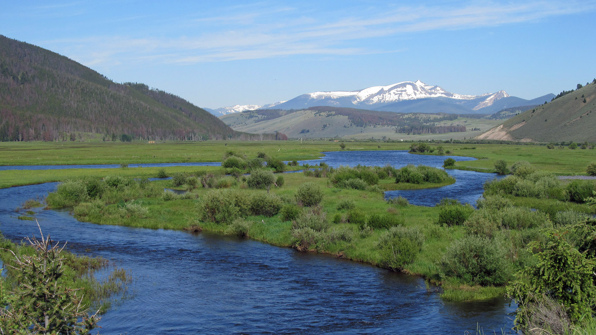

--- 
title: "Watershed Analysis: ENSC 445/LRES 545"
author: "Tim Covino"
date: "`r Sys.Date()`"
site: bookdown::bookdown_site
---

# Introduction

This book provides the materials that we will use in Watershed Analysis (ENSC 445/545). In this class we will be learning the fundamentals of watershed analysis in R. 

Instructor: Dr. Tim Covino\
Class times: T 10:50 – 12:05; Th 10:50 – 12:05\
Office hours: By appointment\
Website: https://tpcovino.github.io/ensc_445_545_bookdown

Course overview and objectives 

(1) provide theoretical understanding and practical experience with common analysis and modeling techniques relevant to watershed hydrology. 

(2) provide training in analyzing, simulating, and presenting scientific data in written and oral formats.

Structure 
This class will be largely hands-on, and students will be conducting watershed analyses and modeling exercises. We will be doing our analysis and modeling in R and will do some R coding in each class session. Programming is best learned by doing it often. We will generally have "lecture" on Tuesday, where we will talk about and work through various types of hydrological analyses. On Thursday's you will then put the content from Tuesday to work in a lab where you will complete a variety of hydrological analyses in R. 

Philosophical approach and books & resources we will utilize 
This course will use all online and open-source resources and will follow FAIR (findability, accessibility, interoperability, and reusability) data principles and promote sharing of hydrological education and research materials. Our computing will utilze open source [R](https://cran.rstudio.com/){target="_blank"} and [RStudio](https://posit.co/download/rstudio-desktop/){target="_blank"} software. Books and readings will include [R for Data Science](https://r4ds.had.co.nz/index.html){target="_blank"} and [Statistical Methods in Water Resources](https://pubs.usgs.gov/tm/04/a03/tm4a3.pdf){target="_blank"}, but other readings will be made available on this bookdown page as needed. *We will promote an open, equitable, and collaborative environment such that we can all succeed and improve our skills in watershed analysis*.  
 
Tentative schedule, subject to change

**Week 1 (Unit 1)**:   
- *Lecture (1/19)*: Introduction, overview, and technical skills.\
- *Reading*: [Chapters 1, 2, & 3](https://r4ds.had.co.nz/introduction.html){target="_blank"} 1-Welcome, 2-Introduction, & 3-Data visualization in R for Data Science (RDS).

**Week 2 (Units 1 & 2)**:  
- *Lecture (1/24)*: Technical skills continued. Data visualization, data wrangling, and programming.  
- *Lab 1 (1/26)*: Data visualization, data wrangling, and programming.  
- *Reading*: [Chapter 2.1](https://pubs.usgs.gov/tm/04/a03/tm4a3.pdf){target="_blank"}: Graphical Analysis of Single Datasets in Statistical Methods in Water Resources (SMWR).
*AND* [Chapters 4 & 5](https://r4ds.had.co.nz/workflow-basics.html){target="_blank"} 4-Workflow: Basics & 5-Data transformation in RDS.  

**Week 3 (Unit 3)**:  
- *Lecture (1/31)*: Statistics in hydrology.  
- *Lab 2 (2/2)*: Statistics in hydrology.  
- *Reading*: [Chapter 1](https://pubs.usgs.gov/tm/04/a03/tm4a3.pdf){target="_blank"}: 1-Summarizing Univariate Data in SMWR 

**Week 4 (Unit 4)**:   
- *Lecture (2/7)*: Downloading and shaping data frames. 
- *Lab 3 (2/9)*: Downloading and shaping data frames.  
- *Reading*: [The Experimental Forest Network](https://www.fs.usda.gov/research/forestsandranges), [the Tenderfoot Creek Experimental Forest](https://www.fs.usda.gov/rmrs/experimental-forests-and-ranges/tenderfoot-creek-experimental-forest/)
*AND* [Introduction to the dataRetrieval package](https://cran.r-project.org/web/packages/dataRetrieval/vignettes/dataRetrieval.html){target="_blank"}
*AND* [Chapter 12 & 13 of R for Data Science](https://r4ds.had.co.nz/tidy-data.html){target="_blank"}

**Week 5 (Units 1 - 4)**:   
- *Lecture (2/14)*: StreamStats. Wrap up dataRetrieval. Wrap up sections 1 - 4.\
- *Exam 1 (2/16)*: Term project overview and assign take home **Exam 1**.  
- *Term project work session*: project brainstorm, identify data, analysis, and models (if applicable) necessary to complete project.  
- Undergraduate students identify partner for term project by 2/16. 

**Week 6 (Unit 5)**:  
- *Lecture (2/21)*: Surface water: Rating curves and hydrographs.  
- *Lab 4 (2/23)*: Rating curves and hydrographs  
- *Reading*: [Chapter 4](https://pubs.usgs.gov/tm/04/a03/tm4a3.pdf){target="_blank"} 4-Hypothesis Tests in SMWR. 

**Week 7 (Unit 6)**:  
- *Lecture (2/28)*: Flow frequency analysis (low flows)  
- *Lab 5 (3/2)*: Low flow frequency analysis  
- *Reading*: [Definitions and characteristics of low flows](https://www.epa.gov/ceam/definition-and-characteristics-low-flows#1Q10){target="_blank"} in EPA Environmental Modeling Community of Practice

**Week 8 (Unit 6 contd)**:  
- *Lecture (3/7)*: Wrap up low flow analysis  
- *Lab 6 (3/9)*: Guest lecture  

**Week 9: Spring break (3/14 & 3/16)** - no class!

**Week 10 (Unit 6 contd)**:  
- *Lecture (3/21)*: Flow frequency analysis (high flows)  
- *Lab 5 - part 1 (3/23)*: Peakflow frequency analysis  
- *Reading*: [PeakFlow Frequency Estiamtes for USGS Streamflow-Gaging Stations in Connecticut](https://pubs.usgs.gov/wri/wri034196/wrir03-4196.pdf){target="_blank"}

**Week 11 (Unit 6 contd)**:  
- *Lab 5 - part 2 (3/28)*: Precipitation analysis  
- *Lab 6 (3/30)*: Trend analysis  
- *Reading*: [Frequency analysis of rainfall data](https://indico.ictp.it/event/a12165/session/21/contribution/16/material/0/0.pdf){target="_blank"} Up to page 32.  
- *Reading*: [Chapters 12.1 & 12.2](https://pubs.usgs.gov/tm/04/a03/tm4a3.pdf){target="_blank"} 12.1-General Structure of Trend Tests & 12.2-Trend Tests with No Exogenous Variables in SMWR. 

**Week 12 (Units 5 - 8)**:  
- *Lecture/lab (4/4)*: Geospatial hydrology in R  
- *Lab (4/6)*:  Term project work session and assign **Exam 2**   

**Week 13 (Unit 9)**:  
- *Lecture/lab (4/11)*: Watershed delineation in R  
- *Lab (4/13)*: Term project update presentations  
- *Reading*: [Geocomputation with R](https://geocompr.robinlovelace.net/intro.html){target="_blank"}  
- *Reading*: [Geospatial analysis in R](https://pjbartlein.github.io/REarthSysSci/geospatial.html){target="_blank"}

**Week 14 (Unit 10)**:  
- *Lecture/lab (4/18)*: Hydrological modeling part 1  
- *Lab (4/20)*: Lab or term project work session (TBD)  
- *Reading* [An Overview of Rainfall-Runoff Model Types](https://cfpub.epa.gov/si/si_public_record_report.cfm?dirEntryId=339328&Lab=NERL){target="_blank"}

**Week 15 (Unit 10 contd)**:  
- *Lab (4/25)*: Hydrological modeling part 2  
- *Lab (4/27)*: Term project work session

**Week 16**: Term project presentations (5/2 and 5/4)

**Week 17 (finals week)**: Final exam due 5/9 (Units 1 - 10)

