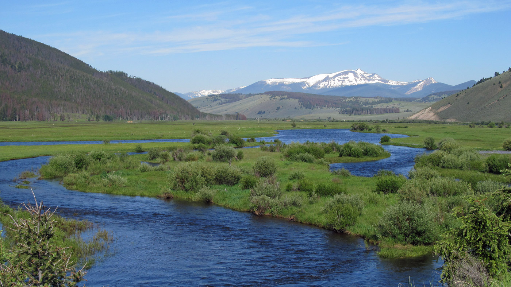

# Introduction

This book provides the materials that we will use in Watershed Analysis (ENSC 445/545). In this class we will be learning the fundamentals of watershed analysis in R.

Instructor: Dr. Tim Covino\
Class times: T 10:55 – 12:10; Th 10:55 – 12:10\
Office hours: By appointment\
Email: timothy.covino@montana.edu\
Website: <https://tpcovino.github.io/ensc_445_545_bookdown>

## Course overview and objectives

(1) provide theoretical understanding and practical experience with common analysis and modeling techniques relevant to watershed hydrology.

(2) provide training in analyzing, simulating, and presenting scientific data in written and oral formats.

## Structure

This class will be largely hands-on, and students will be conducting watershed analyses and modeling exercises. We will be doing our analysis and modeling in R and will do some R coding in each class session. Programming is best learned by doing it often. We will generally have "lecture" on Tuesday, where we will talk about and work through various types of hydrological analyses. On Thursday's you will then put the content from Tuesday to work in a lab where you will complete a variety of hydrological analyses in R.

Philosophical approach and books & resources we will utilize This course will use all online and open-source resources and will follow FAIR (findability, accessibility, interoperability, and reusability) data principles and promote sharing of hydrological education and research materials. Our computing will utilize open source [R](https://cran.rstudio.com/){target="_blank"} and [RStudio](https://posit.co/download/rstudio-desktop/){target="_blank"} software. Books and readings will include [R for Data Science](https://r4ds.hadley.nz/){target="_blank"} and [Statistical Methods in Water Resources](https://www.epa.gov/sites/default/files/2015-06/documents/twri4a3-new.pdf){target="_blank"}, but other readings will be made available on this bookdown page as needed. *We will promote an open, equitable, and collaborative environment such that we can all succeed and improve our skills in watershed analysis*. 
  Here are instructions for installing R and RStudio on your own computer if you would like [Hands on Programming with R](https://rstudio-education.github.io/hopr/starting.html){target="_blank"}

## Tentative schedule, subject to change

**Week 1**:   - *Lecture (1/13)*: Introduction, review.\
*Work session (1/15)*: Getting started in R.  
- *Reading*: [Intro & Chapter 1](https://r4ds.hadley.nz/intro){target="_blank"} Introduction & 1-Data visualization in R for Data Science (RDS).

**Week 2**:   - *Lecture (1/20)*: Overview and data viz.   - *Work session (1/22)*: Data visualization, data wrangling, and programming.   - *Reading*: [Chapter 2.1](https://www.epa.gov/sites/default/files/2015-06/documents/twri4a3-new.pdf){target="_blank"}: Graphical Analysis of Single Datasets in Statistical Methods in Water Resources (SMWR). *AND* [Chapters 2 & 3](https://r4ds.hadley.nz/data-transform.html){target="_blank"} 2-Workflow: Basics & 3-Data transformation in RDS.  

**Week 3**:   - *Term project intro and brainstorm and start Lab 1 (1/27)*: Data viz, wrangling, and programming.   - *Continue Lab 1 (1/29)*: Data viz, wrangling, and programming.  

**Week 4**:   - *Lecture (2/3)*: Downloading and shaping data frames.  - *Lab 2 (2/5)*: Downloading and shaping data frames.   - **Submit term project ideas**   - *Reading*: [Introduction to the dataRetrieval package](https://cran.r-project.org/web/packages/dataRetrieval/vignettes/dataRetrieval.html){target="_blank"} *AND* [Chapter 4 in R for Data Science](https://r4ds.hadley.nz/workflow-style.html){target="_blank"}

**Week 5**:   - *Lecture (2/10)*: Statistics in hydrology.   - *Lab 3 (2/12)*: Statistics in hydrology.   - *Reading*: [Chapter 1](https://www.epa.gov/sites/default/files/2015-06/documents/twri4a3-new.pdf){target="_blank"}: Summarizing Data in SMWR *AND* [Chapter 5 in RDS](https://r4ds.hadley.nz/data-tidy.html){target="_blank"}

**Week 6**:   - *Lecture (2/17)*: Surface water: Rating curves and hydrographs.\
- *Lab 4 (2/19)*: Flood analysis

**Week 7**:   - *Work session (2/24)*: Data acquisition and term project work session.   - *Work session (2/26)*: Term project work session   - *Reading*: [Chapter 6 in RDS](https://r4ds.hadley.nz/workflow-scripts.html){target="_blank"}

**Week 8**:   - *Lecture 5 (3/3)*: Hydrologic processes, climate, and water balance. Trend detection and analysis, non-parametric approaches. Climate download (SNOTEL, NOAA, GHCND)   - *Lab 5 (3/5)*: Trend analysis   - *Reading*: [Chapters 12.1 & 12.2](https://www.epa.gov/sites/default/files/2015-06/documents/twri4a3-new.pdf){target="_blank"} 12.1-General Structure of Trend Tests & 12.2-Trend Tests with No Exogenous Variables in SMWR.

**Week 9**:   - *Work session (3/10)*: Term project work session   - *Guest lecture (3/12)*: SNOTEL   

**Week 10: Spring break (3/17 & 3/19)** - no class!

**Week 11**:   - *Lecture (3/24)*: Low flow analysis   - *Lab 6 (3/26)*: Low flow analysis   - *Reading*: [Definitions and characteristics of low flows](https://www.epa.gov/ceam/definition-and-characteristics-low-flows#1Q10){target="_blank"} in EPA Environmental Modeling Community of Practice

**Week 12**:   - *Guest lecture (3/31)*: City of Bozeman low flow   - *Tutorial (4/2)*: Watershed delineation in R   - *Reading*: [Geocomputation with R](https://geocompr.robinlovelace.net/intro.html){target="_blank"}   - *Reading*: [Geospatial analysis in R](https://pjbartlein.github.io/REarthSysSci/geospatial.html){target="_blank"}

**Week 13**:   - *Lecture/lab (4/7)*: Hydrological modeling   - *Lab 7 (4/9)*: Predict the peak   - *Reading* [An Overview of Rainfall-Runoff Model Types](https://cfpub.epa.gov/si/si_public_record_report.cfm?dirEntryId=339328&Lab=NERL){target="_blank"}

**Week 14**:   - *Lab (4/14)*: Lab or term project work session   - *Lab (4/16)*: Lab or term project work session   - *Reading* [Chapters 10 & 11 in RDS](https://r4ds.hadley.nz/EDA.html)

**Week 15**:   - *Lab (4/21)*: Term project work session   - *Lab (4/23)*: Term project presentations

**Week 16**: Term project presentations (4/28 and 4/30)

**Week 17 (finals week)**: Submit term project R Markdown
